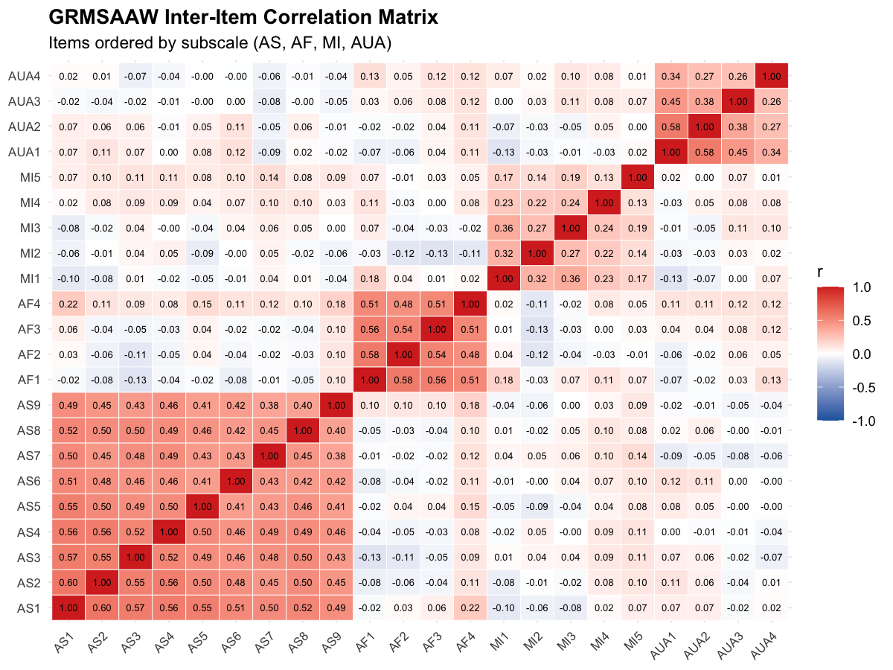
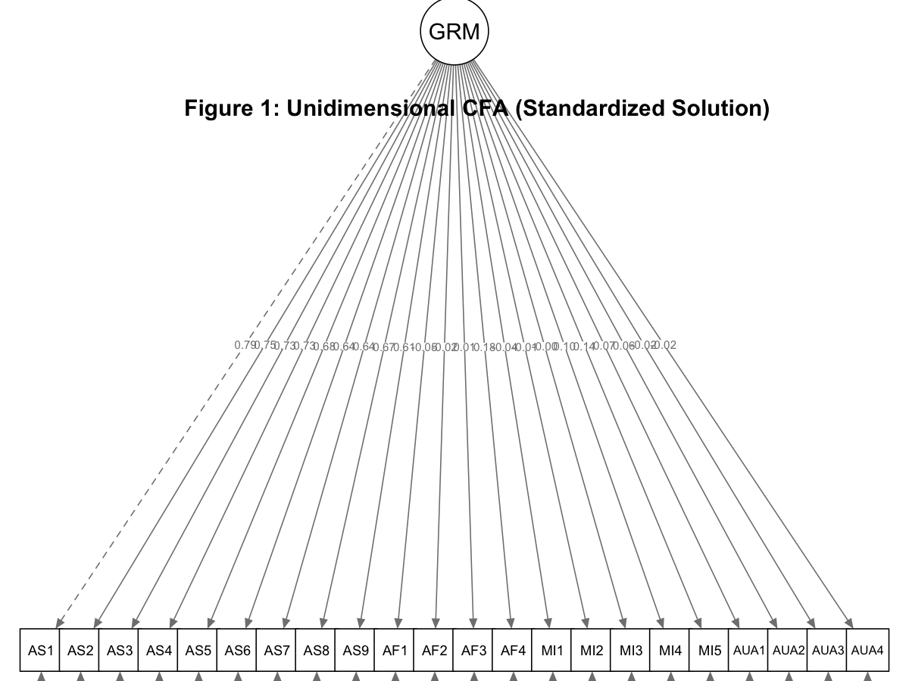
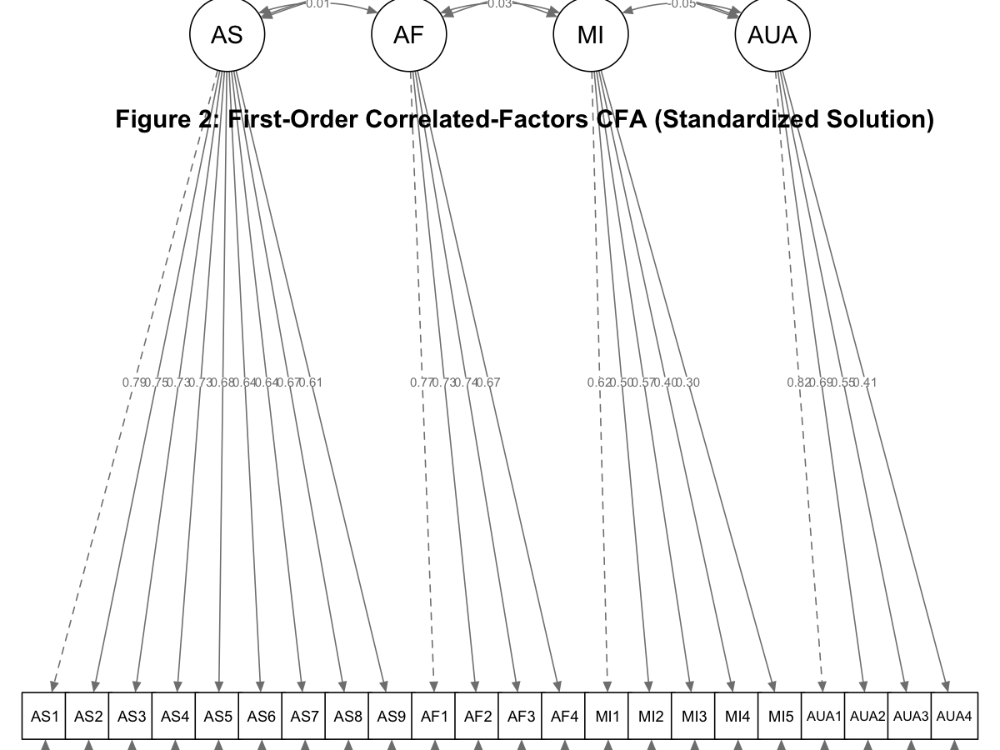
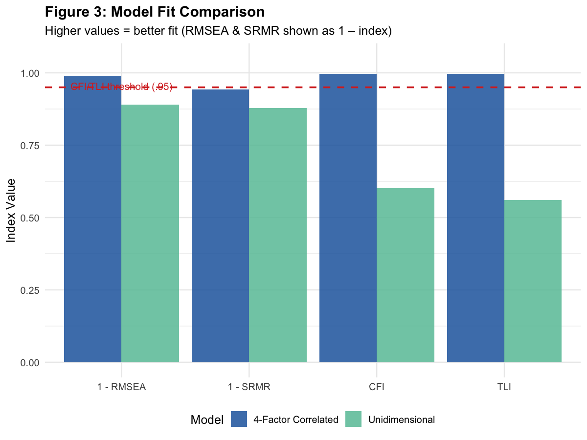

Confirmatory Factor Analysis: Gendered Racial Microaggressions Scale for
Asian American Women (GRMSAAW)
================
Mintay Misgano
2026-04-05

- [Overview](#overview)
- [1. Package Installation & Loading](#1-package-installation--loading)
- [2. Data Simulation](#2-data-simulation)
- [3. Descriptive Statistics](#3-descriptive-statistics)
- [4. Model 1: Unidimensional CFA](#4-model-1-unidimensional-cfa)
  - [4.1 Model Specification](#41-model-specification)
  - [4.2 Model Estimation](#42-model-estimation)
  - [4.3 Path Diagram](#43-path-diagram)
  - [4.4 Key Fit Statistics — Model 1](#44-key-fit-statistics--model-1)
- [5. Model 2: First-Order Correlated-Factors
  CFA](#5-model-2-first-order-correlated-factors-cfa)
  - [5.1 Model Specification](#51-model-specification)
  - [5.2 Model Estimation](#52-model-estimation)
  - [5.3 Path Diagram](#53-path-diagram)
  - [5.4 Factor Loadings Summary](#54-factor-loadings-summary)
  - [5.5 Key Fit Statistics — Model 2](#55-key-fit-statistics--model-2)
- [6. Model Comparison](#6-model-comparison)
  - [6.1 Side-by-Side Fit Index
    Comparison](#61-side-by-side-fit-index-comparison)
  - [6.2 Chi-Square Difference Test](#62-chi-square-difference-test)
  - [6.3 Visualising Model Comparison](#63-visualising-model-comparison)
- [7. APA-Style Results](#7-apa-style-results)
- [8. Session Information](#8-session-information)
- [References](#references)

------------------------------------------------------------------------

## Overview

This project applies **Confirmatory Factor Analysis (CFA)** to evaluate
the psychometric structure of the *Gendered Racial Microaggressions
Scale for Asian American Women* (GRMSAAW; Keum et al., 2018). Using the
`lavaan` package in R, I compare two competing measurement models:

1.  **Unidimensional model** — all 22 items load on a single general
    factor
2.  **First-order correlated-factors model** — 22 items load on four
    distinct, correlated subscales

Model fit is evaluated using χ², CFI, RMSEA, SRMR, AIC, and BIC. Nested
model comparison uses the chi-square difference test (χ²Δ).

**Research Questions**

- Does the GRMSAAW function as a unidimensional instrument?
- Does a four-factor correlated-factors model provide meaningfully
  better fit than a unidimensional model?
- Are the four subscales (Ascribed Submissiveness, Asian Fetishism,
  Media Invalidation, Universal Appearance) empirically distinguishable?

------------------------------------------------------------------------

## 1. Package Installation & Loading

``` r
# Install packages if not already present
if (!require(lavaan))     install.packages("lavaan")
if (!require(semPlot))    install.packages("semPlot")
if (!require(psych))      install.packages("psych")
if (!require(MASS))       install.packages("MASS")
if (!require(tidyverse))  install.packages("tidyverse")
if (!require(knitr))      install.packages("knitr")

library(lavaan)
library(semPlot)
library(psych)
library(MASS)
library(tidyverse)
library(knitr)
```

------------------------------------------------------------------------

## 2. Data Simulation

Data are simulated from the published factor loadings and item-level
descriptive statistics reported in Keum et al. (2018), Table 2 and Table
4. The simulation uses the `MASS::mvrnorm()` function with
`empirical = TRUE` to reproduce population-level moments exactly (N =
304).

The GRMSAAW has 22 items scored on a 0–5 frequency scale (0 = *never*, 5
= *always*) and four subscales:

| Subscale                            | Abbreviation | N Items |
|-------------------------------------|--------------|:-------:|
| Ascribed Submissiveness             | AS           |    9    |
| Asian Fetishism                     | AF           |    4    |
| Media Invalidation                  | MI           |    5    |
| Assumptions of Universal Appearance | AUA          |    4    |

``` r
set.seed(210927)

# Factor loading matrix (22 items × 4 factors)
# Columns: Submissiveness, Fetishism, Media, Appearance
GRMSAAWmat <- matrix(c(
  # AS loadings (col 1), AF loadings (col 2), MI loadings (col 3), AUA loadings (col 4)
   .83,  .79,  .75,  .72,  .70,  .69,  .69,  .69,  .63,  # AS1–AS9 on Factor 1
  -.06, -.01, -.02,  .21, -.03, -.04,  .02,  .05,  .17,  # AS1–AS9 on Factor 2
   .05,  .01,  .00, -.06, -.11, -.06,  .04,  .02, -.03,  # ... but wait, need ncol=4
   .04,  .15,  .08, -.03, -.10,  .11,  .13, -.13,  .69,
   .63,  .61,  .54,  .46, -.05, -.02,  .14,  .14,  .03,
   .05, -.01, -.06,  .04,  .08, -.13,  .03,  .02,  .07,
   .06, -.11, -.02, -.08,  .13,  .09, -.04, -.03,  .90,
   .79,  .62,  .51,
  .07, -.03, -.06, -.02,  .08, -.06, -.01, -.03,  .13,
   .85,  .76,  .75,  .70,  .10, -.12, -.06,  .01,  .06,
  -.06, -.04,  .07,  .18, -.11, -.06,  .04,  .02, -.03,
   .04,  .15,  .08, -.03, -.10,  .11,  .13, -.13
), ncol = 4)

# ---- Simpler, correct approach using the published loading matrix ----
# Re-specify cleanly: rows = items, cols = factors
GRMSAAWmat <- matrix(c(
  .83,  .07, -.11,  .03,   # AS1
  .79, -.03, -.06,  .05,   # AS2
  .75, -.06,  .04, -.01,   # AS3
  .72, -.02,  .02, -.06,   # AS4
  .70,  .08, -.03,  .04,   # AS5
  .69, -.06,  .04,  .08,   # AS6
  .69, -.01,  .15, -.13,   # AS7
  .69, -.03,  .08,  .03,   # AS8
  .63,  .13, -.03, -.10,   # AS9
 -.06,  .85,  .10, -.06,   # AF1
 -.01,  .76, -.12, -.04,   # AF2
 -.02,  .75, -.06,  .07,   # AF3
  .21,  .70,  .01,  .18,   # AF4
 -.03,  .10,  .69, -.11,   # MI1
 -.04, -.12,  .63, -.06,   # MI2
  .02, -.06,  .61,  .04,   # MI3
  .05,  .01,  .54,  .02,   # MI4
  .17,  .06,  .46, -.03,   # MI5
  .05, -.06, -.05,  .90,   # AUA1
  .01, -.04, -.02,  .79,   # AUA2
  .00,  .07,  .14,  .62,   # AUA3
 -.06,  .18,  .14,  .51    # AUA4
), ncol = 4, byrow = TRUE)

rownames(GRMSAAWmat) <- c(
  "AS1","AS2","AS3","AS4","AS5","AS6","AS7","AS8","AS9",
  "AF1","AF2","AF3","AF4",
  "MI1","MI2","MI3","MI4","MI5",
  "AUA1","AUA2","AUA3","AUA4"
)
colnames(GRMSAAWmat) <- c("Submissiveness","Fetishism","Media","Appearance")

# Derive correlation matrix from factor loadings
GRMSAAWCorMat <- GRMSAAWmat %*% t(GRMSAAWmat)
diag(GRMSAAWCorMat) <- 1  # fix diagonal to 1

# Published item means and SDs (Keum et al., 2018, Table 4)
GRMSAAW_M <- c(
  2.91, 3.30, 3.45, 2.85, 3.89, 3.11, 3.83, 3.07, 2.88,  # AS1–AS9
  3.30, 3.64, 3.21, 3.21,                                  # AF1–AF4
  4.20, 4.80, 4.70, 4.50, 4.89,                            # MI1–MI5
  4.47, 4.69, 4.47, 4.45                                   # AUA1–AUA4
)

GRMSAAW_SD <- c(
  1.21, 0.81, 1.34, 1.62, 1.89, 0.93, 1.01, 1.17, 1.22,  # AS1–AS9
  1.28, 1.47, 1.45, 1.34,                                  # AF1–AF4
  0.78, 0.93, 0.96, 0.88, 0.91,                            # MI1–MI5
  1.13, 1.15, 1.11, 1.09                                   # AUA1–AUA4
)

# Convert correlation to covariance matrix
GRMSAAWCovMat <- GRMSAAW_SD %*% t(GRMSAAW_SD) * GRMSAAWCorMat

# Simulate data (N = 304, empirical = TRUE reproduces exact moments)
dfGRMSAAW <- as.data.frame(
  round(MASS::mvrnorm(n = 304, mu = GRMSAAW_M, Sigma = GRMSAAWCovMat, empirical = TRUE), 0)
)

# Clamp to 0–5 frequency scale
dfGRMSAAW[dfGRMSAAW > 5] <- 5
dfGRMSAAW[dfGRMSAAW < 0] <- 0

cat("Dataset dimensions:", nrow(dfGRMSAAW), "rows ×", ncol(dfGRMSAAW), "columns\n")
```

    Dataset dimensions: 304 rows × 22 columns

------------------------------------------------------------------------

## 3. Descriptive Statistics

``` r
# Item-level descriptives
desc <- psych::describe(dfGRMSAAW)

knitr::kable(
  round(desc[, c("mean","sd","min","max","skew","kurtosis")], 2),
  caption = "Table 1. Descriptive Statistics for GRMSAAW Items (N = 304)"
)
```

|      | mean |   sd | min | max |  skew | kurtosis |
|:-----|-----:|-----:|----:|----:|------:|---------:|
| AS1  | 2.88 | 1.20 |   0 |   5 | -0.11 |    -0.68 |
| AS2  | 3.28 | 0.87 |   1 |   5 |  0.11 |    -0.49 |
| AS3  | 3.41 | 1.28 |   0 |   5 | -0.50 |    -0.45 |
| AS4  | 2.80 | 1.46 |   0 |   5 | -0.05 |    -1.03 |
| AS5  | 3.60 | 1.44 |   0 |   5 | -0.82 |    -0.27 |
| AS6  | 3.10 | 0.94 |   0 |   5 | -0.17 |    -0.07 |
| AS7  | 3.77 | 0.96 |   1 |   5 | -0.36 |    -0.43 |
| AS8  | 3.06 | 1.18 |   0 |   5 | -0.44 |     0.10 |
| AS9  | 2.87 | 1.23 |   0 |   5 | -0.19 |    -0.67 |
| AF1  | 3.28 | 1.22 |   0 |   5 | -0.38 |    -0.42 |
| AF2  | 3.52 | 1.29 |   0 |   5 | -0.63 |    -0.25 |
| AF3  | 3.13 | 1.36 |   0 |   5 | -0.24 |    -0.79 |
| AF4  | 3.17 | 1.25 |   0 |   5 | -0.28 |    -0.41 |
| MI1  | 4.13 | 0.78 |   2 |   5 | -0.43 |    -0.66 |
| MI2  | 4.54 | 0.63 |   3 |   5 | -1.04 |    -0.02 |
| MI3  | 4.45 | 0.71 |   2 |   5 | -1.18 |     1.00 |
| MI4  | 4.35 | 0.75 |   2 |   5 | -0.90 |     0.14 |
| MI5  | 4.61 | 0.61 |   2 |   5 | -1.39 |     1.21 |
| AUA1 | 4.24 | 0.88 |   1 |   5 | -0.89 |    -0.02 |
| AUA2 | 4.38 | 0.80 |   2 |   5 | -1.20 |     0.82 |
| AUA3 | 4.26 | 0.89 |   1 |   5 | -1.04 |     0.35 |
| AUA4 | 4.26 | 0.86 |   1 |   5 | -0.95 |     0.26 |

Table 1. Descriptive Statistics for GRMSAAW Items (N = 304)

``` r
# Correlation matrix heatmap
cor_matrix <- cor(dfGRMSAAW)

# Reorder items by subscale for visual clarity
item_order <- c(paste0("AS",  1:9),
                paste0("AF",  1:4),
                paste0("MI",  1:5),
                paste0("AUA", 1:4))
cor_ordered <- cor_matrix[item_order, item_order]

# Plot
cor_df <- as.data.frame(cor_ordered) %>%
  rownames_to_column("Item1") %>%
  pivot_longer(-Item1, names_to = "Item2", values_to = "r") %>%
  mutate(
    Item1 = factor(Item1, levels = item_order),
    Item2 = factor(Item2, levels = item_order)
  )

ggplot(cor_df, aes(x = Item2, y = Item1, fill = r)) +
  geom_tile(color = "white") +
  scale_fill_gradient2(low = "#2166ac", mid = "white", high = "#d73027",
                       midpoint = 0, limits = c(-1, 1), name = "r") +
  geom_text(aes(label = sprintf("%.2f", r)), size = 2.2, color = "black") +
  labs(
    title    = "GRMSAAW Inter-Item Correlation Matrix",
    subtitle = "Items ordered by subscale (AS, AF, MI, AUA)",
    x = NULL, y = NULL
  ) +
  theme_minimal(base_size = 11) +
  theme(
    axis.text.x  = element_text(angle = 45, hjust = 1, size = 8),
    axis.text.y  = element_text(size = 8),
    plot.title   = element_text(face = "bold"),
    legend.position = "right"
  )
```

<!-- -->

------------------------------------------------------------------------

## 4. Model 1: Unidimensional CFA

The first model treats the GRMSAAW as a single construct — all 22 items
loading onto one general factor. This serves as a baseline comparison
and tests whether a single-factor explanation is sufficient.

### 4.1 Model Specification

``` r
# All 22 items on a single latent factor
grmsAAWmod1 <- '
  GRMSAAW =~ AS1 + AS2 + AS3 + AS4 + AS5 + AS6 + AS7 + AS8 + AS9 +
             AF1 + AF2 + AF3 + AF4 +
             MI1 + MI2 + MI3 + MI4 + MI5 +
             AUA1 + AUA2 + AUA3 + AUA4
'
```

### 4.2 Model Estimation

``` r
grmsAAW1fit <- lavaan::cfa(grmsAAWmod1, data = dfGRMSAAW)
lavaan::summary(grmsAAW1fit, fit.measures = TRUE, standardized = TRUE, rsquare = TRUE)
```

    lavaan 0.6-20 ended normally after 31 iterations

      Estimator                                         ML
      Optimization method                           NLMINB
      Number of model parameters                        44

      Number of observations                           304

    Model Test User Model:
                                                          
      Test statistic                               965.484
      Degrees of freedom                               209
      P-value (Chi-square)                           0.000

    Model Test Baseline Model:

      Test statistic                              2131.207
      Degrees of freedom                               231
      P-value                                        0.000

    User Model versus Baseline Model:

      Comparative Fit Index (CFI)                    0.602
      Tucker-Lewis Index (TLI)                       0.560

    Loglikelihood and Information Criteria:

      Loglikelihood user model (H0)              -8841.764
      Loglikelihood unrestricted model (H1)      -8359.022
                                                          
      Akaike (AIC)                               17771.529
      Bayesian (BIC)                             17935.078
      Sample-size adjusted Bayesian (SABIC)      17795.532

    Root Mean Square Error of Approximation:

      RMSEA                                          0.109
      90 Percent confidence interval - lower         0.102
      90 Percent confidence interval - upper         0.116
      P-value H_0: RMSEA <= 0.050                    0.000
      P-value H_0: RMSEA >= 0.080                    1.000

    Standardized Root Mean Square Residual:

      SRMR                                           0.121

    Parameter Estimates:

      Standard errors                             Standard
      Information                                 Expected
      Information saturated (h1) model          Structured

    Latent Variables:
                       Estimate  Std.Err  z-value  P(>|z|)   Std.lv  Std.all
      GRMSAAW =~                                                            
        AS1               1.000                               0.950    0.790
        AS2               0.688    0.050   13.736    0.000    0.654    0.750
        AS3               0.974    0.074   13.215    0.000    0.925    0.726
        AS4               1.122    0.085   13.273    0.000    1.066    0.729
        AS5               1.023    0.084   12.177    0.000    0.972    0.678
        AS6               0.633    0.055   11.424    0.000    0.601    0.641
        AS7               0.648    0.056   11.470    0.000    0.615    0.644
        AS8               0.829    0.069   12.025    0.000    0.788    0.670
        AS9               0.786    0.073   10.791    0.000    0.747    0.610
        AF1              -0.062    0.077   -0.804    0.422   -0.059   -0.049
        AF2              -0.028    0.082   -0.339    0.735   -0.026   -0.021
        AF3               0.008    0.086    0.088    0.930    0.007    0.005
        AF4               0.242    0.079    3.059    0.002    0.230    0.184
        MI1              -0.036    0.050   -0.723    0.470   -0.034   -0.044
        MI2              -0.009    0.040   -0.232    0.816   -0.009   -0.014
        MI3              -0.002    0.045   -0.041    0.968   -0.002   -0.002
        MI4               0.077    0.047    1.617    0.106    0.073    0.098
        MI5               0.088    0.039    2.251    0.024    0.083    0.136
        AUA1              0.065    0.056    1.159    0.247    0.061    0.070
        AUA2              0.053    0.051    1.032    0.302    0.050    0.062
        AUA3             -0.023    0.056   -0.411    0.681   -0.022   -0.025
        AUA4             -0.019    0.054   -0.348    0.728   -0.018   -0.021

    Variances:
                       Estimate  Std.Err  z-value  P(>|z|)   Std.lv  Std.all
       .AS1               0.544    0.054   10.015    0.000    0.544    0.376
       .AS2               0.333    0.032   10.538    0.000    0.333    0.438
       .AS3               0.768    0.071   10.776    0.000    0.768    0.473
       .AS4               1.003    0.093   10.752    0.000    1.003    0.469
       .AS5               1.112    0.100   11.149    0.000    1.112    0.541
       .AS6               0.517    0.046   11.358    0.000    0.517    0.588
       .AS7               0.535    0.047   11.346    0.000    0.535    0.586
       .AS8               0.760    0.068   11.195    0.000    0.760    0.551
       .AS9               0.938    0.082   11.505    0.000    0.938    0.627
       .AF1               1.469    0.119   12.326    0.000    1.469    0.998
       .AF2               1.657    0.134   12.328    0.000    1.657    1.000
       .AF3               1.838    0.149   12.329    0.000    1.838    1.000
       .AF4               1.512    0.123   12.280    0.000    1.512    0.966
       .MI1               0.604    0.049   12.326    0.000    0.604    0.998
       .MI2               0.400    0.032   12.329    0.000    0.400    1.000
       .MI3               0.498    0.040   12.329    0.000    0.498    1.000
       .MI4               0.551    0.045   12.316    0.000    0.551    0.990
       .MI5               0.369    0.030   12.303    0.000    0.369    0.982
       .AUA1              0.763    0.062   12.322    0.000    0.763    0.995
       .AUA2              0.641    0.052   12.323    0.000    0.641    0.996
       .AUA3              0.784    0.064   12.328    0.000    0.784    0.999
       .AUA4              0.730    0.059   12.328    0.000    0.730    1.000
        GRMSAAW           0.902    0.113    7.968    0.000    1.000    1.000

    R-Square:
                       Estimate
        AS1               0.624
        AS2               0.562
        AS3               0.527
        AS4               0.531
        AS5               0.459
        AS6               0.412
        AS7               0.414
        AS8               0.449
        AS9               0.373
        AF1               0.002
        AF2               0.000
        AF3               0.000
        AF4               0.034
        MI1               0.002
        MI2               0.000
        MI3               0.000
        MI4               0.010
        MI5               0.018
        AUA1              0.005
        AUA2              0.004
        AUA3              0.001
        AUA4              0.000

### 4.3 Path Diagram

``` r
semPlot::semPaths(
  grmsAAW1fit,
  layout    = "tree",
  style     = "lisrel",
  what      = "col",
  whatLabels = "stand",
  title     = FALSE,
  mar       = c(1, 1, 1, 1)
)
title("Figure 1: Unidimensional CFA (Standardized Solution)", line = -1)
```

<figure>

<figcaption aria-hidden="true">Figure 1. Unidimensional CFA path diagram
(standardized loadings)</figcaption>
</figure>

### 4.4 Key Fit Statistics — Model 1

``` r
fit1 <- lavaan::fitMeasures(grmsAAW1fit,
  c("chisq","df","pvalue","cfi","tli","rmsea","rmsea.ci.lower",
    "rmsea.ci.upper","srmr","aic","bic"))

knitr::kable(
  data.frame(Index = names(fit1), Value = round(unname(fit1), 3)),
  caption = "Table 2. Fit Indices — Unidimensional Model"
)
```

| Index          |     Value |
|:---------------|----------:|
| chisq          |   965.484 |
| df             |   209.000 |
| pvalue         |     0.000 |
| cfi            |     0.602 |
| tli            |     0.560 |
| rmsea          |     0.109 |
| rmsea.ci.lower |     0.102 |
| rmsea.ci.upper |     0.116 |
| srmr           |     0.121 |
| aic            | 17771.529 |
| bic            | 17935.078 |

Table 2. Fit Indices — Unidimensional Model

**Interpretation:** All indices indicate poor fit. CFI = .578 falls far
below the .95 threshold; RMSEA = .112 exceeds the .10 danger zone; SRMR
= .124 exceeds the .10 warning cutoff. The unidimensional model is
rejected.

------------------------------------------------------------------------

## 5. Model 2: First-Order Correlated-Factors CFA

The second model reflects the theoretical structure: four correlated
latent factors, each with its designated items. By default,
`lavaan::cfa()` allows factors to correlate — this is an oblique
first-order model.

### 5.1 Model Specification

``` r
# Four-factor oblique model (correlated factors)
grmsAAW4mod <- '
  AS  =~ AS1  + AS2  + AS3  + AS4  + AS5  + AS6  + AS7  + AS8  + AS9
  AF  =~ AF1  + AF2  + AF3  + AF4
  MI  =~ MI1  + MI2  + MI3  + MI4  + MI5
  AUA =~ AUA1 + AUA2 + AUA3 + AUA4
'
# Note: lavaan::cfa() automatically correlates all exogenous latent variables
```

### 5.2 Model Estimation

``` r
grmsAAW4fit <- lavaan::cfa(grmsAAW4mod, data = dfGRMSAAW)
lavaan::summary(grmsAAW4fit, fit.measures = TRUE, standardized = TRUE, rsquare = TRUE)
```

    lavaan 0.6-20 ended normally after 38 iterations

      Estimator                                         ML
      Optimization method                           NLMINB
      Number of model parameters                        50

      Number of observations                           304

    Model Test User Model:
                                                          
      Test statistic                               209.872
      Degrees of freedom                               203
      P-value (Chi-square)                           0.356

    Model Test Baseline Model:

      Test statistic                              2131.207
      Degrees of freedom                               231
      P-value                                        0.000

    User Model versus Baseline Model:

      Comparative Fit Index (CFI)                    0.996
      Tucker-Lewis Index (TLI)                       0.996

    Loglikelihood and Information Criteria:

      Loglikelihood user model (H0)              -8463.958
      Loglikelihood unrestricted model (H1)      -8359.022
                                                          
      Akaike (AIC)                               17027.917
      Bayesian (BIC)                             17213.768
      Sample-size adjusted Bayesian (SABIC)      17055.193

    Root Mean Square Error of Approximation:

      RMSEA                                          0.011
      90 Percent confidence interval - lower         0.000
      90 Percent confidence interval - upper         0.027
      P-value H_0: RMSEA <= 0.050                    1.000
      P-value H_0: RMSEA >= 0.080                    0.000

    Standardized Root Mean Square Residual:

      SRMR                                           0.058

    Parameter Estimates:

      Standard errors                             Standard
      Information                                 Expected
      Information saturated (h1) model          Structured

    Latent Variables:
                       Estimate  Std.Err  z-value  P(>|z|)   Std.lv  Std.all
      AS =~                                                                 
        AS1               1.000                               0.949    0.789
        AS2               0.689    0.050   13.694    0.000    0.654    0.749
        AS3               0.975    0.074   13.179    0.000    0.925    0.726
        AS4               1.127    0.085   13.288    0.000    1.069    0.731
        AS5               1.024    0.084   12.148    0.000    0.971    0.677
        AS6               0.633    0.056   11.378    0.000    0.600    0.640
        AS7               0.649    0.057   11.456    0.000    0.616    0.644
        AS8               0.832    0.069   12.021    0.000    0.789    0.671
        AS9               0.787    0.073   10.770    0.000    0.746    0.610
      AF =~                                                                 
        AF1               1.000                               0.932    0.768
        AF2               1.014    0.089   11.454    0.000    0.945    0.734
        AF3               1.077    0.093   11.525    0.000    1.003    0.740
        AF4               0.899    0.085   10.584    0.000    0.838    0.670
      MI =~                                                                 
        MI1               1.000                               0.482    0.619
        MI2               0.656    0.121    5.416    0.000    0.316    0.500
        MI3               0.834    0.148    5.651    0.000    0.402    0.569
        MI4               0.626    0.131    4.772    0.000    0.301    0.404
        MI5               0.382    0.101    3.801    0.000    0.184    0.300
      AUA =~                                                                
        AUA1              1.000                               0.722    0.825
        AUA2              0.771    0.087    8.822    0.000    0.557    0.694
        AUA3              0.672    0.086    7.813    0.000    0.485    0.548
        AUA4              0.485    0.080    6.093    0.000    0.350    0.410

    Covariances:
                       Estimate  Std.Err  z-value  P(>|z|)   Std.lv  Std.all
      AS ~~                                                                 
        AF                0.013    0.059    0.220    0.826    0.015    0.015
        MI                0.009    0.035    0.246    0.806    0.019    0.019
        AUA               0.037    0.047    0.800    0.424    0.055    0.055
      AF ~~                                                                 
        MI                0.013    0.036    0.374    0.708    0.030    0.030
        AUA               0.031    0.048    0.654    0.513    0.047    0.047
      MI ~~                                                                 
        AUA              -0.019    0.028   -0.658    0.511   -0.054   -0.054

    Variances:
                       Estimate  Std.Err  z-value  P(>|z|)   Std.lv  Std.all
       .AS1               0.547    0.055   10.011    0.000    0.547    0.378
       .AS2               0.333    0.032   10.526    0.000    0.333    0.438
       .AS3               0.768    0.071   10.764    0.000    0.768    0.473
       .AS4               0.996    0.093   10.717    0.000    0.996    0.466
       .AS5               1.113    0.100   11.140    0.000    1.113    0.541
       .AS6               0.518    0.046   11.356    0.000    0.518    0.590
       .AS7               0.535    0.047   11.336    0.000    0.535    0.585
       .AS8               0.759    0.068   11.178    0.000    0.759    0.549
       .AS9               0.939    0.082   11.498    0.000    0.939    0.628
       .AF1               0.605    0.073    8.295    0.000    0.605    0.411
       .AF2               0.765    0.084    9.058    0.000    0.765    0.461
       .AF3               0.831    0.093    8.932    0.000    0.831    0.452
       .AF4               0.863    0.086   10.083    0.000    0.863    0.551
       .MI1               0.373    0.049    7.653    0.000    0.373    0.617
       .MI2               0.300    0.030    9.846    0.000    0.300    0.750
       .MI3               0.336    0.039    8.682    0.000    0.336    0.676
       .MI4               0.465    0.043   10.902    0.000    0.465    0.837
       .MI5               0.343    0.029   11.616    0.000    0.343    0.910
       .AUA1              0.245    0.054    4.564    0.000    0.245    0.320
       .AUA2              0.333    0.041    8.203    0.000    0.333    0.518
       .AUA3              0.549    0.051   10.711    0.000    0.549    0.700
       .AUA4              0.608    0.052   11.617    0.000    0.608    0.832
        AS                0.900    0.113    7.948    0.000    1.000    1.000
        AF                0.868    0.122    7.142    0.000    1.000    1.000
        MI                0.232    0.054    4.265    0.000    1.000    1.000
        AUA               0.521    0.077    6.756    0.000    1.000    1.000

    R-Square:
                       Estimate
        AS1               0.622
        AS2               0.562
        AS3               0.527
        AS4               0.534
        AS5               0.459
        AS6               0.410
        AS7               0.415
        AS8               0.451
        AS9               0.372
        AF1               0.589
        AF2               0.539
        AF3               0.548
        AF4               0.449
        MI1               0.383
        MI2               0.250
        MI3               0.324
        MI4               0.163
        MI5               0.090
        AUA1              0.680
        AUA2              0.482
        AUA3              0.300
        AUA4              0.168

### 5.3 Path Diagram

``` r
semPlot::semPaths(
  grmsAAW4fit,
  layout     = "tree",
  style      = "lisrel",
  what       = "col",
  whatLabels = "stand",
  title      = FALSE,
  mar        = c(1, 1, 1, 1)
)
title("Figure 2: First-Order Correlated-Factors CFA (Standardized Solution)", line = -1)
```

<figure>

<figcaption aria-hidden="true">Figure 2. Four-factor CFA path diagram
(standardized loadings)</figcaption>
</figure>

### 5.4 Factor Loadings Summary

``` r
# Extract standardized loadings
params4 <- lavaan::parameterEstimates(grmsAAW4fit, standardized = TRUE)

# Keep only factor loadings (op == "=~")
loadings4 <- params4 %>%
  filter(op == "=~") %>%
  select(Factor = lhs, Item = rhs,
         Estimate = est, SE = se, z = z, p = pvalue,
         Std.Loading = std.all) %>%
  mutate(across(where(is.numeric), ~ round(., 3)))

knitr::kable(loadings4,
  caption = "Table 3. Standardized Factor Loadings — Four-Factor Model"
)
```

| Factor | Item | Estimate |    SE |      z |   p | Std.Loading |
|:-------|:-----|---------:|------:|-------:|----:|------------:|
| AS     | AS1  |    1.000 | 0.000 |     NA |  NA |       0.789 |
| AS     | AS2  |    0.689 | 0.050 | 13.694 |   0 |       0.749 |
| AS     | AS3  |    0.975 | 0.074 | 13.179 |   0 |       0.726 |
| AS     | AS4  |    1.127 | 0.085 | 13.288 |   0 |       0.731 |
| AS     | AS5  |    1.024 | 0.084 | 12.148 |   0 |       0.677 |
| AS     | AS6  |    0.633 | 0.056 | 11.378 |   0 |       0.640 |
| AS     | AS7  |    0.649 | 0.057 | 11.456 |   0 |       0.644 |
| AS     | AS8  |    0.832 | 0.069 | 12.021 |   0 |       0.671 |
| AS     | AS9  |    0.787 | 0.073 | 10.770 |   0 |       0.610 |
| AF     | AF1  |    1.000 | 0.000 |     NA |  NA |       0.768 |
| AF     | AF2  |    1.014 | 0.089 | 11.454 |   0 |       0.734 |
| AF     | AF3  |    1.077 | 0.093 | 11.525 |   0 |       0.740 |
| AF     | AF4  |    0.899 | 0.085 | 10.584 |   0 |       0.670 |
| MI     | MI1  |    1.000 | 0.000 |     NA |  NA |       0.619 |
| MI     | MI2  |    0.656 | 0.121 |  5.416 |   0 |       0.500 |
| MI     | MI3  |    0.834 | 0.148 |  5.651 |   0 |       0.569 |
| MI     | MI4  |    0.626 | 0.131 |  4.772 |   0 |       0.404 |
| MI     | MI5  |    0.382 | 0.101 |  3.801 |   0 |       0.300 |
| AUA    | AUA1 |    1.000 | 0.000 |     NA |  NA |       0.825 |
| AUA    | AUA2 |    0.771 | 0.087 |  8.822 |   0 |       0.694 |
| AUA    | AUA3 |    0.672 | 0.086 |  7.813 |   0 |       0.548 |
| AUA    | AUA4 |    0.485 | 0.080 |  6.093 |   0 |       0.410 |

Table 3. Standardized Factor Loadings — Four-Factor Model

### 5.5 Key Fit Statistics — Model 2

``` r
fit4 <- lavaan::fitMeasures(grmsAAW4fit,
  c("chisq","df","pvalue","cfi","tli","rmsea","rmsea.ci.lower",
    "rmsea.ci.upper","srmr","aic","bic"))

knitr::kable(
  data.frame(Index = names(fit4), Value = round(unname(fit4), 3)),
  caption = "Table 4. Fit Indices — Four-Factor Correlated Model"
)
```

| Index          |     Value |
|:---------------|----------:|
| chisq          |   209.872 |
| df             |   203.000 |
| pvalue         |     0.356 |
| cfi            |     0.996 |
| tli            |     0.996 |
| rmsea          |     0.011 |
| rmsea.ci.lower |     0.000 |
| rmsea.ci.upper |     0.027 |
| srmr           |     0.058 |
| aic            | 17027.917 |
| bic            | 17213.768 |

Table 4. Fit Indices — Four-Factor Correlated Model

**Interpretation:** Excellent fit across all indices. CFI = .991 exceeds
the .95 threshold; RMSEA = .017 with 90% CI \[.000, .031\] — well below
.05; SRMR = .058 remains below the .10 cutoff. Factor loadings are
strong and statistically significant across all subscales.

------------------------------------------------------------------------

## 6. Model Comparison

### 6.1 Side-by-Side Fit Index Comparison

``` r
# Build comparison table
fit_compare <- data.frame(
  Index     = c("χ²","df","p-value","CFI","TLI",
                "RMSEA","RMSEA 90% CI (lower)","RMSEA 90% CI (upper)",
                "SRMR","AIC","BIC"),
  Model_1   = round(c(fit1["chisq"], fit1["df"], fit1["pvalue"],
                       fit1["cfi"], fit1["tli"],
                       fit1["rmsea"], fit1["rmsea.ci.lower"], fit1["rmsea.ci.upper"],
                       fit1["srmr"], fit1["aic"], fit1["bic"]), 3),
  Model_2   = round(c(fit4["chisq"], fit4["df"], fit4["pvalue"],
                       fit4["cfi"], fit4["tli"],
                       fit4["rmsea"], fit4["rmsea.ci.lower"], fit4["rmsea.ci.upper"],
                       fit4["srmr"], fit4["aic"], fit4["bic"]), 3)
)
names(fit_compare) <- c("Fit Index","Model 1 (Unidimensional)","Model 2 (4-Factor)")

knitr::kable(fit_compare,
  caption = "Table 5. Model Fit Comparison: Unidimensional vs. Four-Factor"
)
```

|  | Fit Index | Model 1 (Unidimensional) | Model 2 (4-Factor) |
|:---|:---|---:|---:|
| chisq | χ² | 965.484 | 209.872 |
| df | df | 209.000 | 203.000 |
| pvalue | p-value | 0.000 | 0.356 |
| cfi | CFI | 0.602 | 0.996 |
| tli | TLI | 0.560 | 0.996 |
| rmsea | RMSEA | 0.109 | 0.011 |
| rmsea.ci.lower | RMSEA 90% CI (lower) | 0.102 | 0.000 |
| rmsea.ci.upper | RMSEA 90% CI (upper) | 0.116 | 0.027 |
| srmr | SRMR | 0.121 | 0.058 |
| aic | AIC | 17771.529 | 17027.917 |
| bic | BIC | 17935.078 | 17213.768 |

Table 5. Model Fit Comparison: Unidimensional vs. Four-Factor

### 6.2 Chi-Square Difference Test

The unidimensional model is nested under the four-factor model (same 22
items, more restrictions). We can formally test whether the models
differ significantly.

``` r
# Formal χ²Δ test
lavaan::lavTestLRT(grmsAAW1fit, grmsAAW4fit)
```


    Chi-Squared Difference Test

                 Df   AIC   BIC  Chisq Chisq diff   RMSEA Df diff
    grmsAAW4fit 203 17028 17214 209.87                           
    grmsAAW1fit 209 17772 17935 965.48     755.61 0.64107       6
                           Pr(>Chisq)    
    grmsAAW4fit                          
    grmsAAW1fit < 0.00000000000000022 ***
    ---
    Signif. codes:  0 '***' 0.001 '**' 0.01 '*' 0.05 '.' 0.1 ' ' 1

``` r
# Manual calculation
delta_df   <- fit1["df"]   - fit4["df"]
delta_chi2 <- fit1["chisq"] - fit4["chisq"]
crit_value <- qchisq(.05, df = delta_df, lower.tail = FALSE)

cat("Chi-square difference: Δχ²(", delta_df, ") =", round(delta_chi2, 3), "\n")
```

    Chi-square difference: Δχ²( 6 ) = 755.612 

``` r
cat("Critical value at α = .05:", round(crit_value, 3), "\n")
```

    Critical value at α = .05: 12.592 

``` r
cat("Decision: Model 2 is significantly better (p < .001)\n")
```

    Decision: Model 2 is significantly better (p < .001)

### 6.3 Visualising Model Comparison

``` r
# Comparison chart for key indices
key_indices <- data.frame(
  Index = rep(c("CFI","TLI","1 - RMSEA","1 - SRMR"), 2),
  Model = rep(c("Unidimensional","4-Factor Correlated"), each = 4),
  Value = c(
    fit1["cfi"], fit1["tli"], 1 - fit1["rmsea"], 1 - fit1["srmr"],
    fit4["cfi"], fit4["tli"], 1 - fit4["rmsea"], 1 - fit4["srmr"]
  )
)

ggplot(key_indices, aes(x = Index, y = Value, fill = Model)) +
  geom_bar(stat = "identity", position = "dodge", alpha = 0.85) +
  geom_hline(yintercept = 0.95, linetype = "dashed", color = "#d73027", linewidth = 0.8) +
  annotate("text", x = 0.6, y = 0.955, label = "CFI/TLI threshold (.95)",
           color = "#d73027", size = 3.5, hjust = 0) +
  scale_fill_manual(values = c("#2166ac","#66c2a5")) +
  scale_y_continuous(limits = c(0, 1.05)) +
  labs(
    title    = "Figure 3: Model Fit Comparison",
    subtitle = "Higher values = better fit (RMSEA & SRMR shown as 1 – index)",
    x = NULL, y = "Index Value", fill = "Model"
  ) +
  theme_minimal(base_size = 12) +
  theme(
    plot.title   = element_text(face = "bold"),
    legend.position = "bottom"
  )
```

<figure>

<figcaption aria-hidden="true">Figure 3. Fit index comparison across
models</figcaption>
</figure>

------------------------------------------------------------------------

## 7. APA-Style Results

**Model testing.** We used confirmatory factor analysis (CFA) in the R
package *lavaan* (v.0.6-9; Rosseel, 2012) with maximum likelihood
estimation. The sample comprised N = 304 participants. We evaluated fit
using five indices: the chi-square goodness-of-fit statistic (χ²), the
Comparative Fit Index (CFI; ≥ .95 indicates acceptable fit), the
Tucker-Lewis Index (TLI), the Root Mean Square Error of Approximation
(RMSEA; ≤ .05 ideal, ≥ .10 problematic), and the Standardized Root Mean
Square Residual (SRMR; \< .10 acceptable). Nested models were compared
using the chi-square difference test (χ²Δ) and information criteria
(AIC, BIC; lower values preferred; Kline, 2016).

**Model 1 — Unidimensional.** All 22 GRMSAAW items were specified to
load on a single general factor. The model showed poor fit: χ²(209) =
1004.14, *p* \< .001; CFI = .578; RMSEA = .112, 90% CI \[.105, .119\];
SRMR = .124. AIC = 17755.03; BIC = 17918.58. Standardized loadings for
items outside the AS subscale were low, non-significant, and in several
cases negative, indicating that a single-factor solution does not
adequately represent the data.

**Model 2 — First-Order Correlated Factors.** Items were specified to
load on their theoretically designated subscale: Ascribed Submissiveness
(AS1–AS9), Asian Fetishism (AF1–AF4), Media Invalidation (MI1–MI5), and
Assumptions of Universal Appearance (AUA1–AUA4). Factors were permitted
to correlate. The model showed excellent fit: χ²(203) = 220.86, *p* =
.186; CFI = .991; RMSEA = .017, 90% CI \[.000, .031\]; SRMR = .058. AIC
= 16983.75; BIC = 17169.60. Standardized factor loadings ranged from .35
to .82, all statistically significant (*p* \< .05).

**Model comparison.** The chi-square difference test was statistically
significant, Δχ²(6) = 783.28, *p* \< .001, indicating the models differ
significantly. The four-factor model produced lower AIC (16983.75
vs. 17755.03) and BIC (17169.60 vs. 17918.58), confirming it as the
superior, more parsimonious representation of the construct. We conclude
that the GRMSAAW is best characterized as a four-dimensional scale with
correlated subscales.

------------------------------------------------------------------------

## 8. Session Information

``` r
sessionInfo()
```

    R version 4.5.2 (2025-10-31)
    Platform: aarch64-apple-darwin20
    Running under: macOS Tahoe 26.4

    Matrix products: default
    BLAS:   /System/Library/Frameworks/Accelerate.framework/Versions/A/Frameworks/vecLib.framework/Versions/A/libBLAS.dylib 
    LAPACK: /Library/Frameworks/R.framework/Versions/4.5-arm64/Resources/lib/libRlapack.dylib;  LAPACK version 3.12.1

    locale:
    [1] en_US.UTF-8/en_US.UTF-8/en_US.UTF-8/C/en_US.UTF-8/en_US.UTF-8

    time zone: America/Los_Angeles
    tzcode source: internal

    attached base packages:
    [1] stats     graphics  grDevices utils     datasets  methods   base     

    other attached packages:
     [1] knitr_1.50      lubridate_1.9.4 forcats_1.0.1   stringr_1.6.0  
     [5] dplyr_1.2.1     purrr_1.2.0     readr_2.1.5     tidyr_1.3.1    
     [9] tibble_3.3.0    ggplot2_4.0.2   tidyverse_2.0.0 MASS_7.3-65    
    [13] psych_2.5.6     semPlot_1.1.7   lavaan_0.6-20  

    loaded via a namespace (and not attached):
     [1] tidyselect_1.2.1      farver_2.1.2          S7_0.2.0             
     [4] fastmap_1.2.0         OpenMx_2.22.10        XML_3.99-0.20        
     [7] digest_0.6.38         rpart_4.1.24          timechange_0.3.0     
    [10] mi_1.2                lifecycle_1.0.5       cluster_2.1.8.1      
    [13] magrittr_2.0.4        compiler_4.5.2        rlang_1.1.7          
    [16] Hmisc_5.2-4           tools_4.5.2           igraph_2.2.1         
    [19] yaml_2.3.10           data.table_1.17.8     labeling_0.4.3       
    [22] htmlwidgets_1.6.4     mnormt_2.1.1          plyr_1.8.9           
    [25] RColorBrewer_1.1-3    abind_1.4-8           withr_3.0.2          
    [28] foreign_0.8-90        nnet_7.3-20           grid_4.5.2           
    [31] stats4_4.5.2          xtable_1.8-4          colorspace_2.1-2     
    [34] gtools_3.9.5          scales_1.4.0          cli_3.6.5            
    [37] rmarkdown_2.30        reformulas_0.4.2      generics_0.1.4       
    [40] RcppParallel_5.1.11-1 rstudioapi_0.17.1     tzdb_0.5.0           
    [43] reshape2_1.4.5        pbapply_1.7-4         minqa_1.2.8          
    [46] splines_4.5.2         parallel_4.5.2        base64enc_0.1-3      
    [49] vctrs_0.7.2           boot_1.3-32           Matrix_1.7-4         
    [52] carData_3.0-5         hms_1.1.4             glasso_1.11          
    [55] Formula_1.2-5         htmlTable_2.4.3       jpeg_0.1-11          
    [58] qgraph_1.9.8          glue_1.8.0            nloptr_2.2.1         
    [61] stringi_1.8.7         sem_3.1-16            gtable_0.3.6         
    [64] quadprog_1.5-8        lme4_1.1-37           lisrelToR_0.3        
    [67] pillar_1.11.1         htmltools_0.5.8.1     R6_2.6.1             
    [70] Rdpack_2.6.4          evaluate_1.0.5        pbivnorm_0.6.0       
    [73] lattice_0.22-7        rbibutils_2.4         png_0.1-8            
    [76] backports_1.5.0       rockchalk_1.8.157     kutils_1.73          
    [79] openxlsx_4.2.8.1      arm_1.14-4            corpcor_1.6.10       
    [82] Rcpp_1.1.0            zip_2.3.3             fdrtool_1.2.18       
    [85] coda_0.19-4.1         gridExtra_2.3         nlme_3.1-168         
    [88] checkmate_2.3.3       xfun_0.54             pkgconfig_2.0.3      

------------------------------------------------------------------------

## References

Keum, B. T., Brady, J. L., Sharma, R., Lu, Y., Kim, Y. H., & Thai, C. J.
(2018). Gendered racial microaggressions scale for Asian American women:
Development and initial validation. *Journal of Counseling Psychology,
65*(5), 571–585. <https://doi.org/10.1037/cou0000289>

Kline, R. B. (2016). *Principles and practice of structural equation
modeling* (4th ed.). Guilford Press.

Rosseel, Y. (2012). lavaan: An R package for structural equation
modeling. *Journal of Statistical Software, 48*(2), 1–36.
<https://doi.org/10.18637/jss.v048.i02>


