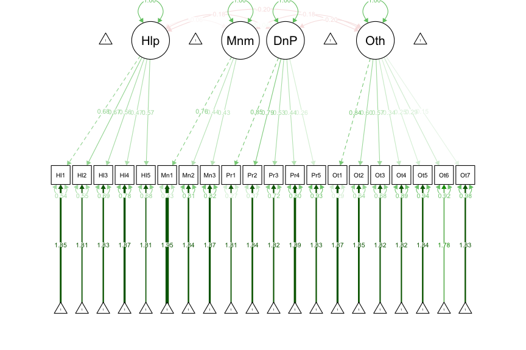
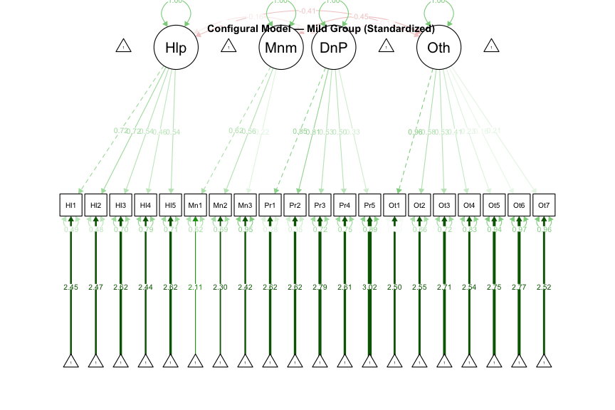

Measurement Invariance Testing: Ableist Microaggressions Scale
================
Mintay Misgano
2026-04-06

- [Overview](#overview)
- [Setup and Data Simulation](#setup-and-data-simulation)
- [CFA Model Specification](#cfa-model-specification)
- [Invariance Sequence](#invariance-sequence)
  - [Model 1 — Configural Invariance](#model-1--configural-invariance)
  - [Model 2 — Weak (Metric)
    Invariance](#model-2--weak-metric-invariance)
  - [Model 3 — Strong (Scalar)
    Invariance](#model-3--strong-scalar-invariance)
  - [Model 4 — Strict Invariance](#model-4--strict-invariance)
- [Model Comparison](#model-comparison)
  - [Formal Δχ² Tests](#formal-δχ²-tests)
  - [Fit Index Summary Table](#fit-index-summary-table)
  - [ΔCFI and Δχ² Summary](#δcfi-and-δχ²-summary)
- [APA Results Summary](#apa-results-summary)
- [Session Info](#session-info)

------------------------------------------------------------------------

## Overview

This analysis tests whether the Ableist Microaggressions Scale (AMS;
Conover et al., 2017) functions equivalently across two groups —
individuals reporting mild versus severe disability-related experiences.
Measurement invariance is a prerequisite for any cross-group comparison:
without it, observed mean differences may reflect differences in the
measurement instrument rather than real differences in the construct.

The invariance sequence follows the Vandenberg & Lance (2000) hierarchy:
configural → weak → strong → strict.

------------------------------------------------------------------------

## Setup and Data Simulation

``` r
library(lavaan)
library(semPlot)
library(psych)
library(MASS)
library(tidyverse)
library(knitr)
```

``` r
set.seed(211023)

# Factor loading matrix from Conover et al. (2017), Table 2
# Items: Help1–5, Min1–3, Pers1–5, Oth1–7
# Factors: Helplessness, Minimization, DenialPersonhood, Otherization
AMS_Imat <- matrix(c(
  # Helplessness
   .74, .75, .65, .58, .62,
   .01, .05,-.08,
   .00, .03, .01, .04, .25,
  -.06,-.02, .11, .18, .25, .26, .14,
  # Minimization
  -.03, .00, .20,-.07, .15,
   .71, .52, .47,
   .02, .04, .00,-.01, .01,
  -.18, .07, .14,-.17, .05,-.12, .16,
  # DenialPersonhood
   .11,-.07,-.03, .20, .03,
   .00, .07, .15,
   .91, .85, .64, .56, .42,
   .04, .04,-.15, .03, .13, .07, .14,
  # Otherization
  -.12, .06, .16,-.01, .02,
  -.07, .05, .20,
  -.01, .01, .19, .16, .21,
   .89, .73, .70, .46, .41, .40, .32
), ncol = 4)

item_names <- c(paste0("Help", 1:5), paste0("Min",  1:3),
                paste0("Pers", 1:5), paste0("Oth",  1:7))
factor_names <- c("Helplessness","Minimization","DenialPersonhood","Otherization")

rownames(AMS_Imat) <- item_names
colnames(AMS_Imat) <- factor_names

# Derive implied correlation matrix
communalities <- rowSums(AMS_Imat^2)
uniqueness    <- 1 - communalities
R_implied     <- AMS_Imat %*% t(AMS_Imat) + diag(uniqueness)

# Simulate N = 833 with empirical = TRUE (replicates population moments exactly)
n <- 833
raw_data <- MASS::mvrnorm(n      = n,
                          mu     = rep(2, 20),
                          Sigma  = R_implied,
                          empirical = TRUE)
colnames(raw_data) <- item_names

# Clamp to 0–5 Likert scale and round to integers
dfAMSi <- as.data.frame(apply(raw_data, 2, function(x) as.integer(pmin(pmax(round(x), 0), 5))))

# Assign Severity groups: rank by AMSm total, bottom 548 = Mild, remainder = Severe
dfAMSi$AMSm_total <- rowMeans(dfAMSi)
dfAMSi$Severity   <- ifelse(rank(dfAMSi$AMSm_total, ties.method = "first") <= 548,
                             "Mild", "Severe")
dfAMSi$AMSm_total <- NULL

cat("Dataset dimensions:", nrow(dfAMSi), "x", ncol(dfAMSi), "\n")
```

    ## Dataset dimensions: 833 x 21

``` r
cat("Severity distribution:\n")
```

    ## Severity distribution:

``` r
print(table(dfAMSi$Severity))
```

    ## 
    ##   Mild Severe 
    ##    548    285

``` r
# Descriptive statistics by group
describe(dfAMSi[dfAMSi$Severity == "Mild",   item_names]) |>
  round(2) |>
  kable(caption = "Descriptive Statistics — Mild Group")
```

|       | vars |   n | mean |   sd | median | trimmed |  mad | min | max | range |  skew | kurtosis |   se |
|:------|-----:|----:|-----:|-----:|-------:|--------:|-----:|----:|----:|------:|------:|---------:|-----:|
| Help1 |    1 | 548 | 1.79 | 0.97 |      2 |    1.80 | 1.48 |   0 |   4 |     4 |  0.12 |    -0.43 | 0.04 |
| Help2 |    2 | 548 | 1.77 | 0.98 |      2 |    1.78 | 1.48 |   0 |   4 |     4 |  0.11 |    -0.41 | 0.04 |
| Help3 |    3 | 548 | 1.74 | 0.95 |      2 |    1.77 | 1.48 |   0 |   4 |     4 | -0.01 |    -0.52 | 0.04 |
| Help4 |    4 | 548 | 1.79 | 0.95 |      2 |    1.81 | 1.48 |   0 |   5 |     5 |  0.06 |    -0.36 | 0.04 |
| Help5 |    5 | 548 | 1.77 | 0.98 |      2 |    1.79 | 1.48 |   0 |   5 |     5 |  0.09 |    -0.31 | 0.04 |
| Min1  |    6 | 548 | 1.94 | 1.00 |      2 |    1.94 | 1.48 |   0 |   5 |     5 |  0.15 |    -0.28 | 0.04 |
| Min2  |    7 | 548 | 1.85 | 1.01 |      2 |    1.84 | 1.48 |   0 |   5 |     5 |  0.28 |    -0.05 | 0.04 |
| Min3  |    8 | 548 | 1.84 | 0.99 |      2 |    1.83 | 1.48 |   0 |   5 |     5 |  0.22 |    -0.10 | 0.04 |
| Pers1 |    9 | 548 | 1.75 | 0.96 |      2 |    1.78 | 1.48 |   0 |   5 |     5 |  0.02 |    -0.35 | 0.04 |
| Pers2 |   10 | 548 | 1.76 | 0.95 |      2 |    1.79 | 1.48 |   0 |   4 |     4 | -0.03 |    -0.46 | 0.04 |
| Pers3 |   11 | 548 | 1.72 | 0.94 |      2 |    1.75 | 1.48 |   0 |   4 |     4 | -0.02 |    -0.56 | 0.04 |
| Pers4 |   12 | 548 | 1.77 | 0.94 |      2 |    1.80 | 1.48 |   0 |   4 |     4 | -0.02 |    -0.57 | 0.04 |
| Pers5 |   13 | 548 | 1.72 | 0.94 |      2 |    1.75 | 1.48 |   0 |   5 |     5 | -0.01 |    -0.29 | 0.04 |
| Oth1  |   14 | 548 | 1.72 | 0.92 |      2 |    1.75 | 1.48 |   0 |   4 |     4 | -0.01 |    -0.42 | 0.04 |
| Oth2  |   15 | 548 | 1.71 | 0.93 |      2 |    1.74 | 1.48 |   0 |   4 |     4 |  0.03 |    -0.52 | 0.04 |
| Oth3  |   16 | 548 | 1.73 | 0.95 |      2 |    1.75 | 1.48 |   0 |   5 |     5 |  0.13 |    -0.29 | 0.04 |
| Oth4  |   17 | 548 | 1.77 | 0.97 |      2 |    1.80 | 1.48 |   0 |   5 |     5 |  0.04 |    -0.26 | 0.04 |
| Oth5  |   18 | 548 | 1.71 | 0.93 |      2 |    1.73 | 1.48 |   0 |   4 |     4 |  0.07 |    -0.30 | 0.04 |
| Oth6  |   19 | 548 | 1.74 | 0.98 |      2 |    1.76 | 1.48 |   0 |   5 |     5 |  0.13 |    -0.36 | 0.04 |
| Oth7  |   20 | 548 | 1.78 | 0.97 |      2 |    1.78 | 1.48 |   0 |   5 |     5 |  0.19 |    -0.11 | 0.04 |

Descriptive Statistics — Mild Group

``` r
describe(dfAMSi[dfAMSi$Severity == "Severe", item_names]) |>
  round(2) |>
  kable(caption = "Descriptive Statistics — Severe Group")
```

|       | vars |   n | mean |   sd | median | trimmed |  mad | min | max | range |  skew | kurtosis |   se |
|:------|-----:|----:|-----:|-----:|-------:|--------:|-----:|----:|----:|------:|------:|---------:|-----:|
| Help1 |    1 | 285 | 2.41 | 0.99 |      2 |    2.39 | 1.48 |   0 |   5 |     5 |  0.12 |     0.04 | 0.06 |
| Help2 |    2 | 285 | 2.45 | 0.99 |      2 |    2.43 | 1.48 |   0 |   5 |     5 |  0.07 |     0.08 | 0.06 |
| Help3 |    3 | 285 | 2.51 | 0.96 |      2 |    2.48 | 1.48 |   1 |   5 |     4 |  0.35 |    -0.37 | 0.06 |
| Help4 |    4 | 285 | 2.42 | 1.00 |      2 |    2.42 | 1.48 |   0 |   5 |     5 | -0.08 |    -0.16 | 0.06 |
| Help5 |    5 | 285 | 2.47 | 0.94 |      2 |    2.45 | 1.48 |   0 |   5 |     5 |  0.17 |    -0.04 | 0.06 |
| Min1  |    6 | 285 | 2.11 | 1.00 |      2 |    2.11 | 1.48 |   0 |   5 |     5 | -0.06 |    -0.32 | 0.06 |
| Min2  |    7 | 285 | 2.28 | 0.99 |      2 |    2.25 | 1.48 |   0 |   5 |     5 |  0.01 |    -0.17 | 0.06 |
| Min3  |    8 | 285 | 2.33 | 0.97 |      2 |    2.34 | 1.48 |   0 |   5 |     5 | -0.24 |    -0.18 | 0.06 |
| Pers1 |    9 | 285 | 2.55 | 0.97 |      3 |    2.56 | 1.48 |   0 |   5 |     5 | -0.08 |    -0.23 | 0.06 |
| Pers2 |   10 | 285 | 2.47 | 0.94 |      2 |    2.48 | 1.48 |   0 |   4 |     4 | -0.09 |    -0.50 | 0.06 |
| Pers3 |   11 | 285 | 2.58 | 0.93 |      3 |    2.59 | 1.48 |   0 |   5 |     5 | -0.14 |    -0.03 | 0.05 |
| Pers4 |   12 | 285 | 2.51 | 0.96 |      3 |    2.53 | 1.48 |   0 |   4 |     4 | -0.17 |    -0.57 | 0.06 |
| Pers5 |   13 | 285 | 2.58 | 0.85 |      3 |    2.59 | 1.48 |   0 |   5 |     5 |  0.01 |    -0.35 | 0.05 |
| Oth1  |   14 | 285 | 2.54 | 1.02 |      3 |    2.55 | 1.48 |   0 |   5 |     5 | -0.03 |    -0.26 | 0.06 |
| Oth2  |   15 | 285 | 2.53 | 0.99 |      3 |    2.52 | 1.48 |   0 |   5 |     5 |  0.08 |    -0.27 | 0.06 |
| Oth3  |   16 | 285 | 2.53 | 0.93 |      3 |    2.53 | 1.48 |   0 |   5 |     5 |  0.03 |    -0.33 | 0.06 |
| Oth4  |   17 | 285 | 2.46 | 0.97 |      2 |    2.45 | 1.48 |   0 |   5 |     5 |  0.12 |    -0.21 | 0.06 |
| Oth5  |   18 | 285 | 2.56 | 0.93 |      3 |    2.57 | 1.48 |   0 |   5 |     5 |  0.03 |    -0.25 | 0.06 |
| Oth6  |   19 | 285 | 2.51 | 0.91 |      3 |    2.52 | 1.48 |   0 |   5 |     5 | -0.06 |    -0.07 | 0.05 |
| Oth7  |   20 | 285 | 2.46 | 0.98 |      2 |    2.46 | 1.48 |   0 |   5 |     5 |  0.04 |    -0.36 | 0.06 |

Descriptive Statistics — Severe Group

------------------------------------------------------------------------

## CFA Model Specification

``` r
AMS4CorrMod <- '
  Helplessness     =~ Help1 + Help2 + Help3 + Help4 + Help5
  Minimization     =~ Min1  + Min2  + Min3
  DenialPersonhood =~ Pers1 + Pers2 + Pers3 + Pers4 + Pers5
  Otherization     =~ Oth1  + Oth2  + Oth3  + Oth4  + Oth5  + Oth6 + Oth7
'
```

The four-factor correlated model mirrors the structure proposed by
Conover et al. (2017):

- **Helplessness** (5 items): experiences in which others treat the
  person as incapable
- **Minimization** (3 items): dismissal or denial of disability-related
  experiences
- **Denial of Personhood** (5 items): dehumanizing or objectifying
  treatment
- **Otherization** (7 items): exclusion, othering, and marginalization

------------------------------------------------------------------------

## Invariance Sequence

### Model 1 — Configural Invariance

The configural model tests whether the same factor structure (pattern of
loadings) holds in both groups. All parameters are freely estimated in
each group.

``` r
fit_configural <- lavaan::cfa(AMS4CorrMod,
                              data       = dfAMSi,
                              group      = "Severity",
                              estimator  = "ML")

summary(fit_configural, fit.measures = TRUE, standardized = TRUE)
```

    ## lavaan 0.6-20 ended normally after 55 iterations
    ## 
    ##   Estimator                                         ML
    ##   Optimization method                           NLMINB
    ##   Number of model parameters                       132
    ## 
    ##   Number of observations per group:                   
    ##     Mild                                           548
    ##     Severe                                         285
    ## 
    ## Model Test User Model:
    ##                                                       
    ##   Test statistic                               645.786
    ##   Degrees of freedom                               328
    ##   P-value (Chi-square)                           0.000
    ##   Test statistic for each group:
    ##     Mild                                       362.781
    ##     Severe                                     283.005
    ## 
    ## Model Test Baseline Model:
    ## 
    ##   Test statistic                              3376.620
    ##   Degrees of freedom                               380
    ##   P-value                                        0.000
    ## 
    ## User Model versus Baseline Model:
    ## 
    ##   Comparative Fit Index (CFI)                    0.894
    ##   Tucker-Lewis Index (TLI)                       0.877
    ## 
    ## Loglikelihood and Information Criteria:
    ## 
    ##   Loglikelihood user model (H0)             -21585.345
    ##   Loglikelihood unrestricted model (H1)     -21262.452
    ##                                                       
    ##   Akaike (AIC)                               43434.690
    ##   Bayesian (BIC)                             44058.394
    ##   Sample-size adjusted Bayesian (SABIC)      43639.208
    ## 
    ## Root Mean Square Error of Approximation:
    ## 
    ##   RMSEA                                          0.048
    ##   90 Percent confidence interval - lower         0.043
    ##   90 Percent confidence interval - upper         0.054
    ##   P-value H_0: RMSEA <= 0.050                    0.696
    ##   P-value H_0: RMSEA >= 0.080                    0.000
    ## 
    ## Standardized Root Mean Square Residual:
    ## 
    ##   SRMR                                           0.066
    ## 
    ## Parameter Estimates:
    ## 
    ##   Standard errors                             Standard
    ##   Information                                 Expected
    ##   Information saturated (h1) model          Structured
    ## 
    ## 
    ## Group 1 [Mild]:
    ## 
    ## Latent Variables:
    ##                       Estimate  Std.Err  z-value  P(>|z|)   Std.lv  Std.all
    ##   Helplessness =~                                                          
    ##     Help1                1.000                               0.656    0.679
    ##     Help2                1.001    0.088   11.407    0.000    0.656    0.674
    ##     Help3                0.802    0.080   10.090    0.000    0.526    0.555
    ##     Help4                0.684    0.077    8.826    0.000    0.448    0.470
    ##     Help5                0.850    0.083   10.289    0.000    0.557    0.570
    ##   Minimization =~                                                          
    ##     Min1                 1.000                               0.753    0.755
    ##     Min2                 0.585    0.120    4.861    0.000    0.441    0.437
    ##     Min3                 0.561    0.116    4.848    0.000    0.422    0.428
    ##   DenialPersonhood =~                                                      
    ##     Pers1                1.000                               0.823    0.854
    ##     Pers2                0.917    0.058   15.816    0.000    0.755    0.792
    ##     Pers3                0.609    0.052   11.645    0.000    0.501    0.533
    ##     Pers4                0.506    0.052    9.675    0.000    0.417    0.445
    ##     Pers5                0.292    0.053    5.510    0.000    0.241    0.256
    ##   Otherization =~                                                          
    ##     Oth1                 1.000                               0.778    0.842
    ##     Oth2                 0.717    0.063   11.296    0.000    0.557    0.602
    ##     Oth3                 0.691    0.064   10.824    0.000    0.537    0.565
    ##     Oth4                 0.422    0.061    6.888    0.000    0.328    0.338
    ##     Oth5                 0.303    0.058    5.200    0.000    0.235    0.252
    ##     Oth6                 0.364    0.061    5.928    0.000    0.283    0.289
    ##     Oth7                 0.187    0.060    3.116    0.002    0.146    0.150
    ## 
    ## Covariances:
    ##                       Estimate  Std.Err  z-value  P(>|z|)   Std.lv  Std.all
    ##   Helplessness ~~                                                          
    ##     Minimization        -0.029    0.031   -0.952    0.341   -0.059   -0.059
    ##     DenialPersonhd      -0.096    0.030   -3.211    0.001   -0.179   -0.179
    ##     Otherization        -0.104    0.029   -3.537    0.000   -0.204   -0.204
    ##   Minimization ~~                                                          
    ##     DenialPersonhd       0.027    0.036    0.732    0.464    0.043    0.043
    ##     Otherization        -0.107    0.036   -2.985    0.003   -0.183   -0.183
    ##   DenialPersonhood ~~                                                      
    ##     Otherization        -0.127    0.034   -3.689    0.000   -0.198   -0.198
    ## 
    ## Intercepts:
    ##                    Estimate  Std.Err  z-value  P(>|z|)   Std.lv  Std.all
    ##    .Help1             1.790    0.041   43.402    0.000    1.790    1.854
    ##    .Help2             1.766    0.042   42.445    0.000    1.766    1.813
    ##    .Help3             1.737    0.040   42.912    0.000    1.737    1.833
    ##    .Help4             1.786    0.041   43.869    0.000    1.786    1.874
    ##    .Help5             1.768    0.042   42.348    0.000    1.768    1.809
    ##    .Min1              1.943    0.043   45.609    0.000    1.943    1.948
    ##    .Min2              1.850    0.043   43.014    0.000    1.850    1.837
    ##    .Min3              1.841    0.042   43.697    0.000    1.841    1.867
    ##    .Pers1             1.748    0.041   42.452    0.000    1.748    1.813
    ##    .Pers2             1.759    0.041   43.189    0.000    1.759    1.845
    ##    .Pers3             1.717    0.040   42.722    0.000    1.717    1.825
    ##    .Pers4             1.768    0.040   44.157    0.000    1.768    1.886
    ##    .Pers5             1.719    0.040   42.786    0.000    1.719    1.828
    ##    .Oth1              1.724    0.039   43.711    0.000    1.724    1.867
    ##    .Oth2              1.714    0.040   43.312    0.000    1.714    1.850
    ##    .Oth3              1.734    0.041   42.695    0.000    1.734    1.824
    ##    .Oth4              1.768    0.041   42.676    0.000    1.768    1.823
    ##    .Oth5              1.712    0.040   42.973    0.000    1.712    1.836
    ##    .Oth6              1.743    0.042   41.611    0.000    1.743    1.778
    ##    .Oth7              1.779    0.041   42.910    0.000    1.779    1.833
    ## 
    ## Variances:
    ##                    Estimate  Std.Err  z-value  P(>|z|)   Std.lv  Std.all
    ##    .Help1             0.503    0.043   11.600    0.000    0.503    0.539
    ##    .Help2             0.518    0.044   11.738    0.000    0.518    0.546
    ##    .Help3             0.621    0.044   14.013    0.000    0.621    0.692
    ##    .Help4             0.708    0.047   14.951    0.000    0.708    0.779
    ##    .Help5             0.645    0.047   13.806    0.000    0.645    0.675
    ##    .Min1              0.428    0.114    3.767    0.000    0.428    0.430
    ##    .Min2              0.820    0.063   13.037    0.000    0.820    0.809
    ##    .Min3              0.795    0.060   13.280    0.000    0.795    0.817
    ##    .Pers1             0.252    0.038    6.683    0.000    0.252    0.271
    ##    .Pers2             0.339    0.036    9.468    0.000    0.339    0.373
    ##    .Pers3             0.634    0.042   15.215    0.000    0.634    0.716
    ##    .Pers4             0.705    0.045   15.737    0.000    0.705    0.802
    ##    .Pers5             0.827    0.051   16.326    0.000    0.827    0.935
    ##    .Oth1              0.248    0.043    5.744    0.000    0.248    0.291
    ##    .Oth2              0.547    0.040   13.531    0.000    0.547    0.638
    ##    .Oth3              0.615    0.043   14.148    0.000    0.615    0.680
    ##    .Oth4              0.833    0.052   15.976    0.000    0.833    0.886
    ##    .Oth5              0.814    0.050   16.256    0.000    0.814    0.936
    ##    .Oth6              0.881    0.055   16.152    0.000    0.881    0.917
    ##    .Oth7              0.921    0.056   16.454    0.000    0.921    0.978
    ##     Helplessness      0.430    0.057    7.590    0.000    1.000    1.000
    ##     Minimization      0.567    0.123    4.605    0.000    1.000    1.000
    ##     DenialPersonhd    0.677    0.064   10.569    0.000    1.000    1.000
    ##     Otherization      0.605    0.064    9.474    0.000    1.000    1.000
    ## 
    ## 
    ## Group 2 [Severe]:
    ## 
    ## Latent Variables:
    ##                       Estimate  Std.Err  z-value  P(>|z|)   Std.lv  Std.all
    ##   Helplessness =~                                                          
    ##     Help1                1.000                               0.707    0.717
    ##     Help2                1.009    0.108    9.343    0.000    0.713    0.718
    ##     Help3                0.738    0.096    7.656    0.000    0.521    0.545
    ##     Help4                0.645    0.098    6.565    0.000    0.456    0.459
    ##     Help5                0.719    0.095    7.586    0.000    0.508    0.539
    ##   Minimization =~                                                          
    ##     Min1                 1.000                               0.619    0.619
    ##     Min2                 0.888    0.196    4.527    0.000    0.549    0.555
    ##     Min3                 0.343    0.129    2.653    0.008    0.212    0.220
    ##   DenialPersonhood =~                                                      
    ##     Pers1                1.000                               0.825    0.850
    ##     Pers2                0.922    0.075   12.325    0.000    0.761    0.808
    ##     Pers3                0.597    0.070    8.577    0.000    0.492    0.533
    ##     Pers4                0.587    0.073    8.093    0.000    0.485    0.504
    ##     Pers5                0.346    0.066    5.275    0.000    0.286    0.335
    ##   Otherization =~                                                          
    ##     Oth1                 1.000                               0.972    0.956
    ##     Oth2                 0.593    0.063    9.346    0.000    0.576    0.582
    ##     Oth3                 0.506    0.059    8.516    0.000    0.492    0.528
    ##     Oth4                 0.405    0.061    6.597    0.000    0.394    0.407
    ##     Oth5                 0.225    0.059    3.811    0.000    0.219    0.235
    ##     Oth6                 0.152    0.058    2.636    0.008    0.148    0.162
    ##     Oth7                 0.211    0.062    3.417    0.001    0.205    0.211
    ## 
    ## Covariances:
    ##                       Estimate  Std.Err  z-value  P(>|z|)   Std.lv  Std.all
    ##   Helplessness ~~                                                          
    ##     Minimization         0.015    0.041    0.362    0.718    0.034    0.034
    ##     DenialPersonhd      -0.093    0.044   -2.108    0.035   -0.159   -0.159
    ##     Otherization        -0.282    0.054   -5.203    0.000   -0.410   -0.410
    ##   Minimization ~~                                                          
    ##     DenialPersonhd      -0.073    0.046   -1.581    0.114   -0.143   -0.143
    ##     Otherization        -0.272    0.059   -4.578    0.000   -0.453   -0.453
    ##   DenialPersonhood ~~                                                      
    ##     Otherization        -0.105    0.054   -1.929    0.054   -0.131   -0.131
    ## 
    ## Intercepts:
    ##                    Estimate  Std.Err  z-value  P(>|z|)   Std.lv  Std.all
    ##    .Help1             2.411    0.058   41.280    0.000    2.411    2.445
    ##    .Help2             2.446    0.059   41.623    0.000    2.446    2.466
    ##    .Help3             2.509    0.057   44.238    0.000    2.509    2.620
    ##    .Help4             2.421    0.059   41.127    0.000    2.421    2.436
    ##    .Help5             2.470    0.056   44.260    0.000    2.470    2.622
    ##    .Min1              2.105    0.059   35.551    0.000    2.105    2.106
    ##    .Min2              2.277    0.059   38.848    0.000    2.277    2.301
    ##    .Min3              2.333    0.057   40.825    0.000    2.333    2.418
    ##    .Pers1             2.547    0.058   44.297    0.000    2.547    2.624
    ##    .Pers2             2.467    0.056   44.203    0.000    2.467    2.618
    ##    .Pers3             2.579    0.055   47.104    0.000    2.579    2.790
    ##    .Pers4             2.509    0.057   44.070    0.000    2.509    2.610
    ##    .Pers5             2.579    0.051   51.028    0.000    2.579    3.023
    ##    .Oth1              2.540    0.060   42.168    0.000    2.540    2.498
    ##    .Oth2              2.526    0.059   43.101    0.000    2.526    2.553
    ##    .Oth3              2.526    0.055   45.808    0.000    2.526    2.713
    ##    .Oth4              2.456    0.057   42.863    0.000    2.456    2.539
    ##    .Oth5              2.565    0.055   46.414    0.000    2.565    2.749
    ##    .Oth6              2.512    0.054   46.686    0.000    2.512    2.765
    ##    .Oth7              2.460    0.058   42.600    0.000    2.460    2.523
    ## 
    ## Variances:
    ##                    Estimate  Std.Err  z-value  P(>|z|)   Std.lv  Std.all
    ##    .Help1             0.472    0.058    8.139    0.000    0.472    0.486
    ##    .Help2             0.476    0.059    8.104    0.000    0.476    0.484
    ##    .Help3             0.645    0.062   10.460    0.000    0.645    0.703
    ##    .Help4             0.780    0.071   11.013    0.000    0.780    0.790
    ##    .Help5             0.630    0.060   10.505    0.000    0.630    0.710
    ##    .Min1              0.617    0.098    6.316    0.000    0.617    0.617
    ##    .Min2              0.678    0.087    7.782    0.000    0.678    0.692
    ##    .Min3              0.886    0.077   11.513    0.000    0.886    0.952
    ##    .Pers1             0.262    0.048    5.422    0.000    0.262    0.278
    ##    .Pers2             0.309    0.045    6.833    0.000    0.309    0.348
    ##    .Pers3             0.612    0.055   11.037    0.000    0.612    0.716
    ##    .Pers4             0.689    0.062   11.166    0.000    0.689    0.746
    ##    .Pers5             0.646    0.055   11.657    0.000    0.646    0.888
    ##    .Oth1              0.089    0.063    1.417    0.157    0.089    0.086
    ##    .Oth2              0.647    0.059   10.885    0.000    0.647    0.661
    ##    .Oth3              0.625    0.056   11.240    0.000    0.625    0.721
    ##    .Oth4              0.781    0.067   11.657    0.000    0.781    0.834
    ##    .Oth5              0.822    0.069   11.873    0.000    0.822    0.945
    ##    .Oth6              0.804    0.067   11.909    0.000    0.804    0.974
    ##    .Oth7              0.908    0.076   11.887    0.000    0.908    0.956
    ##     Helplessness      0.499    0.083    6.027    0.000    1.000    1.000
    ##     Minimization      0.383    0.106    3.614    0.000    1.000    1.000
    ##     DenialPersonhd    0.681    0.087    7.805    0.000    1.000    1.000
    ##     Otherization      0.945    0.107    8.857    0.000    1.000    1.000

``` r
semPlot::semPaths(fit_configural,
                  what       = "std",
                  which      = "first",
                  layout     = "tree",
                  style      = "ram",
                  edge.label.cex = 0.6,
                  sizeMan    = 4,
                  sizeLat    = 8,
                  title      = FALSE,
                  mar        = c(3, 3, 3, 3))
```

<figure>

<figcaption aria-hidden="true">Figure 1. Configural model path diagram
(Mild group)</figcaption>
</figure>

``` r
title("Configural Model — Mild Group (Standardized)", cex.main = 0.9)
```

<figure>

<figcaption aria-hidden="true">Figure 1. Configural model path diagram
(Mild group)</figcaption>
</figure>

------------------------------------------------------------------------

### Model 2 — Weak (Metric) Invariance

Weak invariance constrains factor loadings to be equal across groups
while all other parameters remain free. Supported weak invariance means
the latent constructs are measured on the same scale across groups.

``` r
fit_weak <- lavaan::cfa(AMS4CorrMod,
                        data        = dfAMSi,
                        group       = "Severity",
                        group.equal = "loadings",
                        estimator   = "ML")

summary(fit_weak, fit.measures = TRUE, standardized = TRUE)
```

    ## lavaan 0.6-20 ended normally after 47 iterations
    ## 
    ##   Estimator                                         ML
    ##   Optimization method                           NLMINB
    ##   Number of model parameters                       132
    ##   Number of equality constraints                    16
    ## 
    ##   Number of observations per group:                   
    ##     Mild                                           548
    ##     Severe                                         285
    ## 
    ## Model Test User Model:
    ##                                                       
    ##   Test statistic                               664.594
    ##   Degrees of freedom                               344
    ##   P-value (Chi-square)                           0.000
    ##   Test statistic for each group:
    ##     Mild                                       369.537
    ##     Severe                                     295.057
    ## 
    ## Model Test Baseline Model:
    ## 
    ##   Test statistic                              3376.620
    ##   Degrees of freedom                               380
    ##   P-value                                        0.000
    ## 
    ## User Model versus Baseline Model:
    ## 
    ##   Comparative Fit Index (CFI)                    0.893
    ##   Tucker-Lewis Index (TLI)                       0.882
    ## 
    ## Loglikelihood and Information Criteria:
    ## 
    ##   Loglikelihood user model (H0)             -21594.749
    ##   Loglikelihood unrestricted model (H1)     -21262.452
    ##                                                       
    ##   Akaike (AIC)                               43421.498
    ##   Bayesian (BIC)                             43969.602
    ##   Sample-size adjusted Bayesian (SABIC)      43601.226
    ## 
    ## Root Mean Square Error of Approximation:
    ## 
    ##   RMSEA                                          0.047
    ##   90 Percent confidence interval - lower         0.042
    ##   90 Percent confidence interval - upper         0.053
    ##   P-value H_0: RMSEA <= 0.050                    0.791
    ##   P-value H_0: RMSEA >= 0.080                    0.000
    ## 
    ## Standardized Root Mean Square Residual:
    ## 
    ##   SRMR                                           0.067
    ## 
    ## Parameter Estimates:
    ## 
    ##   Standard errors                             Standard
    ##   Information                                 Expected
    ##   Information saturated (h1) model          Structured
    ## 
    ## 
    ## Group 1 [Mild]:
    ## 
    ## Latent Variables:
    ##                       Estimate  Std.Err  z-value  P(>|z|)   Std.lv  Std.all
    ##   Helplessness =~                                                          
    ##     Help1                1.000                               0.667    0.688
    ##     Help2   (.p2.)       0.998    0.068   14.684    0.000    0.666    0.680
    ##     Help3   (.p3.)       0.779    0.061   12.699    0.000    0.520    0.550
    ##     Help4   (.p4.)       0.668    0.061   11.001    0.000    0.445    0.468
    ##     Help5   (.p5.)       0.799    0.062   12.820    0.000    0.533    0.550
    ##   Minimization =~                                                          
    ##     Min1                 1.000                               0.761    0.763
    ##     Min2    (.p7.)       0.626    0.101    6.209    0.000    0.476    0.468
    ##     Min3    (.p8.)       0.485    0.083    5.857    0.000    0.369    0.378
    ##   DenialPersonhood =~                                                      
    ##     Pers1                1.000                               0.820    0.852
    ##     Pers2   (.10.)       0.918    0.046   20.083    0.000    0.753    0.791
    ##     Pers3   (.11.)       0.604    0.042   14.470    0.000    0.495    0.528
    ##     Pers4   (.12.)       0.534    0.042   12.584    0.000    0.438    0.463
    ##     Pers5   (.13.)       0.313    0.041    7.612    0.000    0.257    0.272
    ##   Otherization =~                                                          
    ##     Oth1                 1.000                               0.816    0.878
    ##     Oth2    (.15.)       0.655    0.045   14.533    0.000    0.535    0.579
    ##     Oth3    (.16.)       0.600    0.044   13.691    0.000    0.490    0.522
    ##     Oth4    (.17.)       0.413    0.044    9.485    0.000    0.337    0.346
    ##     Oth5    (.18.)       0.264    0.042    6.347    0.000    0.215    0.232
    ##     Oth6    (.19.)       0.268    0.042    6.331    0.000    0.219    0.226
    ##     Oth7    (.20.)       0.199    0.043    4.615    0.000    0.163    0.167
    ## 
    ## Covariances:
    ##                       Estimate  Std.Err  z-value  P(>|z|)   Std.lv  Std.all
    ##   Helplessness ~~                                                          
    ##     Minimization        -0.027    0.031   -0.870    0.384   -0.054   -0.054
    ##     DenialPersonhd      -0.097    0.030   -3.219    0.001   -0.178   -0.178
    ##     Otherization        -0.118    0.031   -3.864    0.000   -0.217   -0.217
    ##   Minimization ~~                                                          
    ##     DenialPersonhd       0.024    0.036    0.663    0.507    0.039    0.039
    ##     Otherization        -0.122    0.037   -3.301    0.001   -0.197   -0.197
    ##   DenialPersonhood ~~                                                      
    ##     Otherization        -0.124    0.035   -3.534    0.000   -0.185   -0.185
    ## 
    ## Intercepts:
    ##                    Estimate  Std.Err  z-value  P(>|z|)   Std.lv  Std.all
    ##    .Help1             1.790    0.041   43.202    0.000    1.790    1.845
    ##    .Help2             1.766    0.042   42.235    0.000    1.766    1.804
    ##    .Help3             1.737    0.040   43.021    0.000    1.737    1.838
    ##    .Help4             1.786    0.041   43.919    0.000    1.786    1.876
    ##    .Help5             1.768    0.041   42.726    0.000    1.768    1.825
    ##    .Min1              1.943    0.043   45.626    0.000    1.943    1.949
    ##    .Min2              1.850    0.044   42.529    0.000    1.850    1.817
    ##    .Min3              1.841    0.042   44.199    0.000    1.841    1.888
    ##    .Pers1             1.748    0.041   42.525    0.000    1.748    1.817
    ##    .Pers2             1.759    0.041   43.263    0.000    1.759    1.848
    ##    .Pers3             1.717    0.040   42.849    0.000    1.717    1.830
    ##    .Pers4             1.768    0.040   43.783    0.000    1.768    1.870
    ##    .Pers5             1.719    0.040   42.618    0.000    1.719    1.821
    ##    .Oth1              1.724    0.040   43.424    0.000    1.724    1.855
    ##    .Oth2              1.714    0.039   43.429    0.000    1.714    1.855
    ##    .Oth3              1.734    0.040   43.211    0.000    1.734    1.846
    ##    .Oth4              1.768    0.042   42.479    0.000    1.768    1.815
    ##    .Oth5              1.712    0.040   43.099    0.000    1.712    1.841
    ##    .Oth6              1.743    0.041   42.105    0.000    1.743    1.799
    ##    .Oth7              1.779    0.042   42.802    0.000    1.779    1.828
    ## 
    ## Variances:
    ##                    Estimate  Std.Err  z-value  P(>|z|)   Std.lv  Std.all
    ##    .Help1             0.496    0.042   11.831    0.000    0.496    0.527
    ##    .Help2             0.515    0.043   12.023    0.000    0.515    0.538
    ##    .Help3             0.624    0.044   14.317    0.000    0.624    0.698
    ##    .Help4             0.708    0.047   15.115    0.000    0.708    0.781
    ##    .Help5             0.655    0.046   14.320    0.000    0.655    0.697
    ##    .Min1              0.416    0.098    4.262    0.000    0.416    0.418
    ##    .Min2              0.811    0.062   12.992    0.000    0.811    0.781
    ##    .Min3              0.815    0.055   14.745    0.000    0.815    0.857
    ##    .Pers1             0.254    0.034    7.415    0.000    0.254    0.274
    ##    .Pers2             0.339    0.033   10.170    0.000    0.339    0.375
    ##    .Pers3             0.635    0.041   15.332    0.000    0.635    0.721
    ##    .Pers4             0.702    0.045   15.699    0.000    0.702    0.786
    ##    .Pers5             0.825    0.051   16.310    0.000    0.825    0.926
    ##    .Oth1              0.198    0.041    4.781    0.000    0.198    0.229
    ##    .Oth2              0.567    0.040   14.333    0.000    0.567    0.664
    ##    .Oth3              0.642    0.043   15.029    0.000    0.642    0.728
    ##    .Oth4              0.836    0.052   16.068    0.000    0.836    0.880
    ##    .Oth5              0.818    0.050   16.359    0.000    0.818    0.946
    ##    .Oth6              0.891    0.054   16.370    0.000    0.891    0.949
    ##    .Oth7              0.920    0.056   16.456    0.000    0.920    0.972
    ##     Helplessness      0.445    0.051    8.762    0.000    1.000    1.000
    ##     Minimization      0.578    0.106    5.474    0.000    1.000    1.000
    ##     DenialPersonhd    0.672    0.059   11.462    0.000    1.000    1.000
    ##     Otherization      0.666    0.062   10.831    0.000    1.000    1.000
    ## 
    ## 
    ## Group 2 [Severe]:
    ## 
    ## Latent Variables:
    ##                       Estimate  Std.Err  z-value  P(>|z|)   Std.lv  Std.all
    ##   Helplessness =~                                                          
    ##     Help1                1.000                               0.689    0.705
    ##     Help2   (.p2.)       0.998    0.068   14.684    0.000    0.688    0.700
    ##     Help3   (.p3.)       0.779    0.061   12.699    0.000    0.537    0.558
    ##     Help4   (.p4.)       0.668    0.061   11.001    0.000    0.460    0.462
    ##     Help5   (.p5.)       0.799    0.062   12.820    0.000    0.551    0.575
    ##   Minimization =~                                                          
    ##     Min1                 1.000                               0.678    0.677
    ##     Min2    (.p7.)       0.626    0.101    6.209    0.000    0.424    0.438
    ##     Min3    (.p8.)       0.485    0.083    5.857    0.000    0.329    0.333
    ##   DenialPersonhood =~                                                      
    ##     Pers1                1.000                               0.832    0.855
    ##     Pers2   (.10.)       0.918    0.046   20.083    0.000    0.764    0.809
    ##     Pers3   (.11.)       0.604    0.042   14.470    0.000    0.503    0.541
    ##     Pers4   (.12.)       0.534    0.042   12.584    0.000    0.445    0.470
    ##     Pers5   (.13.)       0.313    0.041    7.612    0.000    0.261    0.308
    ##   Otherization =~                                                          
    ##     Oth1                 1.000                               0.920    0.913
    ##     Oth2    (.15.)       0.655    0.045   14.533    0.000    0.603    0.606
    ##     Oth3    (.16.)       0.600    0.044   13.691    0.000    0.552    0.581
    ##     Oth4    (.17.)       0.413    0.044    9.485    0.000    0.380    0.396
    ##     Oth5    (.18.)       0.264    0.042    6.347    0.000    0.243    0.259
    ##     Oth6    (.19.)       0.268    0.042    6.331    0.000    0.247    0.266
    ##     Oth7    (.20.)       0.199    0.043    4.615    0.000    0.183    0.189
    ## 
    ## Covariances:
    ##                       Estimate  Std.Err  z-value  P(>|z|)   Std.lv  Std.all
    ##   Helplessness ~~                                                          
    ##     Minimization         0.021    0.043    0.480    0.631    0.044    0.044
    ##     DenialPersonhd      -0.093    0.043   -2.160    0.031   -0.162   -0.162
    ##     Otherization        -0.265    0.050   -5.291    0.000   -0.418   -0.418
    ##   Minimization ~~                                                          
    ##     DenialPersonhd      -0.075    0.050   -1.518    0.129   -0.133   -0.133
    ##     Otherization        -0.258    0.057   -4.530    0.000   -0.414   -0.414
    ##   DenialPersonhood ~~                                                      
    ##     Otherization        -0.133    0.054   -2.482    0.013   -0.174   -0.174
    ## 
    ## Intercepts:
    ##                    Estimate  Std.Err  z-value  P(>|z|)   Std.lv  Std.all
    ##    .Help1             2.411    0.058   41.628    0.000    2.411    2.466
    ##    .Help2             2.446    0.058   41.997    0.000    2.446    2.488
    ##    .Help3             2.509    0.057   44.026    0.000    2.509    2.608
    ##    .Help4             2.421    0.059   41.036    0.000    2.421    2.431
    ##    .Help5             2.470    0.057   43.521    0.000    2.470    2.578
    ##    .Min1              2.105    0.059   35.519    0.000    2.105    2.104
    ##    .Min2              2.277    0.057   39.703    0.000    2.277    2.352
    ##    .Min3              2.333    0.059   39.872    0.000    2.333    2.362
    ##    .Pers1             2.547    0.058   44.154    0.000    2.547    2.615
    ##    .Pers2             2.467    0.056   44.068    0.000    2.467    2.610
    ##    .Pers3             2.579    0.055   46.838    0.000    2.579    2.774
    ##    .Pers4             2.509    0.056   44.772    0.000    2.509    2.652
    ##    .Pers5             2.579    0.050   51.402    0.000    2.579    3.045
    ##    .Oth1              2.540    0.060   42.554    0.000    2.540    2.521
    ##    .Oth2              2.526    0.059   42.887    0.000    2.526    2.540
    ##    .Oth3              2.526    0.056   44.822    0.000    2.526    2.655
    ##    .Oth4              2.456    0.057   43.225    0.000    2.456    2.560
    ##    .Oth5              2.565    0.056   46.156    0.000    2.565    2.734
    ##    .Oth6              2.512    0.055   45.624    0.000    2.512    2.703
    ##    .Oth7              2.460    0.057   42.804    0.000    2.460    2.535
    ## 
    ## Variances:
    ##                    Estimate  Std.Err  z-value  P(>|z|)   Std.lv  Std.all
    ##    .Help1             0.481    0.054    8.842    0.000    0.481    0.503
    ##    .Help2             0.493    0.055    8.931    0.000    0.493    0.511
    ##    .Help3             0.637    0.060   10.557    0.000    0.637    0.689
    ##    .Help4             0.780    0.070   11.121    0.000    0.780    0.787
    ##    .Help5             0.615    0.059   10.423    0.000    0.615    0.670
    ##    .Min1              0.542    0.099    5.472    0.000    0.542    0.541
    ##    .Min2              0.757    0.074   10.253    0.000    0.757    0.808
    ##    .Min3              0.868    0.078   11.151    0.000    0.868    0.889
    ##    .Pers1             0.256    0.043    5.965    0.000    0.256    0.270
    ##    .Pers2             0.309    0.041    7.509    0.000    0.309    0.346
    ##    .Pers3             0.611    0.055   11.107    0.000    0.611    0.707
    ##    .Pers4             0.697    0.061   11.374    0.000    0.697    0.779
    ##    .Pers5             0.649    0.055   11.729    0.000    0.649    0.905
    ##    .Oth1              0.169    0.050    3.376    0.001    0.169    0.167
    ##    .Oth2              0.625    0.058   10.751    0.000    0.625    0.632
    ##    .Oth3              0.600    0.055   10.924    0.000    0.600    0.663
    ##    .Oth4              0.776    0.067   11.612    0.000    0.776    0.843
    ##    .Oth5              0.821    0.069   11.818    0.000    0.821    0.933
    ##    .Oth6              0.803    0.068   11.810    0.000    0.803    0.929
    ##    .Oth7              0.908    0.076   11.877    0.000    0.908    0.964
    ##     Helplessness      0.475    0.065    7.330    0.000    1.000    1.000
    ##     Minimization      0.459    0.105    4.393    0.000    1.000    1.000
    ##     DenialPersonhd    0.693    0.077    8.987    0.000    1.000    1.000
    ##     Otherization      0.846    0.093    9.096    0.000    1.000    1.000

------------------------------------------------------------------------

### Model 3 — Strong (Scalar) Invariance

Strong invariance additionally constrains item intercepts to equality.
This is required to make meaningful latent mean comparisons across
groups.

``` r
fit_strong <- lavaan::cfa(AMS4CorrMod,
                          data        = dfAMSi,
                          group       = "Severity",
                          group.equal = c("loadings","intercepts"),
                          estimator   = "ML")

summary(fit_strong, fit.measures = TRUE, standardized = TRUE)
```

    ## lavaan 0.6-20 ended normally after 61 iterations
    ## 
    ##   Estimator                                         ML
    ##   Optimization method                           NLMINB
    ##   Number of model parameters                       136
    ##   Number of equality constraints                    36
    ## 
    ##   Number of observations per group:                   
    ##     Mild                                           548
    ##     Severe                                         285
    ## 
    ## Model Test User Model:
    ##                                                       
    ##   Test statistic                               955.930
    ##   Degrees of freedom                               360
    ##   P-value (Chi-square)                           0.000
    ##   Test statistic for each group:
    ##     Mild                                       483.071
    ##     Severe                                     472.859
    ## 
    ## Model Test Baseline Model:
    ## 
    ##   Test statistic                              3376.620
    ##   Degrees of freedom                               380
    ##   P-value                                        0.000
    ## 
    ## User Model versus Baseline Model:
    ## 
    ##   Comparative Fit Index (CFI)                    0.801
    ##   Tucker-Lewis Index (TLI)                       0.790
    ## 
    ## Loglikelihood and Information Criteria:
    ## 
    ##   Loglikelihood user model (H0)             -21740.417
    ##   Loglikelihood unrestricted model (H1)     -21262.452
    ##                                                       
    ##   Akaike (AIC)                               43680.834
    ##   Bayesian (BIC)                             44153.337
    ##   Sample-size adjusted Bayesian (SABIC)      43835.772
    ## 
    ## Root Mean Square Error of Approximation:
    ## 
    ##   RMSEA                                          0.063
    ##   90 Percent confidence interval - lower         0.058
    ##   90 Percent confidence interval - upper         0.068
    ##   P-value H_0: RMSEA <= 0.050                    0.000
    ##   P-value H_0: RMSEA >= 0.080                    0.000
    ## 
    ## Standardized Root Mean Square Residual:
    ## 
    ##   SRMR                                           0.080
    ## 
    ## Parameter Estimates:
    ## 
    ##   Standard errors                             Standard
    ##   Information                                 Expected
    ##   Information saturated (h1) model          Structured
    ## 
    ## 
    ## Group 1 [Mild]:
    ## 
    ## Latent Variables:
    ##                       Estimate  Std.Err  z-value  P(>|z|)   Std.lv  Std.all
    ##   Helplessness =~                                                          
    ##     Help1                1.000                               0.623    0.653
    ##     Help2   (.p2.)       1.031    0.060   17.084    0.000    0.642    0.664
    ##     Help3   (.p3.)       0.907    0.058   15.579    0.000    0.565    0.586
    ##     Help4   (.p4.)       0.760    0.057   13.361    0.000    0.473    0.491
    ##     Help5   (.p5.)       0.895    0.058   15.429    0.000    0.558    0.571
    ##   Minimization =~                                                          
    ##     Min1                 1.000                               0.564    0.572
    ##     Min2    (.p7.)       1.028    0.130    7.904    0.000    0.580    0.566
    ##     Min3    (.p8.)       0.830    0.108    7.660    0.000    0.468    0.474
    ##   DenialPersonhood =~                                                      
    ##     Pers1                1.000                               0.776    0.823
    ##     Pers2   (.10.)       0.921    0.037   24.798    0.000    0.715    0.770
    ##     Pers3   (.11.)       0.728    0.039   18.736    0.000    0.565    0.581
    ##     Pers4   (.12.)       0.637    0.039   16.244    0.000    0.494    0.509
    ##     Pers5   (.13.)       0.500    0.040   12.616    0.000    0.388    0.388
    ##   Otherization =~                                                          
    ##     Oth1                 1.000                               0.669    0.747
    ##     Oth2    (.15.)       0.841    0.045   18.721    0.000    0.563    0.614
    ##     Oth3    (.16.)       0.809    0.044   18.369    0.000    0.542    0.577
    ##     Oth4    (.17.)       0.589    0.045   13.059    0.000    0.394    0.398
    ##     Oth5    (.18.)       0.533    0.045   11.754    0.000    0.357    0.367
    ##     Oth6    (.19.)       0.512    0.045   11.282    0.000    0.343    0.342
    ##     Oth7    (.20.)       0.415    0.046    9.043    0.000    0.278    0.277
    ## 
    ## Covariances:
    ##                       Estimate  Std.Err  z-value  P(>|z|)   Std.lv  Std.all
    ##   Helplessness ~~                                                          
    ##     Minimization        -0.030    0.024   -1.278    0.201   -0.086   -0.086
    ##     DenialPersonhd      -0.085    0.027   -3.148    0.002   -0.175   -0.175
    ##     Otherization        -0.067    0.024   -2.751    0.006   -0.160   -0.160
    ##   Minimization ~~                                                          
    ##     DenialPersonhd       0.022    0.028    0.792    0.428    0.050    0.050
    ##     Otherization        -0.035    0.025   -1.404    0.160   -0.094   -0.094
    ##   DenialPersonhood ~~                                                      
    ##     Otherization        -0.101    0.029   -3.501    0.000   -0.194   -0.194
    ## 
    ## Intercepts:
    ##                    Estimate  Std.Err  z-value  P(>|z|)   Std.lv  Std.all
    ##    .Help1   (.51.)    1.754    0.039   45.323    0.000    1.754    1.838
    ##    .Help2   (.52.)    1.743    0.039   44.335    0.000    1.743    1.804
    ##    .Help3   (.53.)    1.776    0.039   46.099    0.000    1.776    1.842
    ##    .Help4   (.54.)    1.814    0.038   47.910    0.000    1.814    1.883
    ##    .Help5   (.55.)    1.788    0.039   46.067    0.000    1.788    1.830
    ##    .Min1    (.56.)    1.881    0.040   47.032    0.000    1.881    1.909
    ##    .Min2    (.57.)    1.870    0.041   45.182    0.000    1.870    1.828
    ##    .Min3    (.58.)    1.902    0.039   48.922    0.000    1.902    1.927
    ##    .Pers1   (.59.)    1.715    0.039   43.408    0.000    1.715    1.817
    ##    .Pers2   (.60.)    1.717    0.038   44.769    0.000    1.717    1.850
    ##    .Pers3   (.61.)    1.789    0.038   46.627    0.000    1.789    1.841
    ##    .Pers4   (.62.)    1.826    0.038   48.350    0.000    1.826    1.881
    ##    .Pers5   (.63.)    1.876    0.038   49.812    0.000    1.876    1.873
    ##    .Oth1    (.64.)    1.666    0.037   44.517    0.000    1.666    1.860
    ##    .Oth2    (.65.)    1.704    0.037   45.550    0.000    1.704    1.857
    ##    .Oth3    (.66.)    1.727    0.038   45.666    0.000    1.727    1.839
    ##    .Oth4    (.67.)    1.803    0.039   46.763    0.000    1.803    1.823
    ##    .Oth5    (.68.)    1.816    0.038   47.865    0.000    1.816    1.871
    ##    .Oth6    (.69.)    1.834    0.039   47.382    0.000    1.834    1.833
    ##    .Oth7    (.70.)    1.870    0.039   48.384    0.000    1.870    1.865
    ## 
    ## Variances:
    ##                    Estimate  Std.Err  z-value  P(>|z|)   Std.lv  Std.all
    ##    .Help1             0.523    0.041   12.812    0.000    0.523    0.574
    ##    .Help2             0.522    0.042   12.571    0.000    0.522    0.559
    ##    .Help3             0.611    0.044   13.935    0.000    0.611    0.657
    ##    .Help4             0.704    0.047   14.967    0.000    0.704    0.759
    ##    .Help5             0.644    0.045   14.144    0.000    0.644    0.674
    ##    .Min1              0.653    0.061   10.632    0.000    0.653    0.673
    ##    .Min2              0.711    0.066   10.815    0.000    0.711    0.679
    ##    .Min3              0.755    0.057   13.133    0.000    0.755    0.775
    ##    .Pers1             0.287    0.031    9.290    0.000    0.287    0.323
    ##    .Pers2             0.350    0.031   11.333    0.000    0.350    0.407
    ##    .Pers3             0.625    0.042   14.854    0.000    0.625    0.662
    ##    .Pers4             0.698    0.045   15.400    0.000    0.698    0.741
    ##    .Pers5             0.853    0.053   15.980    0.000    0.853    0.850
    ##    .Oth1              0.354    0.034   10.398    0.000    0.354    0.442
    ##    .Oth2              0.526    0.039   13.596    0.000    0.526    0.624
    ##    .Oth3              0.589    0.042   14.153    0.000    0.589    0.667
    ##    .Oth4              0.823    0.053   15.664    0.000    0.823    0.841
    ##    .Oth5              0.816    0.052   15.815    0.000    0.816    0.865
    ##    .Oth6              0.884    0.055   15.930    0.000    0.884    0.883
    ##    .Oth7              0.928    0.057   16.163    0.000    0.928    0.923
    ##     Helplessness      0.388    0.042    9.136    0.000    1.000    1.000
    ##     Minimization      0.318    0.057    5.547    0.000    1.000    1.000
    ##     DenialPersonhd    0.602    0.051   11.822    0.000    1.000    1.000
    ##     Otherization      0.448    0.043   10.397    0.000    1.000    1.000
    ## 
    ## 
    ## Group 2 [Severe]:
    ## 
    ## Latent Variables:
    ##                       Estimate  Std.Err  z-value  P(>|z|)   Std.lv  Std.all
    ##   Helplessness =~                                                          
    ##     Help1                1.000                               0.640    0.667
    ##     Help2   (.p2.)       1.031    0.060   17.084    0.000    0.660    0.677
    ##     Help3   (.p3.)       0.907    0.058   15.579    0.000    0.580    0.591
    ##     Help4   (.p4.)       0.760    0.057   13.361    0.000    0.486    0.482
    ##     Help5   (.p5.)       0.895    0.058   15.429    0.000    0.573    0.592
    ##   Minimization =~                                                          
    ##     Min1                 1.000                               0.495    0.499
    ##     Min2    (.p7.)       1.028    0.130    7.904    0.000    0.508    0.522
    ##     Min3    (.p8.)       0.830    0.108    7.660    0.000    0.411    0.404
    ##   DenialPersonhood =~                                                      
    ##     Pers1                1.000                               0.787    0.826
    ##     Pers2   (.10.)       0.921    0.037   24.798    0.000    0.725    0.784
    ##     Pers3   (.11.)       0.728    0.039   18.736    0.000    0.573    0.588
    ##     Pers4   (.12.)       0.637    0.039   16.244    0.000    0.501    0.515
    ##     Pers5   (.13.)       0.500    0.040   12.616    0.000    0.394    0.423
    ##   Otherization =~                                                          
    ##     Oth1                 1.000                               0.715    0.749
    ##     Oth2    (.15.)       0.841    0.045   18.721    0.000    0.602    0.608
    ##     Oth3    (.16.)       0.809    0.044   18.369    0.000    0.579    0.615
    ##     Oth4    (.17.)       0.589    0.045   13.059    0.000    0.421    0.432
    ##     Oth5    (.18.)       0.533    0.045   11.754    0.000    0.381    0.378
    ##     Oth6    (.19.)       0.512    0.045   11.282    0.000    0.366    0.373
    ##     Oth7    (.20.)       0.415    0.046    9.043    0.000    0.297    0.294
    ## 
    ## Covariances:
    ##                       Estimate  Std.Err  z-value  P(>|z|)   Std.lv  Std.all
    ##   Helplessness ~~                                                          
    ##     Minimization        -0.000    0.031   -0.015    0.988   -0.001   -0.001
    ##     DenialPersonhd      -0.090    0.038   -2.345    0.019   -0.178   -0.178
    ##     Otherization        -0.179    0.038   -4.673    0.000   -0.390   -0.390
    ##   Minimization ~~                                                          
    ##     DenialPersonhd      -0.046    0.037   -1.238    0.216   -0.118   -0.118
    ##     Otherization        -0.133    0.037   -3.579    0.000   -0.376   -0.376
    ##   DenialPersonhood ~~                                                      
    ##     Otherization        -0.155    0.043   -3.576    0.000   -0.275   -0.275
    ## 
    ## Intercepts:
    ##                    Estimate  Std.Err  z-value  P(>|z|)   Std.lv  Std.all
    ##    .Help1   (.51.)    1.754    0.039   45.323    0.000    1.754    1.827
    ##    .Help2   (.52.)    1.743    0.039   44.335    0.000    1.743    1.789
    ##    .Help3   (.53.)    1.776    0.039   46.099    0.000    1.776    1.809
    ##    .Help4   (.54.)    1.814    0.038   47.910    0.000    1.814    1.799
    ##    .Help5   (.55.)    1.788    0.039   46.067    0.000    1.788    1.847
    ##    .Min1    (.56.)    1.881    0.040   47.032    0.000    1.881    1.899
    ##    .Min2    (.57.)    1.870    0.041   45.182    0.000    1.870    1.922
    ##    .Min3    (.58.)    1.902    0.039   48.922    0.000    1.902    1.870
    ##    .Pers1   (.59.)    1.715    0.039   43.408    0.000    1.715    1.799
    ##    .Pers2   (.60.)    1.717    0.038   44.769    0.000    1.717    1.855
    ##    .Pers3   (.61.)    1.789    0.038   46.627    0.000    1.789    1.836
    ##    .Pers4   (.62.)    1.826    0.038   48.350    0.000    1.826    1.876
    ##    .Pers5   (.63.)    1.876    0.038   49.812    0.000    1.876    2.013
    ##    .Oth1    (.64.)    1.666    0.037   44.517    0.000    1.666    1.743
    ##    .Oth2    (.65.)    1.704    0.037   45.550    0.000    1.704    1.723
    ##    .Oth3    (.66.)    1.727    0.038   45.666    0.000    1.727    1.834
    ##    .Oth4    (.67.)    1.803    0.039   46.763    0.000    1.803    1.851
    ##    .Oth5    (.68.)    1.816    0.038   47.865    0.000    1.816    1.800
    ##    .Oth6    (.69.)    1.834    0.039   47.382    0.000    1.834    1.867
    ##    .Oth7    (.70.)    1.870    0.039   48.384    0.000    1.870    1.852
    ##     Hlplssn           0.724    0.059   12.169    0.000    1.130    1.130
    ##     Minmztn           0.359    0.059    6.086    0.000    0.727    0.727
    ##     DnlPrsn           0.898    0.065   13.750    0.000    1.140    1.140
    ##     Othrztn           1.001    0.063   15.771    0.000    1.399    1.399
    ## 
    ## Variances:
    ##                    Estimate  Std.Err  z-value  P(>|z|)   Std.lv  Std.all
    ##    .Help1             0.512    0.054    9.435    0.000    0.512    0.556
    ##    .Help2             0.514    0.055    9.289    0.000    0.514    0.542
    ##    .Help3             0.628    0.061   10.278    0.000    0.628    0.651
    ##    .Help4             0.780    0.071   11.011    0.000    0.780    0.767
    ##    .Help5             0.609    0.059   10.265    0.000    0.609    0.650
    ##    .Min1              0.737    0.080    9.262    0.000    0.737    0.751
    ##    .Min2              0.689    0.078    8.867    0.000    0.689    0.727
    ##    .Min3              0.865    0.083   10.481    0.000    0.865    0.837
    ##    .Pers1             0.288    0.040    7.133    0.000    0.288    0.317
    ##    .Pers2             0.330    0.040    8.313    0.000    0.330    0.386
    ##    .Pers3             0.621    0.057   10.805    0.000    0.621    0.654
    ##    .Pers4             0.696    0.062   11.171    0.000    0.696    0.735
    ##    .Pers5             0.714    0.062   11.477    0.000    0.714    0.821
    ##    .Oth1              0.402    0.049    8.194    0.000    0.402    0.440
    ##    .Oth2              0.617    0.060   10.242    0.000    0.617    0.630
    ##    .Oth3              0.552    0.054   10.176    0.000    0.552    0.622
    ##    .Oth4              0.772    0.068   11.283    0.000    0.772    0.813
    ##    .Oth5              0.873    0.076   11.466    0.000    0.873    0.857
    ##    .Oth6              0.831    0.072   11.479    0.000    0.831    0.861
    ##    .Oth7              0.931    0.080   11.670    0.000    0.931    0.913
    ##     Helplessness      0.410    0.055    7.498    0.000    1.000    1.000
    ##     Minimization      0.245    0.058    4.224    0.000    1.000    1.000
    ##     DenialPersonhd    0.620    0.068    9.108    0.000    1.000    1.000
    ##     Otherization      0.512    0.063    8.140    0.000    1.000    1.000

------------------------------------------------------------------------

### Model 4 — Strict Invariance

Strict invariance additionally constrains residual variances to
equality, which implies identical item reliabilities across groups.

``` r
fit_strict <- lavaan::cfa(AMS4CorrMod,
                          data        = dfAMSi,
                          group       = "Severity",
                          group.equal = c("loadings","intercepts","residuals"),
                          estimator   = "ML")

summary(fit_strict, fit.measures = TRUE, standardized = TRUE)
```

    ## lavaan 0.6-20 ended normally after 61 iterations
    ## 
    ##   Estimator                                         ML
    ##   Optimization method                           NLMINB
    ##   Number of model parameters                       136
    ##   Number of equality constraints                    56
    ## 
    ##   Number of observations per group:                   
    ##     Mild                                           548
    ##     Severe                                         285
    ## 
    ## Model Test User Model:
    ##                                                       
    ##   Test statistic                               965.333
    ##   Degrees of freedom                               380
    ##   P-value (Chi-square)                           0.000
    ##   Test statistic for each group:
    ##     Mild                                       485.074
    ##     Severe                                     480.259
    ## 
    ## Model Test Baseline Model:
    ## 
    ##   Test statistic                              3376.620
    ##   Degrees of freedom                               380
    ##   P-value                                        0.000
    ## 
    ## User Model versus Baseline Model:
    ## 
    ##   Comparative Fit Index (CFI)                    0.805
    ##   Tucker-Lewis Index (TLI)                       0.805
    ## 
    ## Loglikelihood and Information Criteria:
    ## 
    ##   Loglikelihood user model (H0)             -21745.118
    ##   Loglikelihood unrestricted model (H1)     -21262.452
    ##                                                       
    ##   Akaike (AIC)                               43650.237
    ##   Bayesian (BIC)                             44028.239
    ##   Sample-size adjusted Bayesian (SABIC)      43774.187
    ## 
    ## Root Mean Square Error of Approximation:
    ## 
    ##   RMSEA                                          0.061
    ##   90 Percent confidence interval - lower         0.056
    ##   90 Percent confidence interval - upper         0.066
    ##   P-value H_0: RMSEA <= 0.050                    0.000
    ##   P-value H_0: RMSEA >= 0.080                    0.000
    ## 
    ## Standardized Root Mean Square Residual:
    ## 
    ##   SRMR                                           0.081
    ## 
    ## Parameter Estimates:
    ## 
    ##   Standard errors                             Standard
    ##   Information                                 Expected
    ##   Information saturated (h1) model          Structured
    ## 
    ## 
    ## Group 1 [Mild]:
    ## 
    ## Latent Variables:
    ##                       Estimate  Std.Err  z-value  P(>|z|)   Std.lv  Std.all
    ##   Helplessness =~                                                          
    ##     Help1                1.000                               0.623    0.654
    ##     Help2   (.p2.)       1.031    0.060   17.064    0.000    0.642    0.665
    ##     Help3   (.p3.)       0.908    0.058   15.596    0.000    0.565    0.585
    ##     Help4   (.p4.)       0.761    0.057   13.416    0.000    0.474    0.485
    ##     Help5   (.p5.)       0.896    0.058   15.396    0.000    0.558    0.575
    ##   Minimization =~                                                          
    ##     Min1                 1.000                               0.551    0.553
    ##     Min2    (.p7.)       1.058    0.135    7.869    0.000    0.583    0.574
    ##     Min3    (.p8.)       0.830    0.109    7.621    0.000    0.457    0.456
    ##   DenialPersonhood =~                                                      
    ##     Pers1                1.000                               0.777    0.823
    ##     Pers2   (.10.)       0.923    0.037   24.749    0.000    0.717    0.775
    ##     Pers3   (.11.)       0.728    0.039   18.725    0.000    0.565    0.582
    ##     Pers4   (.12.)       0.637    0.039   16.231    0.000    0.494    0.509
    ##     Pers5   (.13.)       0.493    0.040   12.336    0.000    0.383    0.393
    ##   Otherization =~                                                          
    ##     Oth1                 1.000                               0.666    0.739
    ##     Oth2    (.15.)       0.841    0.044   18.989    0.000    0.561    0.601
    ##     Oth3    (.16.)       0.809    0.044   18.384    0.000    0.539    0.579
    ##     Oth4    (.17.)       0.586    0.045   12.985    0.000    0.390    0.399
    ##     Oth5    (.18.)       0.533    0.045   11.827    0.000    0.355    0.362
    ##     Oth6    (.19.)       0.508    0.045   11.182    0.000    0.339    0.342
    ##     Oth7    (.20.)       0.415    0.046    9.055    0.000    0.276    0.276
    ## 
    ## Covariances:
    ##                       Estimate  Std.Err  z-value  P(>|z|)   Std.lv  Std.all
    ##   Helplessness ~~                                                          
    ##     Minimization        -0.028    0.023   -1.215    0.224   -0.082   -0.082
    ##     DenialPersonhd      -0.085    0.027   -3.147    0.002   -0.175   -0.175
    ##     Otherization        -0.065    0.024   -2.693    0.007   -0.158   -0.158
    ##   Minimization ~~                                                          
    ##     DenialPersonhd       0.021    0.027    0.760    0.447    0.049    0.049
    ##     Otherization        -0.033    0.025   -1.323    0.186   -0.090   -0.090
    ##   DenialPersonhood ~~                                                      
    ##     Otherization        -0.102    0.029   -3.547    0.000   -0.198   -0.198
    ## 
    ## Intercepts:
    ##                    Estimate  Std.Err  z-value  P(>|z|)   Std.lv  Std.all
    ##    .Help1   (.51.)    1.755    0.039   45.386    0.000    1.755    1.842
    ##    .Help2   (.52.)    1.743    0.039   44.374    0.000    1.743    1.806
    ##    .Help3   (.53.)    1.776    0.039   46.011    0.000    1.776    1.837
    ##    .Help4   (.54.)    1.815    0.038   47.566    0.000    1.815    1.858
    ##    .Help5   (.55.)    1.787    0.039   46.195    0.000    1.787    1.840
    ##    .Min1    (.56.)    1.877    0.040   46.715    0.000    1.877    1.884
    ##    .Min2    (.57.)    1.868    0.041   45.272    0.000    1.868    1.838
    ##    .Min3    (.58.)    1.909    0.039   48.788    0.000    1.909    1.902
    ##    .Pers1   (.59.)    1.715    0.040   43.385    0.000    1.715    1.817
    ##    .Pers2   (.60.)    1.718    0.038   44.882    0.000    1.718    1.857
    ##    .Pers3   (.61.)    1.789    0.038   46.635    0.000    1.789    1.842
    ##    .Pers4   (.62.)    1.827    0.038   48.357    0.000    1.827    1.882
    ##    .Pers5   (.63.)    1.862    0.037   50.047    0.000    1.862    1.908
    ##    .Oth1    (.64.)    1.662    0.038   44.238    0.000    1.662    1.844
    ##    .Oth2    (.65.)    1.704    0.038   45.118    0.000    1.704    1.828
    ##    .Oth3    (.66.)    1.729    0.038   46.022    0.000    1.729    1.856
    ##    .Oth4    (.67.)    1.804    0.038   47.111    0.000    1.804    1.842
    ##    .Oth5    (.68.)    1.822    0.038   47.754    0.000    1.822    1.857
    ##    .Oth6    (.69.)    1.832    0.038   47.649    0.000    1.832    1.849
    ##    .Oth7    (.70.)    1.870    0.039   48.447    0.000    1.870    1.865
    ## 
    ## Variances:
    ##                    Estimate  Std.Err  z-value  P(>|z|)   Std.lv  Std.all
    ##    .Help1   (.21.)    0.519    0.033   15.516    0.000    0.519    0.572
    ##    .Help2   (.22.)    0.520    0.034   15.211    0.000    0.520    0.558
    ##    .Help3   (.23.)    0.616    0.036   17.029    0.000    0.616    0.658
    ##    .Help4   (.24.)    0.729    0.040   18.421    0.000    0.729    0.765
    ##    .Help5   (.25.)    0.631    0.037   17.200    0.000    0.631    0.670
    ##    .Min1    (.26.)    0.689    0.052   13.275    0.000    0.689    0.694
    ##    .Min2    (.27.)    0.692    0.055   12.507    0.000    0.692    0.671
    ##    .Min3    (.28.)    0.797    0.049   16.292    0.000    0.797    0.792
    ##    .Pers1   (.29.)    0.288    0.026   11.121    0.000    0.288    0.323
    ##    .Pers2   (.30.)    0.342    0.025   13.492    0.000    0.342    0.400
    ##    .Pers3   (.31.)    0.624    0.034   18.229    0.000    0.624    0.661
    ##    .Pers4   (.32.)    0.698    0.037   18.934    0.000    0.698    0.740
    ##    .Pers5   (.33.)    0.805    0.041   19.649    0.000    0.805    0.846
    ##    .Oth1    (.34.)    0.368    0.029   12.716    0.000    0.368    0.453
    ##    .Oth2    (.35.)    0.555    0.033   16.765    0.000    0.555    0.638
    ##    .Oth3    (.36.)    0.576    0.034   17.178    0.000    0.576    0.665
    ##    .Oth4    (.37.)    0.806    0.042   19.224    0.000    0.806    0.841
    ##    .Oth5    (.38.)    0.836    0.043   19.465    0.000    0.836    0.869
    ##    .Oth6    (.39.)    0.868    0.044   19.582    0.000    0.868    0.883
    ##    .Oth7    (.40.)    0.929    0.047   19.897    0.000    0.929    0.924
    ##     Hlplssn           0.388    0.042    9.158    0.000    1.000    1.000
    ##     Minmztn           0.304    0.055    5.478    0.000    1.000    1.000
    ##     DnlPrsn           0.603    0.051   11.855    0.000    1.000    1.000
    ##     Othrztn           0.444    0.043   10.378    0.000    1.000    1.000
    ## 
    ## 
    ## Group 2 [Severe]:
    ## 
    ## Latent Variables:
    ##                       Estimate  Std.Err  z-value  P(>|z|)   Std.lv  Std.all
    ##   Helplessness =~                                                          
    ##     Help1                1.000                               0.639    0.664
    ##     Help2   (.p2.)       1.031    0.060   17.064    0.000    0.659    0.675
    ##     Help3   (.p3.)       0.908    0.058   15.596    0.000    0.580    0.594
    ##     Help4   (.p4.)       0.761    0.057   13.416    0.000    0.486    0.495
    ##     Help5   (.p5.)       0.896    0.058   15.396    0.000    0.573    0.585
    ##   Minimization =~                                                          
    ##     Min1                 1.000                               0.498    0.515
    ##     Min2    (.p7.)       1.058    0.135    7.869    0.000    0.527    0.535
    ##     Min3    (.p8.)       0.830    0.109    7.621    0.000    0.414    0.420
    ##   DenialPersonhood =~                                                      
    ##     Pers1                1.000                               0.787    0.826
    ##     Pers2   (.10.)       0.923    0.037   24.749    0.000    0.726    0.779
    ##     Pers3   (.11.)       0.728    0.039   18.725    0.000    0.573    0.587
    ##     Pers4   (.12.)       0.637    0.039   16.231    0.000    0.501    0.514
    ##     Pers5   (.13.)       0.493    0.040   12.336    0.000    0.388    0.397
    ##   Otherization =~                                                          
    ##     Oth1                 1.000                               0.726    0.767
    ##     Oth2    (.15.)       0.841    0.044   18.989    0.000    0.611    0.634
    ##     Oth3    (.16.)       0.809    0.044   18.384    0.000    0.588    0.612
    ##     Oth4    (.17.)       0.586    0.045   12.985    0.000    0.426    0.428
    ##     Oth5    (.18.)       0.533    0.045   11.827    0.000    0.387    0.390
    ##     Oth6    (.19.)       0.508    0.045   11.182    0.000    0.369    0.369
    ##     Oth7    (.20.)       0.415    0.046    9.055    0.000    0.301    0.298
    ## 
    ## Covariances:
    ##                       Estimate  Std.Err  z-value  P(>|z|)   Std.lv  Std.all
    ##   Helplessness ~~                                                          
    ##     Minimization        -0.001    0.031   -0.045    0.964   -0.004   -0.004
    ##     DenialPersonhd      -0.090    0.038   -2.339    0.019   -0.178   -0.178
    ##     Otherization        -0.184    0.039   -4.770    0.000   -0.396   -0.396
    ##   Minimization ~~                                                          
    ##     DenialPersonhd      -0.044    0.037   -1.205    0.228   -0.112   -0.112
    ##     Otherization        -0.131    0.037   -3.546    0.000   -0.362   -0.362
    ##   DenialPersonhood ~~                                                      
    ##     Otherization        -0.150    0.044   -3.446    0.001   -0.263   -0.263
    ## 
    ## Intercepts:
    ##                    Estimate  Std.Err  z-value  P(>|z|)   Std.lv  Std.all
    ##    .Help1   (.51.)    1.755    0.039   45.386    0.000    1.755    1.821
    ##    .Help2   (.52.)    1.743    0.039   44.374    0.000    1.743    1.785
    ##    .Help3   (.53.)    1.776    0.039   46.011    0.000    1.776    1.820
    ##    .Help4   (.54.)    1.815    0.038   47.566    0.000    1.815    1.847
    ##    .Help5   (.55.)    1.787    0.039   46.195    0.000    1.787    1.824
    ##    .Min1    (.56.)    1.877    0.040   46.715    0.000    1.877    1.939
    ##    .Min2    (.57.)    1.868    0.041   45.272    0.000    1.868    1.896
    ##    .Min3    (.58.)    1.909    0.039   48.788    0.000    1.909    1.939
    ##    .Pers1   (.59.)    1.715    0.040   43.385    0.000    1.715    1.800
    ##    .Pers2   (.60.)    1.718    0.038   44.882    0.000    1.718    1.843
    ##    .Pers3   (.61.)    1.789    0.038   46.635    0.000    1.789    1.834
    ##    .Pers4   (.62.)    1.827    0.038   48.357    0.000    1.827    1.875
    ##    .Pers5   (.63.)    1.862    0.037   50.047    0.000    1.862    1.904
    ##    .Oth1    (.64.)    1.662    0.038   44.238    0.000    1.662    1.756
    ##    .Oth2    (.65.)    1.704    0.038   45.118    0.000    1.704    1.769
    ##    .Oth3    (.66.)    1.729    0.038   46.022    0.000    1.729    1.801
    ##    .Oth4    (.67.)    1.804    0.038   47.111    0.000    1.804    1.815
    ##    .Oth5    (.68.)    1.822    0.038   47.754    0.000    1.822    1.835
    ##    .Oth6    (.69.)    1.832    0.038   47.649    0.000    1.832    1.829
    ##    .Oth7    (.70.)    1.870    0.039   48.447    0.000    1.870    1.852
    ##     Hlplssn           0.724    0.059   12.172    0.000    1.132    1.132
    ##     Minmztn           0.356    0.058    6.087    0.000    0.714    0.714
    ##     DnlPrsn           0.896    0.065   13.719    0.000    1.138    1.138
    ##     Othrztn           0.997    0.063   15.720    0.000    1.373    1.373
    ## 
    ## Variances:
    ##                    Estimate  Std.Err  z-value  P(>|z|)   Std.lv  Std.all
    ##    .Help1   (.21.)    0.519    0.033   15.516    0.000    0.519    0.560
    ##    .Help2   (.22.)    0.520    0.034   15.211    0.000    0.520    0.545
    ##    .Help3   (.23.)    0.616    0.036   17.029    0.000    0.616    0.647
    ##    .Help4   (.24.)    0.729    0.040   18.421    0.000    0.729    0.755
    ##    .Help5   (.25.)    0.631    0.037   17.200    0.000    0.631    0.658
    ##    .Min1    (.26.)    0.689    0.052   13.275    0.000    0.689    0.735
    ##    .Min2    (.27.)    0.692    0.055   12.507    0.000    0.692    0.713
    ##    .Min3    (.28.)    0.797    0.049   16.292    0.000    0.797    0.823
    ##    .Pers1   (.29.)    0.288    0.026   11.121    0.000    0.288    0.317
    ##    .Pers2   (.30.)    0.342    0.025   13.492    0.000    0.342    0.394
    ##    .Pers3   (.31.)    0.624    0.034   18.229    0.000    0.624    0.655
    ##    .Pers4   (.32.)    0.698    0.037   18.934    0.000    0.698    0.735
    ##    .Pers5   (.33.)    0.805    0.041   19.649    0.000    0.805    0.842
    ##    .Oth1    (.34.)    0.368    0.029   12.716    0.000    0.368    0.411
    ##    .Oth2    (.35.)    0.555    0.033   16.765    0.000    0.555    0.598
    ##    .Oth3    (.36.)    0.576    0.034   17.178    0.000    0.576    0.625
    ##    .Oth4    (.37.)    0.806    0.042   19.224    0.000    0.806    0.817
    ##    .Oth5    (.38.)    0.836    0.043   19.465    0.000    0.836    0.848
    ##    .Oth6    (.39.)    0.868    0.044   19.582    0.000    0.868    0.864
    ##    .Oth7    (.40.)    0.929    0.047   19.897    0.000    0.929    0.911
    ##     Hlplssn           0.409    0.054    7.514    0.000    1.000    1.000
    ##     Minmztn           0.248    0.056    4.462    0.000    1.000    1.000
    ##     DnlPrsn           0.619    0.068    9.133    0.000    1.000    1.000
    ##     Othrztn           0.528    0.063    8.358    0.000    1.000    1.000

------------------------------------------------------------------------

## Model Comparison

### Formal Δχ² Tests

``` r
lavaan::lavTestLRT(fit_configural, fit_weak, fit_strong, fit_strict)
```

    ## 
    ## Chi-Squared Difference Test
    ## 
    ##                 Df   AIC   BIC  Chisq Chisq diff   RMSEA Df diff Pr(>Chisq)    
    ## fit_configural 328 43435 44058 645.79                                          
    ## fit_weak       344 43421 43970 664.59     18.809 0.02053      16     0.2787    
    ## fit_strong     360 43681 44153 955.93    291.336 0.20327      16     <2e-16 ***
    ## fit_strict     380 43650 44028 965.33      9.403 0.00000      20     0.9778    
    ## ---
    ## Signif. codes:  0 '***' 0.001 '**' 0.01 '*' 0.05 '.' 0.1 ' ' 1

### Fit Index Summary Table

``` r
# Extract fit indices for each model
extract_fit <- function(fit, model_name) {
  fi <- lavaan::fitMeasures(fit, c("chisq","df","pvalue","cfi","tli",
                                    "rmsea","rmsea.ci.lower","rmsea.ci.upper",
                                    "srmr","aic","bic"))
  data.frame(
    Model  = model_name,
    chi2   = round(fi["chisq"],  3),
    df     = fi["df"],
    p      = round(fi["pvalue"], 3),
    CFI    = round(fi["cfi"],    3),
    TLI    = round(fi["tli"],    3),
    RMSEA  = round(fi["rmsea"],  3),
    RMSEA_CI = paste0("[", round(fi["rmsea.ci.lower"],3), ", ",
                           round(fi["rmsea.ci.upper"],3), "]"),
    SRMR   = round(fi["srmr"],   3),
    AIC    = round(fi["aic"],    2),
    BIC    = round(fi["bic"],    2)
  )
}

fit_table <- rbind(
  extract_fit(fit_configural, "Configural"),
  extract_fit(fit_weak,       "Weak"),
  extract_fit(fit_strong,     "Strong"),
  extract_fit(fit_strict,     "Strict")
)

kable(fit_table,
      col.names = c("Model","χ²","df","p","CFI","TLI","RMSEA","90% CI","SRMR","AIC","BIC"),
      caption   = "Table 1. Fit Indices for Measurement Invariance Sequence — AMS")
```

|  | Model | χ² | df | p | CFI | TLI | RMSEA | 90% CI | SRMR | AIC | BIC |
|:---|:---|---:|---:|---:|---:|---:|---:|:---|---:|---:|---:|
| chisq | Configural | 645.786 | 328 | 0 | 0.894 | 0.877 | 0.048 | \[0.043, 0.054\] | 0.066 | 43434.69 | 44058.39 |
| chisq1 | Weak | 664.594 | 344 | 0 | 0.893 | 0.882 | 0.047 | \[0.042, 0.053\] | 0.067 | 43421.50 | 43969.60 |
| chisq2 | Strong | 955.930 | 360 | 0 | 0.801 | 0.790 | 0.063 | \[0.058, 0.068\] | 0.080 | 43680.83 | 44153.34 |
| chisq3 | Strict | 965.333 | 380 | 0 | 0.805 | 0.805 | 0.061 | \[0.056, 0.066\] | 0.081 | 43650.24 | 44028.24 |

Table 1. Fit Indices for Measurement Invariance Sequence — AMS

### ΔCFI and Δχ² Summary

``` r
# Compute ΔCFI across sequential models
cfi_vals <- sapply(list(fit_configural, fit_weak, fit_strong, fit_strict),
                   function(f) lavaan::fitMeasures(f, "cfi"))
chi_vals  <- sapply(list(fit_configural, fit_weak, fit_strong, fit_strict),
                    function(f) lavaan::fitMeasures(f, "chisq"))
df_vals   <- sapply(list(fit_configural, fit_weak, fit_strong, fit_strict),
                    function(f) lavaan::fitMeasures(f, "df"))

delta_df <- data.frame(
  Comparison       = c("—", "Weak vs. Configural", "Strong vs. Weak", "Strict vs. Strong"),
  Delta_chi2       = c(NA, diff(chi_vals)),
  Delta_df         = c(NA, diff(df_vals)),
  Delta_CFI        = c(NA, diff(cfi_vals)),
  Decision         = c("—", "Supported", "Not supported", "Not tested")
)

kable(delta_df,
      col.names = c("Comparison","Δχ²","Δdf","ΔCFI","Decision"),
      caption   = "Table 2. Sequential Model Comparison — Δχ² and ΔCFI",
      digits    = 3)
```

| Comparison          |     Δχ² | Δdf |   ΔCFI | Decision      |
|:--------------------|--------:|----:|-------:|:--------------|
| —                   |      NA |  NA |     NA | —             |
| Weak vs. Configural |  18.809 |  16 | -0.001 | Supported     |
| Strong vs. Weak     | 291.336 |  16 | -0.092 | Not supported |
| Strict vs. Strong   |   9.403 |  20 |  0.004 | Not tested    |

Table 2. Sequential Model Comparison — Δχ² and ΔCFI

------------------------------------------------------------------------

## APA Results Summary

``` r
fi_c <- lavaan::fitMeasures(fit_configural, c("chisq","df","pvalue","cfi","rmsea",
                                               "rmsea.ci.lower","rmsea.ci.upper","srmr"))
fi_w <- lavaan::fitMeasures(fit_weak,       c("chisq","df","pvalue","cfi","rmsea",
                                               "rmsea.ci.lower","rmsea.ci.upper","srmr"))
fi_s <- lavaan::fitMeasures(fit_strong,     c("chisq","df","pvalue","cfi","rmsea",
                                               "rmsea.ci.lower","rmsea.ci.upper","srmr"))

lrt_weak   <- lavaan::lavTestLRT(fit_configural, fit_weak)
lrt_strong <- lavaan::lavTestLRT(fit_weak, fit_strong)

cat(sprintf("
**Measurement Invariance Results**

A sequence of increasingly constrained CFA models was estimated in lavaan (Rosseel, 2012)
using maximum likelihood estimation to evaluate measurement invariance of the AMS
across mild (n = 548) and severe (n = 285) disability-severity groups.

The **configural model** established that the same four-factor structure fits adequately in
both groups, χ²(%d) = %.3f, *p* %s, CFI = %.3f, RMSEA = %.3f [%.3f, %.3f], SRMR = %.3f.

The **weak invariance model** constrained factor loadings to equality across groups.
Model fit remained acceptable and did not significantly degrade relative to configural,
Δχ²(%d) = %.3f, *p* = %.3f, ΔCFI = %.3f, supporting the conclusion that factor loadings
are invariant. The AMS items carry equivalent relationships to their respective constructs
regardless of disability severity group.

The **strong invariance model** additionally constrained item intercepts to equality.
This model showed a substantial and statistically significant decrement in fit relative to
the weak model, Δχ²(%d) = %.3f, *p* < .001, ΔCFI = %.3f. Strong invariance is **not supported**,
indicating that item intercepts differ across groups — items are systematically endorsed
at different levels by Mild and Severe respondents independent of their latent factor scores.

**Practical interpretation:** Cross-group comparisons of latent means are not valid without
strong invariance. Researchers using the AMS should report subscale means separately by
group rather than computing and comparing composite scores as if the scale were a uniform
ruler across disability severity levels.
",
fi_c["df"], fi_c["chisq"],
ifelse(fi_c["pvalue"] < .001, "< .001", sprintf("= %.3f", fi_c["pvalue"])),
fi_c["cfi"], fi_c["rmsea"], fi_c["rmsea.ci.lower"], fi_c["rmsea.ci.upper"], fi_c["srmr"],
as.integer(lrt_weak$Df[2]),   lrt_weak$`Chisq diff`[2],   lrt_weak$`Pr(>Chisq)`[2],
abs(cfi_vals[2] - cfi_vals[1]),
as.integer(lrt_strong$Df[2]), lrt_strong$`Chisq diff`[2],
abs(cfi_vals[3] - cfi_vals[2])
))
```

**Measurement Invariance Results**

A sequence of increasingly constrained CFA models was estimated in
lavaan (Rosseel, 2012) using maximum likelihood estimation to evaluate
measurement invariance of the AMS across mild (n = 548) and severe (n =
285) disability-severity groups.

The **configural model** established that the same four-factor structure
fits adequately in both groups, χ²(328) = 645.786, *p* \< .001, CFI =
0.894, RMSEA = 0.048 \[0.043, 0.054\], SRMR = 0.066.

The **weak invariance model** constrained factor loadings to equality
across groups. Model fit remained acceptable and did not significantly
degrade relative to configural, Δχ²(344) = 18.809, *p* = 0.279, ΔCFI =
0.001, supporting the conclusion that factor loadings are invariant. The
AMS items carry equivalent relationships to their respective constructs
regardless of disability severity group.

The **strong invariance model** additionally constrained item intercepts
to equality. This model showed a substantial and statistically
significant decrement in fit relative to the weak model, Δχ²(360) =
291.336, *p* \< .001, ΔCFI = 0.092. Strong invariance is **not
supported**, indicating that item intercepts differ across groups —
items are systematically endorsed at different levels by Mild and Severe
respondents independent of their latent factor scores.

**Practical interpretation:** Cross-group comparisons of latent means
are not valid without strong invariance. Researchers using the AMS
should report subscale means separately by group rather than computing
and comparing composite scores as if the scale were a uniform ruler
across disability severity levels.

------------------------------------------------------------------------

## Session Info

``` r
sessionInfo()
```

    ## R version 4.5.2 (2025-10-31)
    ## Platform: aarch64-apple-darwin20
    ## Running under: macOS Tahoe 26.4
    ## 
    ## Matrix products: default
    ## BLAS:   /System/Library/Frameworks/Accelerate.framework/Versions/A/Frameworks/vecLib.framework/Versions/A/libBLAS.dylib 
    ## LAPACK: /Library/Frameworks/R.framework/Versions/4.5-arm64/Resources/lib/libRlapack.dylib;  LAPACK version 3.12.1
    ## 
    ## locale:
    ## [1] en_US.UTF-8/en_US.UTF-8/en_US.UTF-8/C/en_US.UTF-8/en_US.UTF-8
    ## 
    ## time zone: America/Los_Angeles
    ## tzcode source: internal
    ## 
    ## attached base packages:
    ## [1] stats     graphics  grDevices utils     datasets  methods   base     
    ## 
    ## other attached packages:
    ##  [1] knitr_1.50      lubridate_1.9.4 forcats_1.0.1   stringr_1.6.0  
    ##  [5] dplyr_1.2.1     purrr_1.2.0     readr_2.1.5     tidyr_1.3.1    
    ##  [9] tibble_3.3.0    ggplot2_4.0.2   tidyverse_2.0.0 MASS_7.3-65    
    ## [13] psych_2.5.6     semPlot_1.1.7   lavaan_0.6-20  
    ## 
    ## loaded via a namespace (and not attached):
    ##  [1] tidyselect_1.2.1      farver_2.1.2          S7_0.2.0             
    ##  [4] fastmap_1.2.0         OpenMx_2.22.10        XML_3.99-0.20        
    ##  [7] digest_0.6.38         rpart_4.1.24          timechange_0.3.0     
    ## [10] mi_1.2                lifecycle_1.0.5       cluster_2.1.8.1      
    ## [13] magrittr_2.0.4        compiler_4.5.2        rlang_1.1.7          
    ## [16] Hmisc_5.2-4           tools_4.5.2           igraph_2.2.1         
    ## [19] yaml_2.3.10           data.table_1.17.8     htmlwidgets_1.6.4    
    ## [22] mnormt_2.1.1          plyr_1.8.9            RColorBrewer_1.1-3   
    ## [25] abind_1.4-8           withr_3.0.2           foreign_0.8-90       
    ## [28] nnet_7.3-20           grid_4.5.2            stats4_4.5.2         
    ## [31] xtable_1.8-4          colorspace_2.1-2      gtools_3.9.5         
    ## [34] scales_1.4.0          cli_3.6.5             rmarkdown_2.30       
    ## [37] reformulas_0.4.2      generics_0.1.4        RcppParallel_5.1.11-1
    ## [40] rstudioapi_0.17.1     tzdb_0.5.0            reshape2_1.4.5       
    ## [43] pbapply_1.7-4         minqa_1.2.8           splines_4.5.2        
    ## [46] parallel_4.5.2        base64enc_0.1-3       vctrs_0.7.2          
    ## [49] boot_1.3-32           Matrix_1.7-4          carData_3.0-5        
    ## [52] hms_1.1.4             glasso_1.11           Formula_1.2-5        
    ## [55] htmlTable_2.4.3       jpeg_0.1-11           qgraph_1.9.8         
    ## [58] glue_1.8.0            nloptr_2.2.1          stringi_1.8.7        
    ## [61] sem_3.1-16            gtable_0.3.6          quadprog_1.5-8       
    ## [64] lme4_1.1-37           lisrelToR_0.3         pillar_1.11.1        
    ## [67] htmltools_0.5.8.1     R6_2.6.1              Rdpack_2.6.4         
    ## [70] evaluate_1.0.5        pbivnorm_0.6.0        lattice_0.22-7       
    ## [73] rbibutils_2.4         png_0.1-8             backports_1.5.0      
    ## [76] rockchalk_1.8.157     kutils_1.73           openxlsx_4.2.8.1     
    ## [79] arm_1.14-4            corpcor_1.6.10        Rcpp_1.1.0           
    ## [82] zip_2.3.3             fdrtool_1.2.18        coda_0.19-4.1        
    ## [85] gridExtra_2.3         nlme_3.1-168          checkmate_2.3.3      
    ## [88] xfun_0.54             pkgconfig_2.0.3
