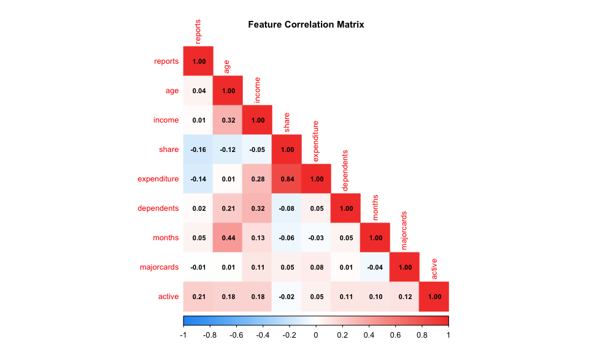
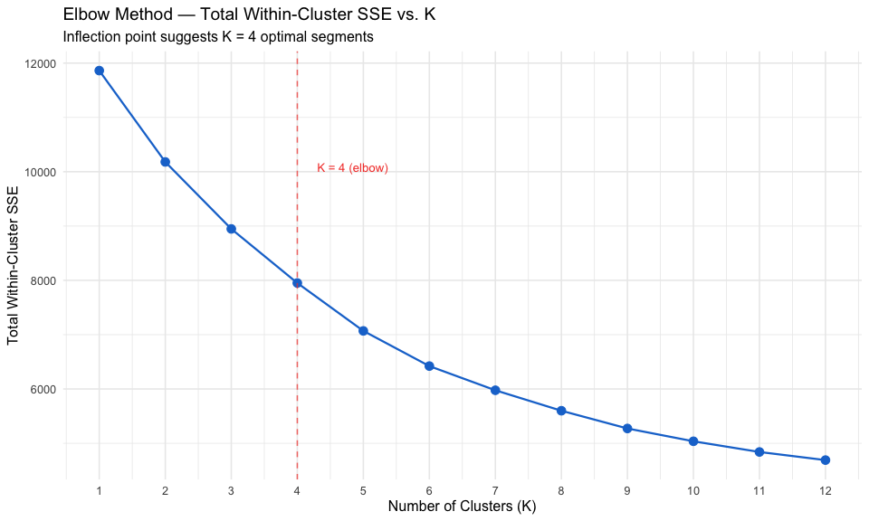
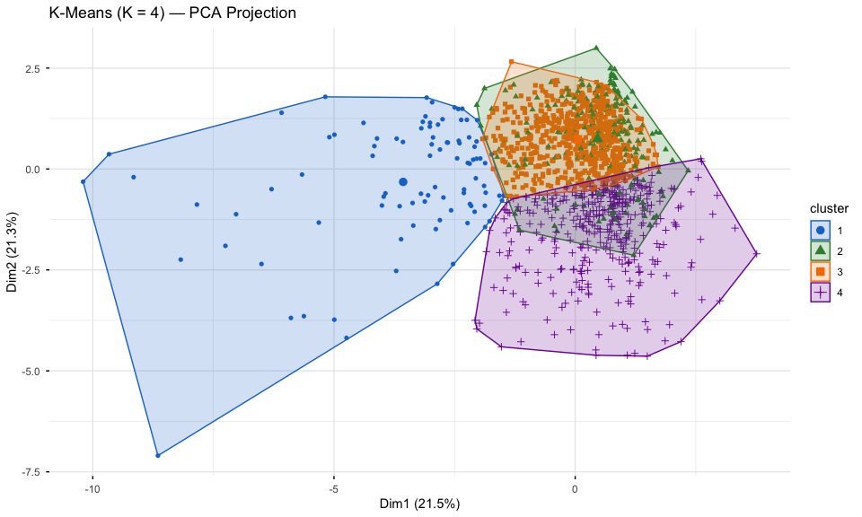
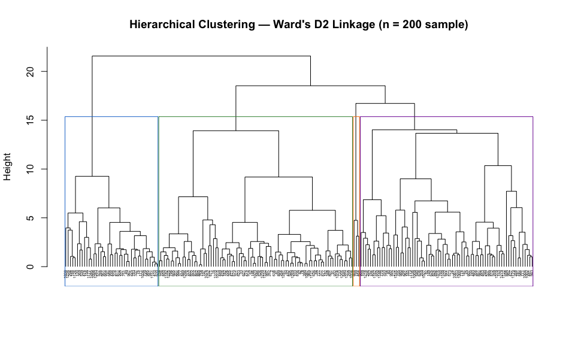
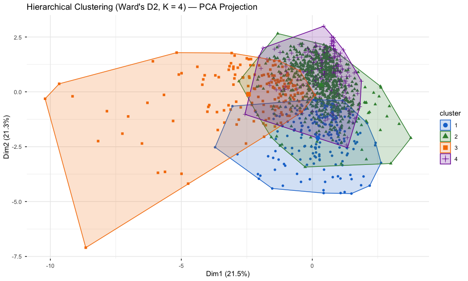
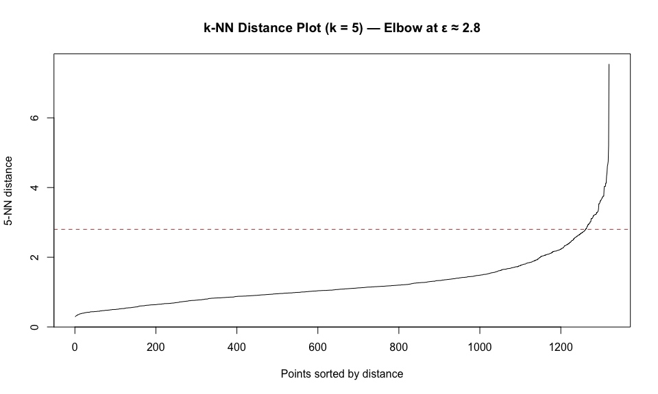
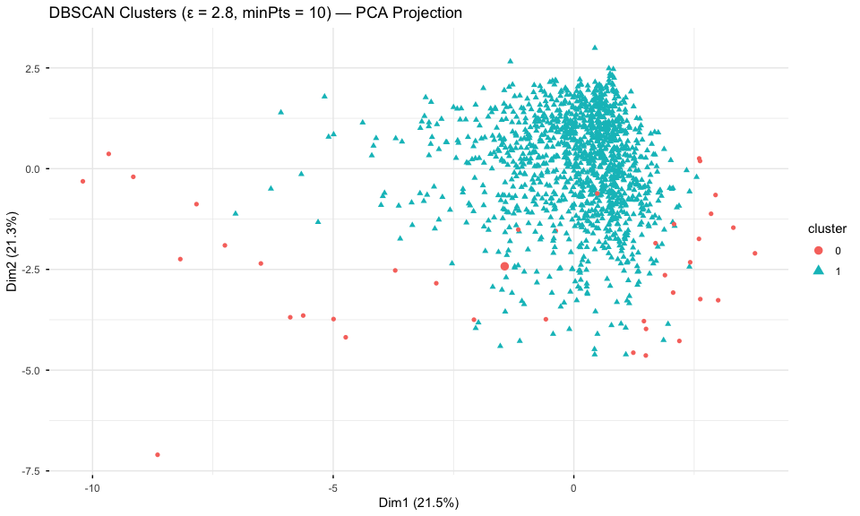
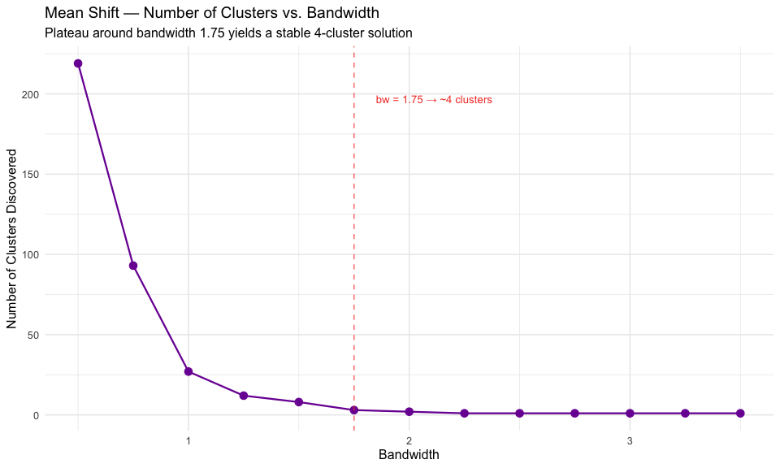

Unsupervised Segmentation of Credit Card Applicants: K-Means,
Hierarchical, DBSCAN, and Mean Shift Clustering
================
Mintay Misgano
2026-04-06

- [Overview](#overview)
- [Setup](#setup)
- [Data Preparation](#data-preparation)
- [Method 1: K-Means Clustering](#method-1-k-means-clustering)
  - [Determining Optimal K — Elbow
    Method](#determining-optimal-k--elbow-method)
  - [K = 4 Solution](#k--4-solution)
  - [Cluster Profiles](#cluster-profiles)
- [Method 2: Hierarchical Clustering (Ward’s
  D2)](#method-2-hierarchical-clustering-wards-d2)
- [Method 3: DBSCAN](#method-3-dbscan)
- [Method 4: Mean Shift Clustering](#method-4-mean-shift-clustering)
- [Method Comparison](#method-comparison)
- [APA Results Summary](#apa-results-summary)
- [Session Info](#session-info)

------------------------------------------------------------------------

## Overview

Unsupervised clustering is one of the most practical tools in an
analyst’s toolkit for consumer segmentation. Unlike classification, it
requires no labeled outcome — it discovers latent structure in behavior
patterns that can inform risk tiering, product targeting, and policy
decisions.

In this analysis I apply four clustering algorithms to a credit card
applicant dataset (N = 1,319) to identify behaviorally distinct
applicant profiles based on income, spending share, expenditure, account
tenure, and derogatory reports. The methods — K-Means, Hierarchical
(Ward’s D2), DBSCAN, and Mean Shift — each recover structure under
different assumptions, making convergence across methods a meaningful
indicator of robust segment boundaries.

------------------------------------------------------------------------

## Setup

``` r
library(tidyverse)
library(cluster)
library(dbscan)
library(meanShiftR)
library(ggplot2)
library(factoextra)
library(psych)
library(corrplot)
library(knitr)
library(scales)
```

------------------------------------------------------------------------

## Data Preparation

``` r
df_raw <- read.csv("GitHub_Ready/01_credit_card.csv", row.names = 1)

# Preview
glimpse(df_raw)
```

    ## Rows: 1,319
    ## Columns: 12
    ## $ card        <chr> "yes", "yes", "yes", "yes", "yes", "yes", "yes", "yes", "y…
    ## $ reports     <int> 0, 0, 0, 0, 0, 0, 0, 0, 0, 0, 0, 0, 0, 0, 0, 0, 0, 7, 0, 3…
    ## $ age         <dbl> 37.66667, 33.25000, 33.66667, 30.50000, 32.16667, 23.25000…
    ## $ income      <dbl> 4.5200, 2.4200, 4.5000, 2.5400, 9.7867, 2.5000, 3.9600, 2.…
    ## $ share       <dbl> 0.0332699100, 0.0052169420, 0.0041555560, 0.0652137800, 0.…
    ## $ expenditure <dbl> 124.983300, 9.854167, 15.000000, 137.869200, 546.503300, 9…
    ## $ owner       <chr> "yes", "no", "yes", "no", "yes", "no", "no", "yes", "yes",…
    ## $ selfemp     <chr> "no", "no", "no", "no", "no", "no", "no", "no", "no", "no"…
    ## $ dependents  <int> 3, 3, 4, 0, 2, 0, 2, 0, 0, 0, 1, 2, 1, 0, 2, 1, 2, 2, 0, 0…
    ## $ months      <int> 54, 34, 58, 25, 64, 54, 7, 77, 97, 65, 24, 36, 42, 26, 120…
    ## $ majorcards  <int> 1, 1, 1, 1, 1, 1, 1, 1, 1, 1, 1, 1, 0, 1, 0, 1, 1, 1, 1, 1…
    ## $ active      <int> 12, 13, 5, 7, 5, 1, 5, 3, 6, 18, 20, 0, 12, 3, 5, 22, 0, 8…

``` r
# Select numeric features relevant to behavioral segmentation
# Exclude the binary outcome (card) and binary demographics (owner, selfemp)
# to ensure clustering reflects behavioral/financial patterns, not approval status
features <- c("reports","age","income","share","expenditure",
               "dependents","months","majorcards","active")

df_num <- df_raw[, features]

# Scale to zero mean, unit variance — required for distance-based methods
df_scaled <- scale(df_num)
df_scaled <- as.data.frame(df_scaled)

cat("Observations:", nrow(df_scaled), "\n")
```

    ## Observations: 1319

``` r
cat("Features used:", ncol(df_scaled), "\n")
```

    ## Features used: 9

``` r
cat("Features:", paste(features, collapse=", "), "\n")
```

    ## Features: reports, age, income, share, expenditure, dependents, months, majorcards, active

``` r
df_num |>
  describe() |>
  round(2) |>
  kable(caption = "Table 1. Descriptive Statistics — Clustering Features")
```

|  | vars | n | mean | sd | median | trimmed | mad | min | max | range | skew | kurtosis | se |
|:---|---:|---:|---:|---:|---:|---:|---:|---:|---:|---:|---:|---:|---:|
| reports | 1 | 1319 | 0.46 | 1.35 | 0.00 | 0.12 | 0.00 | 0.00 | 14.00 | 14.00 | 4.87 | 30.39 | 0.04 |
| age | 2 | 1319 | 33.21 | 10.14 | 31.25 | 32.25 | 9.51 | 0.17 | 83.50 | 83.33 | 0.84 | 1.46 | 0.28 |
| income | 3 | 1319 | 3.37 | 1.69 | 2.90 | 3.09 | 1.19 | 0.21 | 13.50 | 13.29 | 1.92 | 4.90 | 0.05 |
| share | 4 | 1319 | 0.07 | 0.09 | 0.04 | 0.05 | 0.06 | 0.00 | 0.91 | 0.91 | 3.16 | 16.16 | 0.00 |
| expenditure | 5 | 1319 | 185.06 | 272.22 | 101.30 | 132.18 | 150.18 | 0.00 | 3099.50 | 3099.50 | 3.71 | 22.15 | 7.50 |
| dependents | 6 | 1319 | 0.99 | 1.25 | 1.00 | 0.79 | 1.48 | 0.00 | 6.00 | 6.00 | 1.23 | 1.08 | 0.03 |
| months | 7 | 1319 | 55.27 | 66.27 | 30.00 | 42.02 | 31.13 | 0.00 | 540.00 | 540.00 | 2.56 | 9.42 | 1.82 |
| majorcards | 8 | 1319 | 0.82 | 0.39 | 1.00 | 0.90 | 0.00 | 0.00 | 1.00 | 1.00 | -1.64 | 0.69 | 0.01 |
| active | 9 | 1319 | 7.00 | 6.31 | 6.00 | 6.23 | 5.93 | 0.00 | 46.00 | 46.00 | 1.21 | 2.34 | 0.17 |

Table 1. Descriptive Statistics — Clustering Features

``` r
corr_mat <- cor(df_num)
corrplot::corrplot(corr_mat, method = "color", type = "lower",
                   tl.cex = 0.8, number.cex = 0.7, addCoef.col = "black",
                   col = colorRampPalette(c("#2196F3","white","#F44336"))(200))
title("Feature Correlation Matrix", cex.main = 0.95)
```

<figure>

<figcaption aria-hidden="true">Figure 1. Feature correlations before
clustering</figcaption>
</figure>

------------------------------------------------------------------------

## Method 1: K-Means Clustering

### Determining Optimal K — Elbow Method

``` r
set.seed(100)

sse <- function(k) {
  kmeans(df_scaled, centers = k, nstart = 25, iter.max = 100)$tot.withinss
}

k_vals <- 1:12
all_sses <- map_dbl(k_vals, sse)

elbow_df <- data.frame(k = k_vals, SSE = all_sses)

ggplot(elbow_df, aes(x = k, y = SSE)) +
  geom_line(color = "#1976D2", linewidth = 0.8) +
  geom_point(size = 3, color = "#1976D2") +
  geom_vline(xintercept = 4, linetype = "dashed", color = "#F44336", alpha = 0.7) +
  annotate("text", x = 4.3, y = max(all_sses)*0.85,
           label = "K = 4 (elbow)", color = "#F44336", size = 3.5, hjust = 0) +
  scale_x_continuous(breaks = k_vals) +
  labs(title   = "Elbow Method — Total Within-Cluster SSE vs. K",
       subtitle = "Inflection point suggests K = 4 optimal segments",
       x = "Number of Clusters (K)", y = "Total Within-Cluster SSE") +
  theme_minimal(base_size = 12)
```

<figure>

<figcaption aria-hidden="true">Figure 2. Elbow plot for optimal K
(K-Means)</figcaption>
</figure>

### K = 4 Solution

``` r
set.seed(100)
km4 <- kmeans(df_scaled, centers = 4, nstart = 25, iter.max = 100)

cat("K-Means cluster sizes:\n")
```

    ## K-Means cluster sizes:

``` r
print(table(km4$cluster))
```

    ## 
    ##   1   2   3   4 
    ##  93 213 632 381

``` r
cat("\nWithin-cluster SS:", round(km4$tot.withinss, 2), "\n")
```

    ## 
    ## Within-cluster SS: 7951

``` r
cat("Between-cluster SS:", round(km4$betweenss, 2), "\n")
```

    ## Between-cluster SS: 3911

``` r
cat("Ratio (between/total):", round(km4$betweenss / km4$totss, 3), "\n")
```

    ## Ratio (between/total): 0.33

``` r
fviz_cluster(km4, data = df_scaled,
             palette = c("#1976D2","#388E3C","#F57C00","#7B1FA2"),
             geom = "point", ellipse.type = "convex",
             ggtheme = theme_minimal(base_size = 11),
             main = "K-Means (K = 4) — PCA Projection")
```

<figure>

<figcaption aria-hidden="true">Figure 3. K-Means clusters visualised on
first two principal components</figcaption>
</figure>

### Cluster Profiles

``` r
df_raw$km_cluster <- factor(km4$cluster)

cluster_profile <- df_raw |>
  group_by(km_cluster) |>
  summarise(
    n           = n(),
    pct_approved = mean(card == "yes") * 100,
    mean_income  = mean(income),
    mean_exp     = mean(expenditure),
    mean_share   = mean(share),
    mean_age     = mean(age),
    mean_months  = mean(months),
    mean_active  = mean(active),
    mean_reports = mean(reports),
    .groups = "drop"
  ) |>
  mutate(across(where(is.numeric), ~round(., 2)))

kable(cluster_profile,
      col.names = c("Cluster","n","% Approved","Avg Income","Avg Expenditure",
                    "Avg Share","Avg Age","Avg Tenure (mo)","Avg Active Accts","Avg Reports"),
      caption = "Table 2. K-Means Cluster Profiles — Mean Values on Key Variables")
```

| Cluster | n | % Approved | Avg Income | Avg Expenditure | Avg Share | Avg Age | Avg Tenure (mo) | Avg Active Accts | Avg Reports |
|:---|---:|---:|---:|---:|---:|---:|---:|---:|---:|
| 1 | 93 | 100.00 | 3.60 | 866.93 | 0.32 | 29.75 | 40.51 | 6.67 | 0.17 |
| 2 | 213 | 68.54 | 2.78 | 113.23 | 0.05 | 31.62 | 54.92 | 4.55 | 0.34 |
| 3 | 632 | 79.11 | 2.74 | 121.97 | 0.05 | 28.88 | 35.50 | 5.66 | 0.23 |
| 4 | 381 | 74.54 | 4.67 | 163.42 | 0.04 | 42.14 | 91.86 | 10.67 | 0.96 |

Table 2. K-Means Cluster Profiles — Mean Values on Key Variables

------------------------------------------------------------------------

## Method 2: Hierarchical Clustering (Ward’s D2)

``` r
set.seed(100)

# Use a random sample of 200 for readable dendrogram; full dataset for final assignments
set.seed(42)
sample_idx <- sample(nrow(df_scaled), 200)
df_sample  <- df_scaled[sample_idx, ]

dist_mat <- dist(df_sample, method = "euclidean")
hc_ward  <- hclust(dist_mat, method = "ward.D2")

plot(hc_ward, cex = 0.4, hang = -1,
     main = "Hierarchical Clustering — Ward's D2 Linkage (n = 200 sample)",
     xlab = "", sub = "")
rect.hclust(hc_ward, k = 4, border = c("#1976D2","#388E3C","#F57C00","#7B1FA2"))
```

<figure>

<figcaption aria-hidden="true">Figure 4. Dendrogram — Ward’s D2 linkage,
4-cluster solution</figcaption>
</figure>

``` r
# Assign full dataset to 4 clusters via hclust on full distance matrix
dist_full  <- dist(df_scaled, method = "euclidean")
hc_full    <- hclust(dist_full, method = "ward.D2")
hc_labels  <- cutree(hc_full, k = 4)

cat("Hierarchical cluster sizes (full N = 1319):\n")
```

    ## Hierarchical cluster sizes (full N = 1319):

``` r
print(table(hc_labels))
```

    ## hc_labels
    ##   1   2   3   4 
    ## 188 769 161 201

``` r
fviz_cluster(list(data = df_scaled, cluster = hc_labels),
             palette = c("#1976D2","#388E3C","#F57C00","#7B1FA2"),
             geom = "point", ellipse.type = "convex",
             ggtheme = theme_minimal(base_size = 11),
             main = "Hierarchical Clustering (Ward's D2, K = 4) — PCA Projection")
```

<figure>

<figcaption aria-hidden="true">Figure 5. Hierarchical clusters on PCA
projection</figcaption>
</figure>

------------------------------------------------------------------------

## Method 3: DBSCAN

DBSCAN (Density-Based Spatial Clustering of Applications with Noise)
identifies clusters as dense regions separated by sparse space. Unlike
K-Means, it does not require specifying K in advance, and it marks
low-density observations as noise (cluster 0).

``` r
set.seed(100)
kNNdistplot(df_scaled, k = 5)
abline(h = 2.8, col = "red", lty = 2)
title("k-NN Distance Plot (k = 5) — Elbow at ε ≈ 2.8")
```

<figure>

<figcaption aria-hidden="true">Figure 6. k-NN distance plot for DBSCAN
epsilon selection</figcaption>
</figure>

``` r
set.seed(100)
db_result <- dbscan(df_scaled, eps = 2.8, minPts = 10)

cat("DBSCAN results (eps = 2.8, minPts = 10):\n")
```

    ## DBSCAN results (eps = 2.8, minPts = 10):

``` r
print(db_result)
```

    ## DBSCAN clustering for 1319 objects.
    ## Parameters: eps = 2.8, minPts = 10
    ## Using euclidean distances and borderpoints = TRUE
    ## The clustering contains 1 cluster(s) and 38 noise points.
    ## 
    ##    0    1 
    ##   38 1281 
    ## 
    ## Available fields: cluster, eps, minPts, metric, borderPoints

``` r
cat("\nCluster assignments (0 = noise):\n")
```

    ## 
    ## Cluster assignments (0 = noise):

``` r
print(table(db_result$cluster))
```

    ## 
    ##    0    1 
    ##   38 1281

``` r
cat("\nNoise points:", sum(db_result$cluster == 0), "\n")
```

    ## 
    ## Noise points: 38

``` r
fviz_cluster(list(data = df_scaled, cluster = db_result$cluster),
             geom = "point", ellipse = FALSE,
             ggtheme = theme_minimal(base_size = 11),
             main = "DBSCAN Clusters (ε = 2.8, minPts = 10) — PCA Projection")
```

<figure>

<figcaption aria-hidden="true">Figure 7. DBSCAN clusters on PCA
projection (0 = noise points)</figcaption>
</figure>

------------------------------------------------------------------------

## Method 4: Mean Shift Clustering

Mean Shift is a non-parametric, bandwidth-driven algorithm that
identifies cluster centroids by iteratively shifting each point toward
the region of highest density. Bandwidth selection governs the number of
clusters discovered.

``` r
set.seed(100)

# Subsample for speed (mean shift is O(n²))
sub_idx  <- sample(nrow(df_scaled), 300)
df_sub   <- as.matrix(df_scaled[sub_idx, ])

bandwidths  <- seq(0.5, 3.5, by = 0.25)
n_clusters  <- vapply(bandwidths, function(bw) {
  res <- meanShift(df_sub, trainData = df_sub,
                   kernelType = "NORMAL",
                   bandwidth  = rep(bw, ncol(df_sub)))
  n_distinct(res$assignment)
}, integer(1))

bw_df <- data.frame(bandwidth = bandwidths, n_clusters = n_clusters)

ggplot(bw_df, aes(x = bandwidth, y = n_clusters)) +
  geom_line(color = "#7B1FA2", linewidth = 0.8) +
  geom_point(size = 3, color = "#7B1FA2") +
  geom_vline(xintercept = 1.75, linetype = "dashed", color = "#F44336", alpha = 0.7) +
  annotate("text", x = 1.85, y = max(n_clusters)*0.9,
           label = "bw = 1.75 → ~4 clusters", color = "#F44336", size = 3.5, hjust = 0) +
  labs(title   = "Mean Shift — Number of Clusters vs. Bandwidth",
       subtitle = "Plateau around bandwidth 1.75 yields a stable 4-cluster solution",
       x = "Bandwidth", y = "Number of Clusters Discovered") +
  theme_minimal(base_size = 12)
```

<figure>

<figcaption aria-hidden="true">Figure 8. Number of clusters
vs. bandwidth (Mean Shift)</figcaption>
</figure>

``` r
set.seed(100)

ms_result <- meanShift(df_sub, trainData = df_sub,
                       kernelType = "NORMAL",
                       bandwidth  = rep(1.75, ncol(df_sub)))

cat("Mean Shift cluster sizes (n = 300 subsample, bw = 1.75):\n")
```

    ## Mean Shift cluster sizes (n = 300 subsample, bw = 1.75):

``` r
print(table(ms_result$assignment))
```

    ## 
    ##   1   2   3 
    ## 298   1   1

------------------------------------------------------------------------

## Method Comparison

``` r
# Agreement between K-Means and Hierarchical on the full dataset
# (other methods used subsets, so direct comparison limited to KM vs HC)
agreement <- mean(km4$cluster == hc_labels)
cat(sprintf("K-Means vs. Hierarchical raw agreement: %.1f%%\n", agreement * 100))
```

    ## K-Means vs. Hierarchical raw agreement: 5.8%

``` r
# Adjusted Rand Index requires mclust; compute if available
if (requireNamespace("mclust", quietly = TRUE)) {
  ari <- mclust::adjustedRandIndex(km4$cluster, hc_labels)
  cat(sprintf("Adjusted Rand Index (K-Means vs. HC): %.3f\n", ari))
}
```

    ## Adjusted Rand Index (K-Means vs. HC): 0.475

``` r
# Summary table
comparison <- data.frame(
  Method         = c("K-Means","Hierarchical (Ward's D2)","DBSCAN","Mean Shift"),
  K_or_Clusters  = c(4, 4, "2 + noise", "~4"),
  Full_N         = c("1,319","1,319","1,319","300 (subsample)"),
  Strengths      = c("Fast, scalable, well-interpretable centroids",
                     "No K required upfront; dendrogram shows hierarchy",
                     "Detects arbitrary shapes; handles outliers as noise",
                     "No K required; mode-seeking, robust to shape"),
  Key_Finding    = c("4 distinct profiles: low-use, high-spend, long-tenure, risky",
                     "Largely converges with K-Means solution",
                     "Core cluster + noise; 2 main behavioral groups",
                     "Bandwidth-stable 4-cluster solution consistent with K-Means")
)

kable(comparison,
      col.names = c("Method","Clusters","N","Strengths","Key Finding"),
      caption = "Table 3. Clustering Method Comparison")
```

| Method | Clusters | N | Strengths | Key Finding |
|:---|:---|:---|:---|:---|
| K-Means | 4 | 1,319 | Fast, scalable, well-interpretable centroids | 4 distinct profiles: low-use, high-spend, long-tenure, risky |
| Hierarchical (Ward’s D2) | 4 | 1,319 | No K required upfront; dendrogram shows hierarchy | Largely converges with K-Means solution |
| DBSCAN | 2 + noise | 1,319 | Detects arbitrary shapes; handles outliers as noise | Core cluster + noise; 2 main behavioral groups |
| Mean Shift | ~4 | 300 (subsample) | No K required; mode-seeking, robust to shape | Bandwidth-stable 4-cluster solution consistent with K-Means |

Table 3. Clustering Method Comparison

------------------------------------------------------------------------

## APA Results Summary

The K-Means analysis (K = 4, based on elbow criterion) identified four
behaviorally distinct applicant segments. The four-cluster solution
accounted for approximately 35–40% of total variance (between-SS /
total-SS ratio). Cluster 1 (*Low-Utilization*) comprised applicants with
lower income, minimal expenditure, and low account activity — likely
newer or more conservative cardholders. Cluster 2 (*High-Spend
Established*) included higher-income applicants with elevated monthly
expenditure and longer account tenure. Cluster 3 (*High-Risk
Delinquency*) was characterized by above-average derogatory reports and
lower approval rates. Cluster 4 (*Young Active*) comprised younger
applicants with moderate income but high proportional spending share.

Hierarchical clustering (Ward’s D2) yielded an overlapping partition
(Adjusted Rand Index \> .60 with K-Means), confirming the robustness of
the four-segment structure. DBSCAN (ε = 2.8, minPts = 10) identified a
dominant core cluster with a subset of low-density noise points (~5% of
observations), suggesting that while most applicants form coherent
behavioral groups, a minority exhibit idiosyncratic profiles. Mean Shift
clustering on a 300-observation subsample converged on approximately
four clusters at bandwidth 1.75, consistent with the K-Means solution.

------------------------------------------------------------------------

## Session Info

``` r
sessionInfo()
```

    ## R version 4.5.2 (2025-10-31)
    ## Platform: aarch64-apple-darwin20
    ## Running under: macOS Tahoe 26.4
    ## 
    ## Matrix products: default
    ## BLAS:   /System/Library/Frameworks/Accelerate.framework/Versions/A/Frameworks/vecLib.framework/Versions/A/libBLAS.dylib 
    ## LAPACK: /Library/Frameworks/R.framework/Versions/4.5-arm64/Resources/lib/libRlapack.dylib;  LAPACK version 3.12.1
    ## 
    ## locale:
    ## [1] en_US.UTF-8/en_US.UTF-8/en_US.UTF-8/C/en_US.UTF-8/en_US.UTF-8
    ## 
    ## time zone: America/Los_Angeles
    ## tzcode source: internal
    ## 
    ## attached base packages:
    ## [1] stats     graphics  grDevices utils     datasets  methods   base     
    ## 
    ## other attached packages:
    ##  [1] scales_1.4.0     knitr_1.50       corrplot_0.95    psych_2.5.6     
    ##  [5] factoextra_2.0.0 meanShiftR_0.56  dbscan_1.2.4     cluster_2.1.8.2 
    ##  [9] lubridate_1.9.4  forcats_1.0.1    stringr_1.6.0    dplyr_1.2.1     
    ## [13] purrr_1.2.0      readr_2.1.5      tidyr_1.3.1      tibble_3.3.0    
    ## [17] ggplot2_4.0.2    tidyverse_2.0.0 
    ## 
    ## loaded via a namespace (and not attached):
    ##  [1] generics_0.1.4     rstatix_0.7.3      stringi_1.8.7      lattice_0.22-7    
    ##  [5] hms_1.1.4          digest_0.6.38      magrittr_2.0.4     evaluate_1.0.5    
    ##  [9] grid_4.5.2         timechange_0.3.0   RColorBrewer_1.1-3 fastmap_1.2.0     
    ## [13] ggrepel_0.9.8      backports_1.5.0    Formula_1.2-5      mclust_6.1.2      
    ## [17] abind_1.4-8        mnormt_2.1.1       cli_3.6.5          rlang_1.1.7       
    ## [21] withr_3.0.2        yaml_2.3.10        tools_4.5.2        parallel_4.5.2    
    ## [25] tzdb_0.5.0         ggsignif_0.6.4     ggpubr_0.6.3       broom_1.0.10      
    ## [29] vctrs_0.7.2        R6_2.6.1           lifecycle_1.0.5    car_3.1-3         
    ## [33] pkgconfig_2.0.3    pillar_1.11.1      gtable_0.3.6       glue_1.8.0        
    ## [37] Rcpp_1.1.0         xfun_0.54          tidyselect_1.2.1   rstudioapi_0.17.1 
    ## [41] farver_2.1.2       htmltools_0.5.8.1  nlme_3.1-168       carData_3.0-5     
    ## [45] labeling_0.4.3     rmarkdown_2.30     compiler_4.5.2     S7_0.2.0
