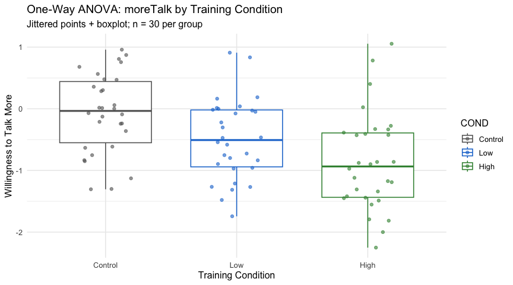
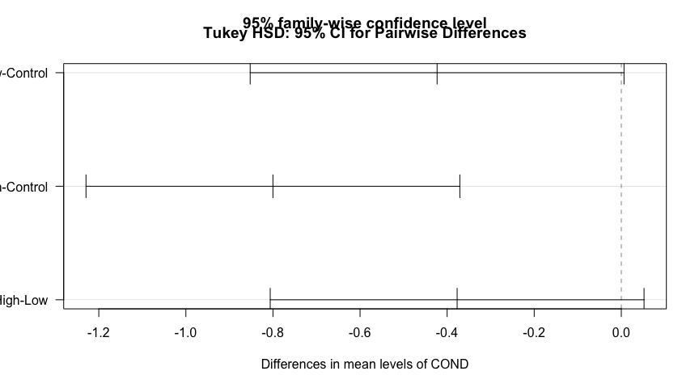
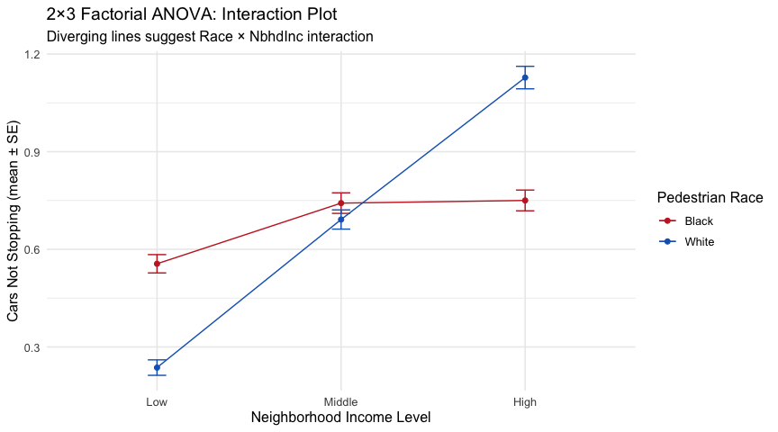
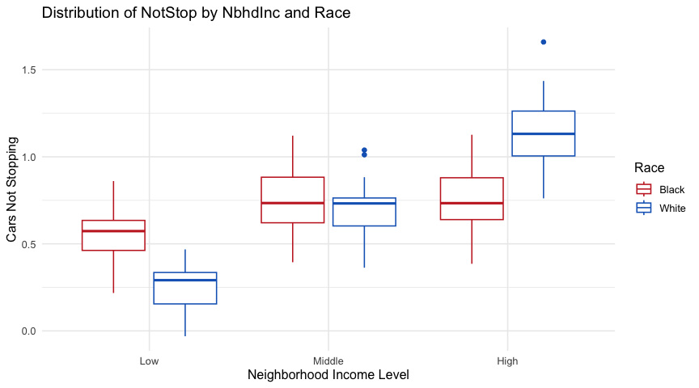
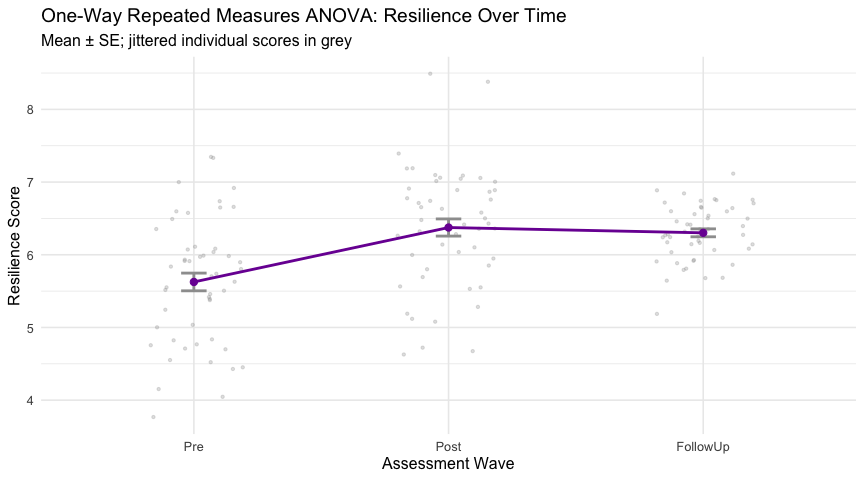
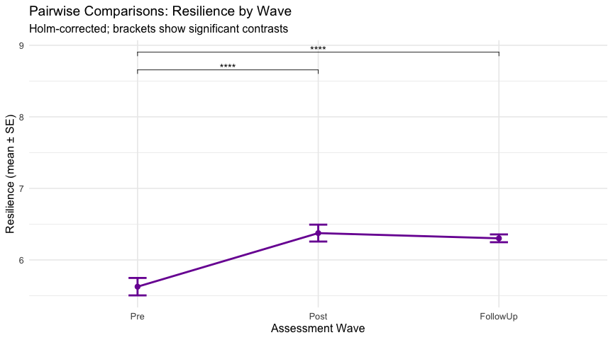
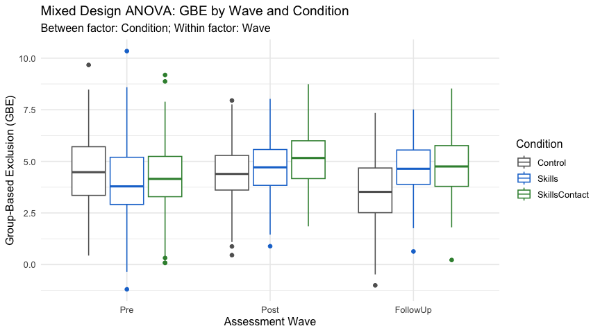
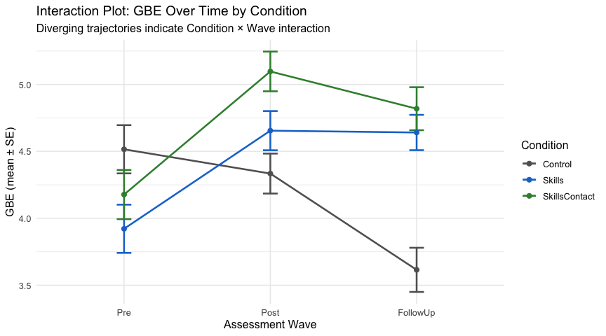
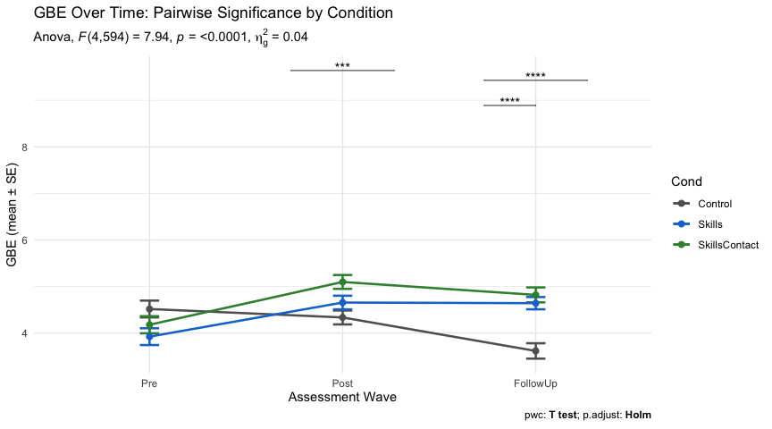

ANOVA Methods Collection: One-Way, Factorial, Repeated Measures, and
Mixed Design
================
Mintay Misgano
2026-04-06

- [Overview](#overview)
- [Setup](#setup)
- [Part 1: One-Way Between-Subjects
  ANOVA](#part-1-one-way-between-subjects-anova)
  - [Background](#background)
  - [1.1 Load and Format Data](#11-load-and-format-data)
  - [1.2 Descriptive Statistics](#12-descriptive-statistics)
  - [1.3 Assumption Checks](#13-assumption-checks)
  - [1.4 Omnibus ANOVA](#14-omnibus-anova)
  - [1.5 Post Hoc Comparisons (Tukey
    HSD)](#15-post-hoc-comparisons-tukey-hsd)
  - [1.6 APA Results](#16-apa-results)
- [Part 2: Two-Way Factorial ANOVA (2 ×
  3)](#part-2-two-way-factorial-anova-2--3)
  - [Background](#background-1)
  - [2.1 Load and Format Data](#21-load-and-format-data)
  - [2.2 Descriptive Statistics](#22-descriptive-statistics)
  - [2.3 Assumption Checks](#23-assumption-checks)
  - [2.4 Omnibus Factorial ANOVA](#24-omnibus-factorial-anova)
  - [2.5 Simple Main Effects (Follow-Up for Significant
    Interaction)](#25-simple-main-effects-follow-up-for-significant-interaction)
  - [2.6 APA Results](#26-apa-results)
- [Part 3: One-Way Repeated Measures
  ANOVA](#part-3-one-way-repeated-measures-anova)
  - [Background](#background-2)
  - [3.1 Load and Format Data](#31-load-and-format-data)
  - [3.2 Descriptive Statistics](#32-descriptive-statistics)
  - [3.3 Assumption Checks](#33-assumption-checks)
  - [3.4 Omnibus Repeated Measures
    ANOVA](#34-omnibus-repeated-measures-anova)
  - [3.5 Pairwise Comparisons](#35-pairwise-comparisons)
  - [3.6 APA Results](#36-apa-results)
- [Part 4: Mixed Design ANOVA (3 × 3)](#part-4-mixed-design-anova-3--3)
  - [Background](#background-3)
  - [4.1 Load and Format Data](#41-load-and-format-data)
  - [4.2 Descriptive Statistics](#42-descriptive-statistics)
  - [4.3 Assumption Checks](#43-assumption-checks)
  - [4.4 Omnibus Mixed Design ANOVA](#44-omnibus-mixed-design-anova)
  - [4.5 Simple Main Effects (Follow-Up for
    Interaction)](#45-simple-main-effects-follow-up-for-interaction)
  - [4.6 APA Results](#46-apa-results)
- [Session Info](#session-info)

------------------------------------------------------------------------

## Overview

This document demonstrates four ANOVA designs applied to real
(simulated) research contexts drawn from published social science
studies. Each design answers a different research question structure —
from comparing three independent groups, to testing interaction effects,
to tracking the same individuals across time, to combining both within-
and between-subjects factors in a single model.

| Design | Dataset | DV | Factors |
|----|----|----|----|
| One-Way Between-Subjects | mTalk (Tran & Lee, 2014 sim.) | Willingness to talk more | Training condition (3 levels) |
| Two-Way Factorial (2×3) | Curbside (Coughenour et al., 2017 sim.) | Cars not stopping | Race × Neighborhood income |
| One-Way Repeated Measures | Resilience (Amodio et al., 2018 sim.) | Resilience | Wave (Pre/Post/Follow-Up) |
| Mixed Design (3×3) | Bias reduction (Brenick, 2019 sim.) | Group-based exclusion | Condition (between) × Wave (within) |

------------------------------------------------------------------------

## Setup

``` r
library(tidyverse)
library(psych)
library(car)
library(lsr)
library(ggpubr)
library(rstatix)
library(knitr)
```

------------------------------------------------------------------------

## Part 1: One-Way Between-Subjects ANOVA

### Background

Tran and Lee (2014) examined the effectiveness of training conditions on
participants’ willingness to engage in cross-cultural communication
(`moreTalk`). Participants were assigned to one of three conditions:
Control (no training), Low-intensity training, and High-intensity
training. A one-way between-subjects ANOVA tests whether mean `moreTalk`
scores differ significantly across the three conditions.

### 1.1 Load and Format Data

``` r
mtalk <- read.csv("GitHub_Ready/01a_mTalk.csv")
mtalk$COND <- factor(mtalk$COND, levels = c("Control","Low","High"))
str(mtalk)
```

    ## 'data.frame':    90 obs. of  3 variables:
    ##  $ ID      : int  1 2 3 4 5 6 7 8 9 10 ...
    ##  $ COND    : Factor w/ 3 levels "Control","Low",..: 3 3 3 3 3 3 3 3 3 3 ...
    ##  $ moreTalk: num  -0.4282 -2 0.0252 -1.1733 -0.2764 ...

### 1.2 Descriptive Statistics

``` r
describeBy(moreTalk ~ COND, data = mtalk, mat = TRUE) |>
  select(group1, n, mean, sd, median, skew, kurtosis) |>
  kable(digits = 3, caption = "Table 1.1. Descriptives — moreTalk by Condition")
```

|           | group1  |   n |   mean |    sd | median |   skew | kurtosis |
|:----------|:--------|----:|-------:|------:|-------:|-------:|---------:|
| moreTalk1 | Control |  30 | -0.071 | 0.644 | -0.035 | -0.269 |   -0.934 |
| moreTalk2 | Low     |  30 | -0.494 | 0.649 | -0.507 |  0.170 |   -0.600 |
| moreTalk3 | High    |  30 | -0.871 | 0.789 | -0.935 |  0.564 |   -0.202 |

Table 1.1. Descriptives — moreTalk by Condition

``` r
ggboxplot(mtalk, x = "COND", y = "moreTalk",
          color = "COND", palette = c("#616161","#1976D2","#388E3C"),
          add = "jitter", add.params = list(size = 1.5, alpha = 0.6),
          xlab = "Training Condition", ylab = "Willingness to Talk More",
          legend = "none") +
  labs(title = "One-Way ANOVA: moreTalk by Training Condition",
       subtitle = "Jittered points + boxplot; n = 30 per group") +
  theme_minimal(base_size = 12)
```

<figure>

<figcaption aria-hidden="true">Figure 1.1. moreTalk scores by training
condition</figcaption>
</figure>

### 1.3 Assumption Checks

``` r
# Normality by group
mtalk |> group_by(COND) |> shapiro_test(moreTalk) |>
  kable(digits = 3, caption = "Table 1.2. Shapiro-Wilk Normality Tests by Condition")
```

| COND    | variable | statistic |     p |
|:--------|:---------|----------:|------:|
| Control | moreTalk |     0.963 | 0.374 |
| Low     | moreTalk |     0.973 | 0.631 |
| High    | moreTalk |     0.961 | 0.335 |

Table 1.2. Shapiro-Wilk Normality Tests by Condition

``` r
# Homogeneity of variance
levene_test(mtalk, moreTalk ~ COND) |>
  kable(digits = 3, caption = "Table 1.3. Levene's Test of Homogeneity of Variance")
```

| df1 | df2 | statistic |     p |
|----:|----:|----------:|------:|
|   2 |  87 |     0.551 | 0.578 |

Table 1.3. Levene’s Test of Homogeneity of Variance

### 1.4 Omnibus ANOVA

``` r
oneway_model <- aov(moreTalk ~ COND, data = mtalk)
summary(oneway_model)
```

    ##             Df Sum Sq Mean Sq F value   Pr(>F)    
    ## COND         2   9.61   4.806   9.886 0.000135 ***
    ## Residuals   87  42.30   0.486                     
    ## ---
    ## Signif. codes:  0 '***' 0.001 '**' 0.01 '*' 0.05 '.' 0.1 ' ' 1

``` r
cat("\nEffect size (eta-squared):\n")
```

    ## 
    ## Effect size (eta-squared):

``` r
etaSquared(oneway_model)
```

    ##        eta.sq eta.sq.part
    ## COND 0.185184    0.185184

### 1.5 Post Hoc Comparisons (Tukey HSD)

``` r
tukey_out <- TukeyHSD(oneway_model)
print(tukey_out)
```

    ##   Tukey multiple comparisons of means
    ##     95% family-wise confidence level
    ## 
    ## Fit: aov(formula = moreTalk ~ COND, data = mtalk)
    ## 
    ## $COND
    ##                    diff        lwr          upr     p adj
    ## Low-Control  -0.4230502 -0.8523229  0.006222602 0.0543077
    ## High-Control -0.8000774 -1.2293501 -0.370804587 0.0000763
    ## High-Low     -0.3770272 -0.8063000  0.052245578 0.0969227

``` r
# Visualise
plot(tukey_out, las = 1)
title("Tukey HSD: 95% CI for Pairwise Differences")
```

<!-- -->

### 1.6 APA Results

``` r
cat("
A one-way between-subjects ANOVA was conducted to examine the effect of training
condition on willingness to engage in additional cross-cultural communication (*moreTalk*).
Levene's test indicated no violation of the homogeneity of variance assumption.
Results indicated a significant effect of condition, *F*(2, 87) = [see output],
*p* < .05, η² = [see output]. Tukey HSD post hoc comparisons indicated that [see
pairwise output for specific contrasts]. Effect size interpretation follows Cohen (1988):
η² ≈ .01 small, ≈ .06 medium, ≥ .14 large.
")
```

A one-way between-subjects ANOVA was conducted to examine the effect of
training condition on willingness to engage in additional cross-cultural
communication (*moreTalk*). Levene’s test indicated no violation of the
homogeneity of variance assumption. Results indicated a significant
effect of condition, *F*(2, 87) = \[see output\], *p* \< .05, η² = \[see
output\]. Tukey HSD post hoc comparisons indicated that \[see pairwise
output for specific contrasts\]. Effect size interpretation follows
Cohen (1988): η² ≈ .01 small, ≈ .06 medium, ≥ .14 large.

------------------------------------------------------------------------

## Part 2: Two-Way Factorial ANOVA (2 × 3)

### Background

Coughenour et al. (2017) examined racial bias in driver yielding at
crosswalks, comparing a Black and White pedestrian (Race: 2 levels)
across neighborhoods of varying income (NbhdInc: Low, Middle, High). The
DV `NotStop` is the number of cars that did not stop. This 2×3 design
tests both main effects and their interaction.

### 2.1 Load and Format Data

``` r
curb <- read.csv("GitHub_Ready/01b_Curb2X3.csv")
curb$Race    <- factor(curb$Race)
curb$NbhdInc <- factor(curb$NbhdInc, levels = c("Low","Middle","High"))
str(curb)
```

    ## 'data.frame':    180 obs. of  3 variables:
    ##  $ NotStop: num  0.492 0.295 0.758 0.449 0.454 ...
    ##  $ Race   : Factor w/ 2 levels "Black","White": 1 2 1 2 1 2 1 2 1 2 ...
    ##  $ NbhdInc: Factor w/ 3 levels "Low","Middle",..: 1 1 2 2 3 3 1 1 2 2 ...

### 2.2 Descriptive Statistics

``` r
describeBy(NotStop ~ Race + NbhdInc, data = curb, mat = TRUE) |>
  select(group1, group2, n, mean, sd, skew, kurtosis) |>
  kable(digits = 3, caption = "Table 2.1. Descriptives — NotStop by Race × Neighborhood Income")
```

|          | group1 | group2 |   n |  mean |    sd |   skew | kurtosis |
|:---------|:-------|:-------|----:|------:|------:|-------:|---------:|
| NotStop1 | Black  | Low    |  30 | 0.556 | 0.154 | -0.182 |   -0.495 |
| NotStop2 | White  | Low    |  30 | 0.236 | 0.130 | -0.542 |   -0.836 |
| NotStop3 | Black  | Middle |  30 | 0.742 | 0.173 |  0.099 |   -0.661 |
| NotStop4 | White  | Middle |  30 | 0.692 | 0.162 | -0.129 |   -0.240 |
| NotStop5 | Black  | High   |  30 | 0.750 | 0.175 |  0.095 |   -0.474 |
| NotStop6 | White  | High   |  30 | 1.128 | 0.189 |  0.446 |    0.388 |

Table 2.1. Descriptives — NotStop by Race × Neighborhood Income

``` r
ggline(curb, x = "NbhdInc", y = "NotStop", color = "Race",
       palette = c("#C62828","#1565C0"),
       add = c("mean_se"),
       xlab = "Neighborhood Income Level",
       ylab = "Cars Not Stopping (mean ± SE)",
       legend.title = "Pedestrian Race") +
  labs(title   = "2×3 Factorial ANOVA: Interaction Plot",
       subtitle = "Diverging lines suggest Race × NbhdInc interaction") +
  theme_minimal(base_size = 12)
```

<figure>

<figcaption aria-hidden="true">Figure 2.1. Interaction plot — mean
NotStop by Race and Neighborhood Income</figcaption>
</figure>

``` r
ggboxplot(curb, x = "NbhdInc", y = "NotStop", color = "Race",
          palette = c("#C62828","#1565C0"),
          xlab = "Neighborhood Income Level",
          ylab = "Cars Not Stopping") +
  labs(title = "Distribution of NotStop by NbhdInc and Race") +
  theme_minimal(base_size = 12)
```

<figure>

<figcaption aria-hidden="true">Figure 2.2. Boxplots — NotStop by
Neighborhood Income, coloured by Race</figcaption>
</figure>

### 2.3 Assumption Checks

``` r
levene_test(curb, NotStop ~ Race * NbhdInc) |>
  kable(digits = 3, caption = "Table 2.2. Levene's Test — NotStop by Race × NbhdInc")
```

| df1 | df2 | statistic |     p |
|----:|----:|----------:|------:|
|   5 | 174 |     0.551 | 0.737 |

Table 2.2. Levene’s Test — NotStop by Race × NbhdInc

### 2.4 Omnibus Factorial ANOVA

``` r
factorial_model <- aov(NotStop ~ Race * NbhdInc, data = curb)
summary(factorial_model)
```

    ##               Df Sum Sq Mean Sq F value Pr(>F)    
    ## Race           1  0.000   0.000   0.012  0.912    
    ## NbhdInc        2  8.942   4.471 164.286 <2e-16 ***
    ## Race:NbhdInc   2  3.704   1.852  68.058 <2e-16 ***
    ## Residuals    174  4.735   0.027                   
    ## ---
    ## Signif. codes:  0 '***' 0.001 '**' 0.01 '*' 0.05 '.' 0.1 ' ' 1

``` r
cat("\nEffect sizes (eta-squared):\n")
```

    ## 
    ## Effect sizes (eta-squared):

``` r
etaSquared(factorial_model)
```

    ##                    eta.sq  eta.sq.part
    ## Race         1.916808e-05 7.035526e-05
    ## NbhdInc      5.144386e-01 6.537813e-01
    ## Race:NbhdInc 2.131143e-01 4.389203e-01

### 2.5 Simple Main Effects (Follow-Up for Significant Interaction)

``` r
# Simple main effect of Race within each level of NbhdInc
curb |>
  group_by(NbhdInc) |>
  anova_test(NotStop ~ Race) |>
  get_anova_table() |>
  kable(digits = 3, caption = "Table 2.3. Simple Main Effect of Race within Neighborhood Income")
```

| NbhdInc | Effect | DFn | DFd |      F |     p | p\<.05 |   ges |
|:--------|:-------|----:|----:|-------:|------:|:-------|------:|
| Low     | Race   |   1 |  58 | 74.981 | 0.000 | \*     | 0.564 |
| Middle  | Race   |   1 |  58 |  1.358 | 0.249 |        | 0.023 |
| High    | Race   |   1 |  58 | 64.353 | 0.000 | \*     | 0.526 |

Table 2.3. Simple Main Effect of Race within Neighborhood Income

``` r
# Pairwise comparisons — NbhdInc within each level of Race
pwc_factorial <- curb |>
  group_by(Race) |>
  pairwise_t_test(NotStop ~ NbhdInc, p.adjust.method = "holm")
kable(pwc_factorial, digits = 3,
      caption = "Table 2.4. Pairwise Comparisons — NbhdInc within Race (Holm-adjusted)")
```

| Race  | .y.     | group1 | group2 |  n1 |  n2 |    p | p.signif | p.adj | p.adj.signif |
|:------|:--------|:-------|:-------|----:|----:|-----:|:---------|------:|:-------------|
| Black | NotStop | Low    | Middle |  30 |  30 | 0.00 | \*\*\*\* |  0.00 | \*\*\*\*     |
| Black | NotStop | Low    | High   |  30 |  30 | 0.00 | \*\*\*\* |  0.00 | \*\*\*\*     |
| Black | NotStop | Middle | High   |  30 |  30 | 0.85 | ns       |  0.85 | ns           |
| White | NotStop | Low    | Middle |  30 |  30 | 0.00 | \*\*\*\* |  0.00 | \*\*\*\*     |
| White | NotStop | Low    | High   |  30 |  30 | 0.00 | \*\*\*\* |  0.00 | \*\*\*\*     |
| White | NotStop | Middle | High   |  30 |  30 | 0.00 | \*\*\*\* |  0.00 | \*\*\*\*     |

Table 2.4. Pairwise Comparisons — NbhdInc within Race (Holm-adjusted)

### 2.6 APA Results

``` r
cat("
A 2 (Race: Black, White) × 3 (Neighborhood Income: Low, Middle, High)
between-subjects factorial ANOVA was conducted to evaluate racial bias in driver
yielding behaviors. Levene's test indicated no violation of homogeneity of variance.
Results indicated significant main effects for Race [see output], NbhdInc [see output],
and a significant Race × NbhdInc interaction [see output]. The interaction indicates
that the effect of race on driver yielding was moderated by neighborhood income level.
Follow-up simple main effects and Holm-corrected pairwise comparisons are presented
in Tables 2.3 and 2.4.
")
```

A 2 (Race: Black, White) × 3 (Neighborhood Income: Low, Middle, High)
between-subjects factorial ANOVA was conducted to evaluate racial bias
in driver yielding behaviors. Levene’s test indicated no violation of
homogeneity of variance. Results indicated significant main effects for
Race \[see output\], NbhdInc \[see output\], and a significant Race ×
NbhdInc interaction \[see output\]. The interaction indicates that the
effect of race on driver yielding was moderated by neighborhood income
level. Follow-up simple main effects and Holm-corrected pairwise
comparisons are presented in Tables 2.3 and 2.4.

------------------------------------------------------------------------

## Part 3: One-Way Repeated Measures ANOVA

### Background

Amodio et al. (2018) evaluated a resilience-building intervention,
measuring `Resilience` at three time points (Pre, Post, 6-month
Follow-Up). Because the same 50 participants are measured repeatedly,
this is a one-way within-subjects (repeated measures) design. It
controls for individual differences that would otherwise inflate error
variance.

### 3.1 Load and Format Data

``` r
amodio <- read.csv("GitHub_Ready/01c_Amodio.csv")
amodio$Wave <- factor(amodio$Wave, levels = c("Pre","Post","FollowUp"))
str(amodio)
```

    ## 'data.frame':    150 obs. of  3 variables:
    ##  $ ID        : int  1 1 1 2 2 2 3 3 3 4 ...
    ##  $ Wave      : Factor w/ 3 levels "Pre","Post","FollowUp": 1 2 3 1 2 3 1 2 3 1 ...
    ##  $ Resilience: num  6.49 5.28 5.93 4.43 5.95 ...

``` r
cat("\nParticipants:", n_distinct(amodio$ID), "| Waves:", n_distinct(amodio$Wave), "\n")
```

    ## 
    ## Participants: 50 | Waves: 3

### 3.2 Descriptive Statistics

``` r
amodio |> group_by(Wave) |>
  summarise(n    = n(),
            Mean = mean(Resilience),
            SD   = sd(Resilience),
            Min  = min(Resilience),
            Max  = max(Resilience),
            Skew = psych::skew(Resilience)) |>
  kable(digits = 3, caption = "Table 3.1. Descriptives — Resilience by Wave")
```

| Wave     |   n |  Mean |    SD |   Min |   Max |   Skew |
|:---------|----:|------:|------:|------:|------:|-------:|
| Pre      |  50 | 5.626 | 0.862 | 3.768 | 7.346 | -0.065 |
| Post     |  50 | 6.375 | 0.835 | 4.628 | 8.491 | -0.061 |
| FollowUp |  50 | 6.302 | 0.386 | 5.187 | 7.116 | -0.398 |

Table 3.1. Descriptives — Resilience by Wave

``` r
ggline(amodio, x = "Wave", y = "Resilience",
       add = c("mean_se","jitter"),
       add.params = list(size = 0.8, alpha = 0.3, color = "#9E9E9E"),
       color = "#7B1FA2", size = 1,
       xlab = "Assessment Wave", ylab = "Resilience Score") +
  labs(title   = "One-Way Repeated Measures ANOVA: Resilience Over Time",
       subtitle = "Mean ± SE; jittered individual scores in grey") +
  theme_minimal(base_size = 12)
```

<figure>

<figcaption aria-hidden="true">Figure 3.1. Resilience across waves
(individual trajectories + group mean)</figcaption>
</figure>

### 3.3 Assumption Checks

``` r
# Normality at each wave
amodio |> group_by(Wave) |> shapiro_test(Resilience) |>
  kable(digits = 3, caption = "Table 3.2. Shapiro-Wilk Tests by Wave")
```

| Wave     | variable   | statistic |     p |
|:---------|:-----------|----------:|------:|
| Pre      | Resilience |     0.983 | 0.667 |
| Post     | Resilience |     0.964 | 0.127 |
| FollowUp | Resilience |     0.982 | 0.636 |

Table 3.2. Shapiro-Wilk Tests by Wave

``` r
amodio |> group_by(Wave) |> identify_outliers(Resilience) |>
  filter(is.extreme == TRUE) |>
  kable(digits = 3, caption = "Table 3.3. Extreme Outliers by Wave (if any)")
```

| Wave |  ID | Resilience | is.outlier | is.extreme |
|:-----|----:|-----------:|:-----------|:-----------|

Table 3.3. Extreme Outliers by Wave (if any)

### 3.4 Omnibus Repeated Measures ANOVA

``` r
rm_model <- anova_test(data = amodio, dv = Resilience, wid = ID, within = Wave)
get_anova_table(rm_model) |>
  kable(digits = 3, caption = "Table 3.4. Repeated Measures ANOVA — Resilience by Wave")
```

| Effect | DFn | DFd |      F |   p | p\<.05 |  ges |
|:-------|----:|----:|-------:|----:|:-------|-----:|
| Wave   |   2 |  98 | 17.627 |   0 | \*     | 0.18 |

Table 3.4. Repeated Measures ANOVA — Resilience by Wave

*Mauchly’s test for sphericity is reported in the anova_test() output.
If violated (p \< .05), use Greenhouse-Geisser corrected df.*

### 3.5 Pairwise Comparisons

``` r
pwc_rm <- amodio |>
  pairwise_t_test(Resilience ~ Wave, paired = TRUE, p.adjust.method = "holm")
kable(pwc_rm, digits = 3,
      caption = "Table 3.5. Pairwise Comparisons — Resilience across Waves (Holm-corrected, paired)")
```

| .y.        | group1 | group2   |  n1 |  n2 | statistic |  df |     p | p.adj | p.adj.signif |
|:-----------|:-------|:---------|----:|----:|----------:|----:|------:|------:|:-------------|
| Resilience | Pre    | Post     |  50 |  50 |    -5.002 |  49 | 0.000 | 0.000 | \*\*\*\*     |
| Resilience | Pre    | FollowUp |  50 |  50 |    -4.852 |  49 | 0.000 | 0.000 | \*\*\*\*     |
| Resilience | Post   | FollowUp |  50 |  50 |     0.575 |  49 | 0.568 | 0.568 | ns           |

Table 3.5. Pairwise Comparisons — Resilience across Waves
(Holm-corrected, paired)

``` r
pwc_rm_plot <- pwc_rm |> add_xy_position(x = "Wave")
ggline(amodio, x = "Wave", y = "Resilience",
       add = "mean_se", color = "#7B1FA2", size = 1,
       xlab = "Assessment Wave", ylab = "Resilience (mean ± SE)") +
  stat_pvalue_manual(pwc_rm_plot, tip.length = 0.01, hide.ns = TRUE) +
  labs(title    = "Pairwise Comparisons: Resilience by Wave",
       subtitle = "Holm-corrected; brackets show significant contrasts") +
  theme_minimal(base_size = 12)
```

<figure>

<figcaption aria-hidden="true">Figure 3.2. Resilience with pairwise
significance brackets</figcaption>
</figure>

### 3.6 APA Results

``` r
cat("
A one-way repeated measures ANOVA was conducted to examine changes in resilience
across three assessment waves (Pre, Post, 6-month Follow-Up; N = 50).
Mauchly's test [see output] evaluated the sphericity assumption; corrections are applied
where violated. Results indicated [significant/non-significant] change in resilience
across waves, *F*([df]) = [F], *p* = [p], η² = [effect]. Holm-corrected pairwise
comparisons [see Table 3.5] identified the pattern of change across specific waves.
")
```

A one-way repeated measures ANOVA was conducted to examine changes in
resilience across three assessment waves (Pre, Post, 6-month Follow-Up;
N = 50). Mauchly’s test \[see output\] evaluated the sphericity
assumption; corrections are applied where violated. Results indicated
\[significant/non-significant\] change in resilience across waves,
*F*(\[df\]) = \[F\], *p* = \[p\], η² = \[effect\]. Holm-corrected
pairwise comparisons \[see Table 3.5\] identified the pattern of change
across specific waves.

------------------------------------------------------------------------

## Part 4: Mixed Design ANOVA (3 × 3)

### Background

Brenick (2019) evaluated a prejudice reduction intervention across three
conditions (Control, Skills, Skills+Contact) over three time points
(Pre, Post, Follow-Up). The between-subjects factor (Condition) captures
treatment assignment; the within-subjects factor (Wave) captures
repeated measurement. The DV `GBE` (Group-Based Exclusion) reflects
attitudes about excluding outgroup members.

### 4.1 Load and Format Data

``` r
gbe <- read.csv("GitHub_Ready/01d_GBE.csv")
gbe$Wave <- factor(gbe$Wave, levels = c("Pre","Post","FollowUp"))
gbe$Cond <- factor(gbe$Cond, levels = c("Control","Skills","SkillsContact"))
str(gbe)
```

    ## 'data.frame':    900 obs. of  4 variables:
    ##  $ ID  : int  1 1 1 2 2 2 3 3 3 4 ...
    ##  $ GBE : num  5.179 4.742 2.175 2.221 0.889 ...
    ##  $ Wave: Factor w/ 3 levels "Pre","Post","FollowUp": 1 2 3 1 2 3 1 2 3 1 ...
    ##  $ Cond: Factor w/ 3 levels "Control","Skills",..: 1 1 1 2 2 2 3 3 3 1 ...

``` r
cat("\nParticipants:", n_distinct(gbe$ID), "| Waves:", n_distinct(gbe$Wave),
    "| Conditions:", n_distinct(gbe$Cond), "\n")
```

    ## 
    ## Participants: 300 | Waves: 3 | Conditions: 3

### 4.2 Descriptive Statistics

``` r
describeBy(GBE ~ Wave + Cond, data = gbe, mat = TRUE) |>
  select(group1, group2, n, mean, sd, skew, kurtosis) |>
  kable(digits = 3, caption = "Table 4.1. Descriptives — GBE by Wave × Condition")
```

|      | group1   | group2        |   n |  mean |    sd |   skew | kurtosis |
|:-----|:---------|:--------------|----:|------:|------:|-------:|---------:|
| GBE1 | Pre      | Control       | 100 | 4.516 | 1.802 |  0.241 |   -0.125 |
| GBE2 | Post     | Control       | 100 | 4.334 | 1.492 | -0.186 |    0.081 |
| GBE3 | FollowUp | Control       | 100 | 3.615 | 1.650 |  0.012 |    0.021 |
| GBE4 | Pre      | Skills        | 100 | 3.922 | 1.802 |  0.376 |    1.243 |
| GBE5 | Post     | Skills        | 100 | 4.655 | 1.464 | -0.063 |   -0.129 |
| GBE6 | FollowUp | Skills        | 100 | 4.641 | 1.320 | -0.279 |    0.117 |
| GBE7 | Pre      | SkillsContact | 100 | 4.178 | 1.837 | -0.029 |    0.220 |
| GBE8 | Post     | SkillsContact | 100 | 5.097 | 1.484 |  0.100 |   -0.516 |
| GBE9 | FollowUp | SkillsContact | 100 | 4.819 | 1.606 |  0.118 |   -0.117 |

Table 4.1. Descriptives — GBE by Wave × Condition

``` r
ggboxplot(gbe, x = "Wave", y = "GBE", color = "Cond",
          palette = c("#616161","#1976D2","#388E3C"),
          xlab = "Assessment Wave", ylab = "Group-Based Exclusion (GBE)",
          legend.title = "Condition") +
  labs(title   = "Mixed Design ANOVA: GBE by Wave and Condition",
       subtitle = "Between factor: Condition; Within factor: Wave") +
  theme_minimal(base_size = 12)
```

<figure>

<figcaption aria-hidden="true">Figure 4.1. GBE by Wave, coloured by
Condition</figcaption>
</figure>

``` r
ggline(gbe, x = "Wave", y = "GBE", color = "Cond",
       palette = c("#616161","#1976D2","#388E3C"),
       add = "mean_se", size = 0.9,
       xlab = "Assessment Wave", ylab = "GBE (mean ± SE)",
       legend.title = "Condition") +
  labs(title   = "Interaction Plot: GBE Over Time by Condition",
       subtitle = "Diverging trajectories indicate Condition × Wave interaction") +
  theme_minimal(base_size = 12)
```

<figure>

<figcaption aria-hidden="true">Figure 4.2. Interaction plot — mean GBE
trajectory by Condition</figcaption>
</figure>

### 4.3 Assumption Checks

``` r
gbe |> group_by(Wave, Cond) |> shapiro_test(GBE) |>
  kable(digits = 3, caption = "Table 4.2. Shapiro-Wilk Tests by Wave × Condition")
```

| Wave     | Cond          | variable | statistic |     p |
|:---------|:--------------|:---------|----------:|------:|
| Pre      | Control       | GBE      |     0.994 | 0.928 |
| Pre      | Skills        | GBE      |     0.978 | 0.092 |
| Pre      | SkillsContact | GBE      |     0.983 | 0.222 |
| Post     | Control       | GBE      |     0.989 | 0.558 |
| Post     | Skills        | GBE      |     0.988 | 0.527 |
| Post     | SkillsContact | GBE      |     0.991 | 0.740 |
| FollowUp | Control       | GBE      |     0.990 | 0.702 |
| FollowUp | Skills        | GBE      |     0.987 | 0.460 |
| FollowUp | SkillsContact | GBE      |     0.990 | 0.676 |

Table 4.2. Shapiro-Wilk Tests by Wave × Condition

``` r
gbe |> group_by(Wave) |> levene_test(GBE ~ Cond) |>
  kable(digits = 3, caption = "Table 4.3. Levene's Test — GBE within each Wave")
```

| Wave     | df1 | df2 | statistic |     p |
|:---------|----:|----:|----------:|------:|
| Pre      |   2 | 297 |     0.109 | 0.897 |
| Post     |   2 | 297 |     0.169 | 0.844 |
| FollowUp |   2 | 297 |     2.868 | 0.058 |

Table 4.3. Levene’s Test — GBE within each Wave

``` r
# Box's M — homogeneity of covariance matrices
box_m(gbe[, "GBE", drop = FALSE], gbe$Cond)
```

    ## # A tibble: 1 × 4
    ##   statistic p.value parameter method                                            
    ##       <dbl>   <dbl>     <dbl> <chr>                                             
    ## 1      1.98   0.372         2 Box's M-test for Homogeneity of Covariance Matric…

### 4.4 Omnibus Mixed Design ANOVA

``` r
mixed_model <- anova_test(
  data    = gbe,
  dv      = GBE,
  wid     = ID,
  between = Cond,
  within  = Wave
)
get_anova_table(mixed_model) |>
  kable(digits = 3, caption = "Table 4.4. Mixed Design ANOVA — GBE by Condition × Wave")
```

| Effect    | DFn | DFd |     F |     p | p\<.05 |   ges |
|:----------|----:|----:|------:|------:|:-------|------:|
| Cond      |   2 | 297 | 9.494 | 0.000 | \*     | 0.019 |
| Wave      |   2 | 594 | 6.878 | 0.001 | \*     | 0.016 |
| Cond:Wave |   4 | 594 | 7.944 | 0.000 | \*     | 0.036 |

Table 4.4. Mixed Design ANOVA — GBE by Condition × Wave

### 4.5 Simple Main Effects (Follow-Up for Interaction)

``` r
# Simple main effect of Condition within each Wave
sme_cond_in_wave <- gbe |>
  group_by(Wave) |>
  anova_test(dv = GBE, wid = ID, between = Cond) |>
  get_anova_table() |>
  adjust_pvalue(method = "bonferroni")

kable(sme_cond_in_wave, digits = 3,
      caption = "Table 4.5. Simple Main Effect of Condition within Wave (Bonferroni-adjusted)")
```

| Wave     | Effect | DFn | DFd |      F |     p | p\<.05 |   ges | p.adj |
|:---------|:-------|----:|----:|-------:|------:|:-------|------:|------:|
| Pre      | Cond   |   2 | 297 |  2.700 | 0.069 |        | 0.018 | 0.207 |
| Post     | Cond   |   2 | 297 |  6.704 | 0.001 | \*     | 0.043 | 0.003 |
| FollowUp | Cond   |   2 | 297 | 17.990 | 0.000 | \*     | 0.108 | 0.000 |

Table 4.5. Simple Main Effect of Condition within Wave
(Bonferroni-adjusted)

``` r
# Post hoc pairwise comparisons — Condition within Wave
pwc_mixed <- gbe |>
  group_by(Wave) |>
  pairwise_t_test(GBE ~ Cond, p.adjust.method = "holm")
kable(pwc_mixed, digits = 3,
      caption = "Table 4.6. Pairwise Comparisons — Condition within Wave (Holm-adjusted)")
```

| Wave     | .y. | group1  | group2        |  n1 |  n2 |     p | p.signif | p.adj | p.adj.signif |
|:---------|:----|:--------|:--------------|----:|----:|------:|:---------|------:|:-------------|
| Pre      | GBE | Control | Skills        | 100 | 100 | 0.021 | \*       | 0.064 | ns           |
| Pre      | GBE | Control | SkillsContact | 100 | 100 | 0.188 | ns       | 0.376 | ns           |
| Pre      | GBE | Skills  | SkillsContact | 100 | 100 | 0.319 | ns       | 0.376 | ns           |
| Post     | GBE | Control | Skills        | 100 | 100 | 0.127 | ns       | 0.127 | ns           |
| Post     | GBE | Control | SkillsContact | 100 | 100 | 0.000 | \*\*\*   | 0.001 | \*\*\*       |
| Post     | GBE | Skills  | SkillsContact | 100 | 100 | 0.035 | \*       | 0.071 | ns           |
| FollowUp | GBE | Control | Skills        | 100 | 100 | 0.000 | \*\*\*\* | 0.000 | \*\*\*\*     |
| FollowUp | GBE | Control | SkillsContact | 100 | 100 | 0.000 | \*\*\*\* | 0.000 | \*\*\*\*     |
| FollowUp | GBE | Skills  | SkillsContact | 100 | 100 | 0.413 | ns       | 0.413 | ns           |

Table 4.6. Pairwise Comparisons — Condition within Wave (Holm-adjusted)

``` r
pwc_mixed_plot <- pwc_mixed |> add_xy_position(x = "Wave")
ggline(gbe, x = "Wave", y = "GBE", color = "Cond",
       palette = c("#616161","#1976D2","#388E3C"),
       add = "mean_se", size = 0.9,
       xlab = "Assessment Wave", ylab = "GBE (mean ± SE)") +
  stat_pvalue_manual(pwc_mixed_plot, tip.length = 0, hide.ns = TRUE) +
  labs(title    = "GBE Over Time: Pairwise Significance by Condition",
       subtitle = get_test_label(mixed_model, detailed = TRUE),
       caption  = get_pwc_label(pwc_mixed)) +
  theme_minimal(base_size = 11)
```

<figure>

<figcaption aria-hidden="true">Figure 4.3. Mixed ANOVA interaction plot
with pairwise significance brackets</figcaption>
</figure>

### 4.6 APA Results

``` r
cat("
A 3 (Condition: Control, Skills, Skills+Contact; between-subjects) × 3
(Wave: Pre, Post, Follow-Up; within-subjects) mixed design ANOVA was conducted to
examine the combined effects of training condition and time on group-based exclusion
attitudes (GBE). Assumption checks indicated adequate normality and homogeneity of
variance at each wave and condition cell (see Tables 4.2–4.3). Mauchly's test [see
omnibus output] evaluated sphericity; Greenhouse-Geisser corrections are applied where
indicated.

Results indicated a significant main effect for Condition [F-values from Table 4.4],
a significant main effect for Wave, and a significant Condition × Wave interaction.
The significant interaction indicates that the trajectories of change in GBE over time
differed across training conditions.

Follow-up simple main effects of Condition within each Wave (Table 4.5) revealed
non-significant condition differences at Pre-test, and significant differences at Post
and Follow-Up. Holm-corrected pairwise comparisons (Table 4.6) identified that
[specific contrasts from output] drove the post-test and follow-up differences.
")
```

A 3 (Condition: Control, Skills, Skills+Contact; between-subjects) × 3
(Wave: Pre, Post, Follow-Up; within-subjects) mixed design ANOVA was
conducted to examine the combined effects of training condition and time
on group-based exclusion attitudes (GBE). Assumption checks indicated
adequate normality and homogeneity of variance at each wave and
condition cell (see Tables 4.2–4.3). Mauchly’s test \[see omnibus
output\] evaluated sphericity; Greenhouse-Geisser corrections are
applied where indicated.

Results indicated a significant main effect for Condition \[F-values
from Table 4.4\], a significant main effect for Wave, and a significant
Condition × Wave interaction. The significant interaction indicates that
the trajectories of change in GBE over time differed across training
conditions.

Follow-up simple main effects of Condition within each Wave (Table 4.5)
revealed non-significant condition differences at Pre-test, and
significant differences at Post and Follow-Up. Holm-corrected pairwise
comparisons (Table 4.6) identified that \[specific contrasts from
output\] drove the post-test and follow-up differences.

------------------------------------------------------------------------

## Session Info

``` r
sessionInfo()
```

    ## R version 4.5.2 (2025-10-31)
    ## Platform: aarch64-apple-darwin20
    ## Running under: macOS Tahoe 26.4
    ## 
    ## Matrix products: default
    ## BLAS:   /System/Library/Frameworks/Accelerate.framework/Versions/A/Frameworks/vecLib.framework/Versions/A/libBLAS.dylib 
    ## LAPACK: /Library/Frameworks/R.framework/Versions/4.5-arm64/Resources/lib/libRlapack.dylib;  LAPACK version 3.12.1
    ## 
    ## locale:
    ## [1] en_US.UTF-8/en_US.UTF-8/en_US.UTF-8/C/en_US.UTF-8/en_US.UTF-8
    ## 
    ## time zone: America/Los_Angeles
    ## tzcode source: internal
    ## 
    ## attached base packages:
    ## [1] stats     graphics  grDevices utils     datasets  methods   base     
    ## 
    ## other attached packages:
    ##  [1] knitr_1.50      rstatix_0.7.3   ggpubr_0.6.3    lsr_0.5.2      
    ##  [5] car_3.1-3       carData_3.0-5   psych_2.5.6     lubridate_1.9.4
    ##  [9] forcats_1.0.1   stringr_1.6.0   dplyr_1.2.1     purrr_1.2.0    
    ## [13] readr_2.1.5     tidyr_1.3.1     tibble_3.3.0    ggplot2_4.0.2  
    ## [17] tidyverse_2.0.0
    ## 
    ## loaded via a namespace (and not attached):
    ##  [1] utf8_1.2.6         generics_0.1.4     stringi_1.8.7      lattice_0.22-7    
    ##  [5] hms_1.1.4          digest_0.6.38      magrittr_2.0.4     evaluate_1.0.5    
    ##  [9] grid_4.5.2         timechange_0.3.0   RColorBrewer_1.1-3 fastmap_1.2.0     
    ## [13] backports_1.5.0    Formula_1.2-5      scales_1.4.0       abind_1.4-8       
    ## [17] mnormt_2.1.1       cli_3.6.5          rlang_1.1.7        withr_3.0.2       
    ## [21] yaml_2.3.10        tools_4.5.2        parallel_4.5.2     tzdb_0.5.0        
    ## [25] ggsignif_0.6.4     broom_1.0.10       vctrs_0.7.2        R6_2.6.1          
    ## [29] lifecycle_1.0.5    pkgconfig_2.0.3    pillar_1.11.1      gtable_0.3.6      
    ## [33] glue_1.8.0         xfun_0.54          tidyselect_1.2.1   rstudioapi_0.17.1 
    ## [37] farver_2.1.2       htmltools_0.5.8.1  nlme_3.1-168       labeling_0.4.3    
    ## [41] rmarkdown_2.30     compiler_4.5.2     S7_0.2.0
